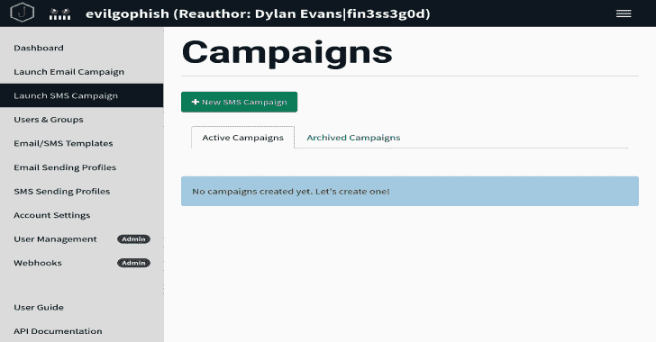
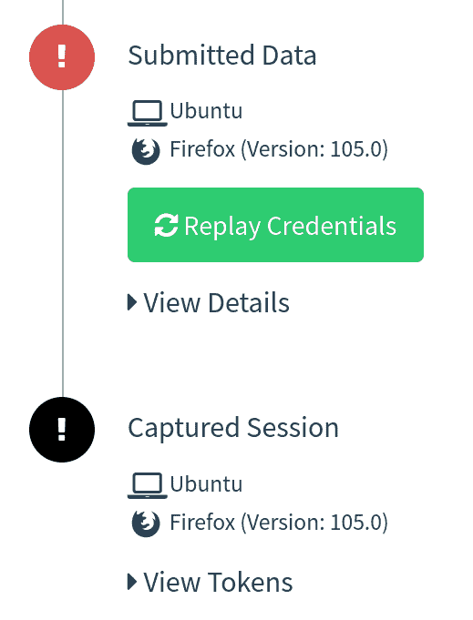
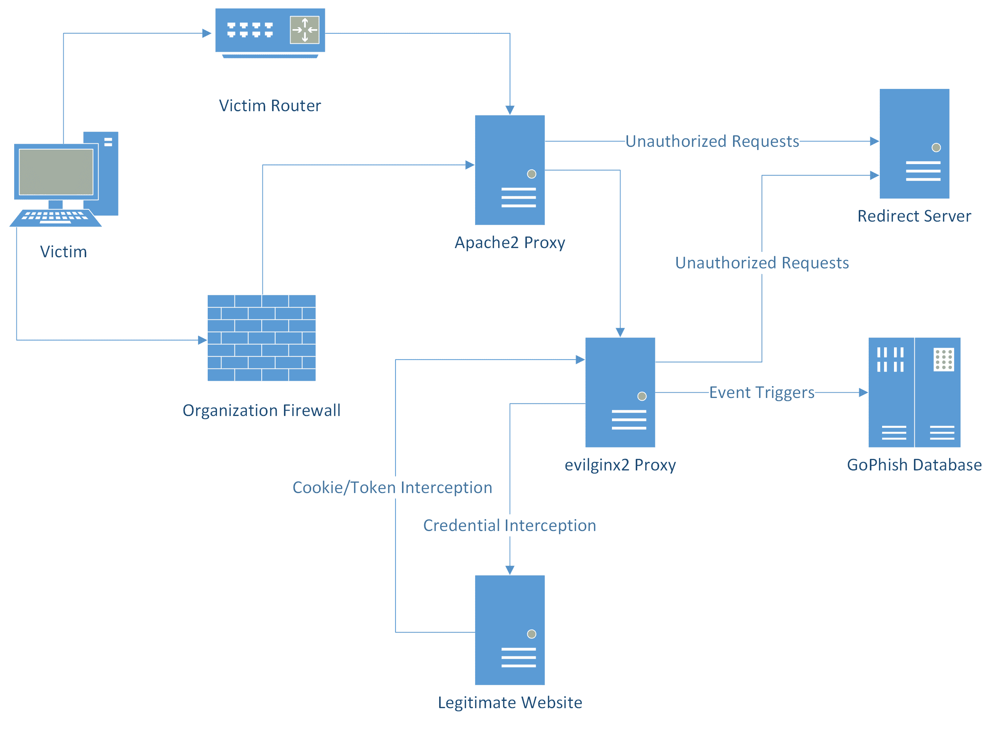
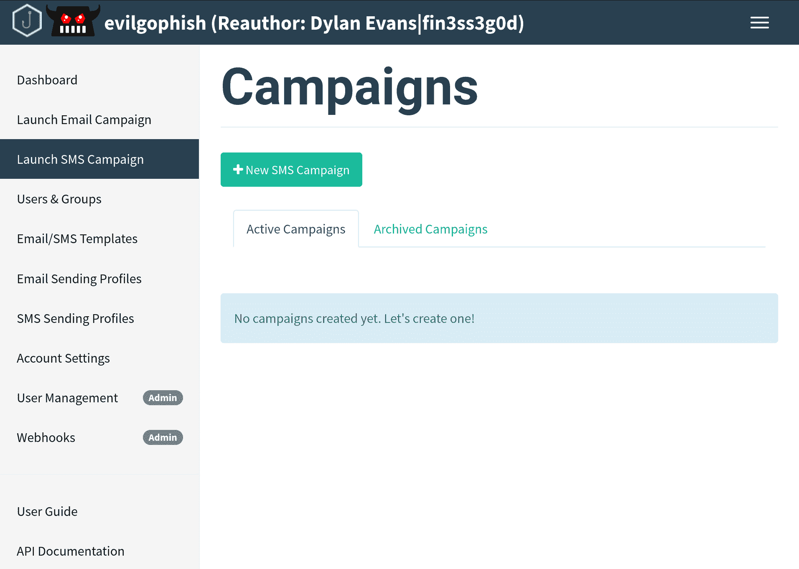
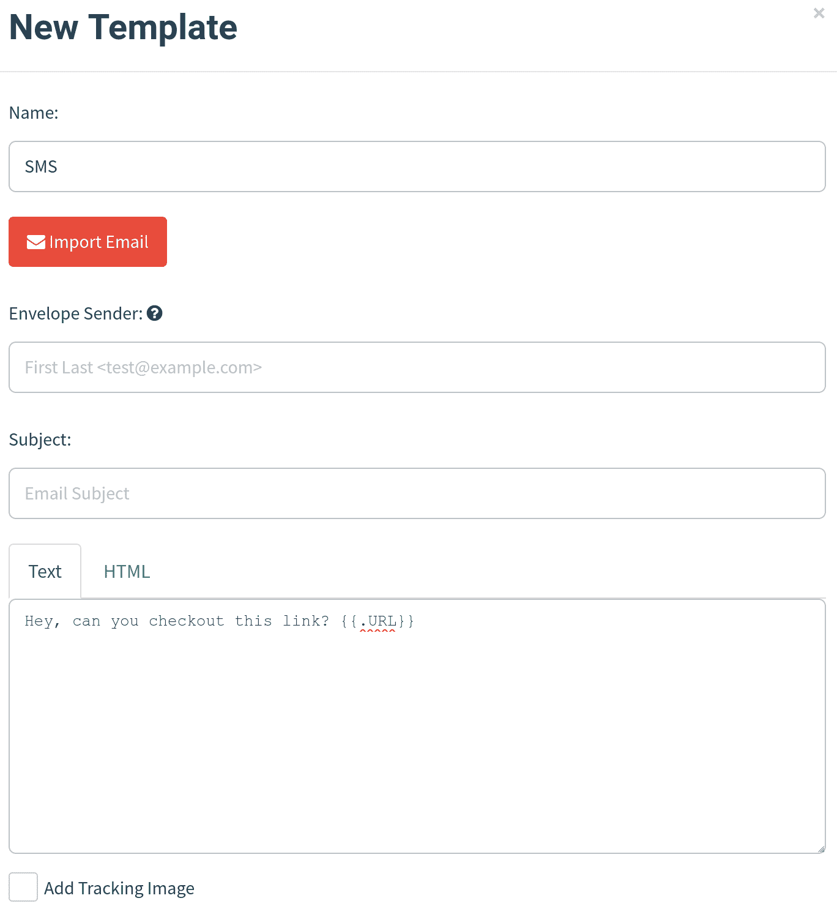
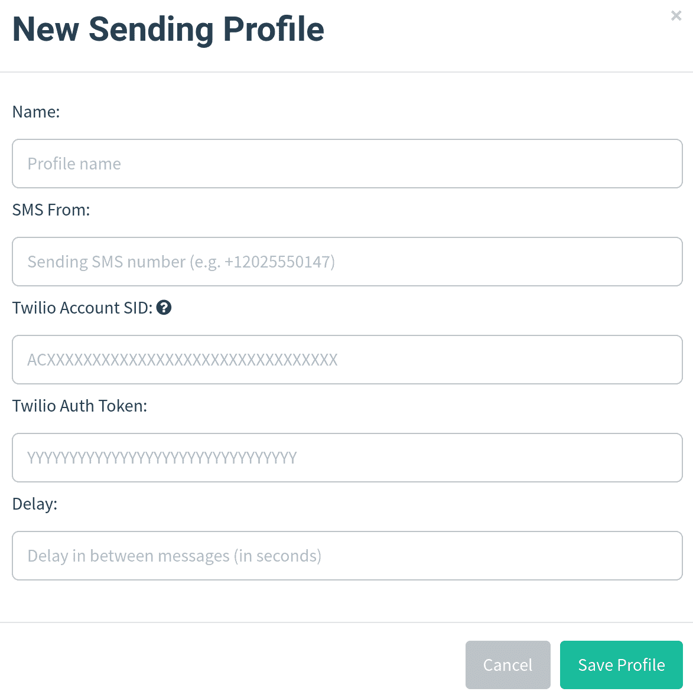
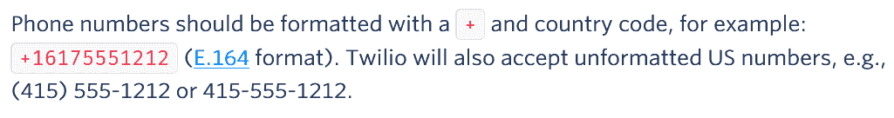
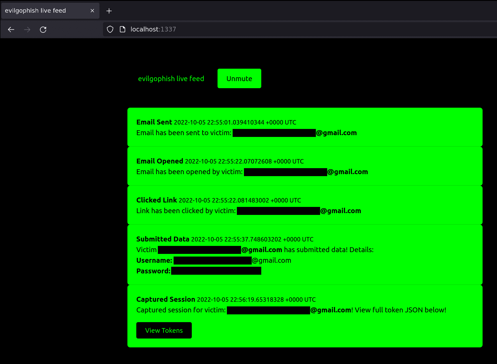

# Evilgophish : Evilginx2 + Gophish

> 原文：<https://kalilinuxtutorials.com/evilgophish-2/>

[](https://blogger.googleusercontent.com/img/b/R29vZ2xl/AVvXsEgayLnJjpxBqvfUXyKHifnFI_Ehqrigof5rGcVLjabQzuhsTJlDHZPjj2gabw-G8JhBIeNWiWcOepWigH3xDhsntRaAJ5UH5dObNPjW4mBZXph4ry8uT4m6dRFUb4MHnqBdkwpVM1T8MxrVUuZ0gfOphqLqikw8QnAFGMyN44FLZKrRsOjOVvjYtFT8/s728/evilgophish3.png)

[evilginx2](https://github.com/kgretzky/evilginx2) 和 [GoPhish](https://github.com/gophish/gophish) 的组合。

## 先决条件

你应该对如何使用`GoPhish`、`evilginx2`和`Apache2`有一个基本的了解。

## 免责声明

我将不对本软件的任何误用或非法使用负责。本软件仅用于授权渗透测试或红队项目，在这些项目中，操作员已获得明确的书面许可来执行社会工程。

## 为什么？

作为渗透测试人员或 red teamer，您可能听说过作为能够绕过`two-factor/multi-factor authentication`的代理中间人框架的`evilginx2`。退一步说，这很吸引我们，但是当试图将它用于社会工程项目时，会有一些问题。我将强调这个项目已经解决的两个主要问题，尽管在这个版本中已经修复了一些其他的错误，我将在后面强调。

1.  缺乏跟踪-`evilginx2`不提供每个受害者的唯一跟踪统计数据(例如，打开的电子邮件、点击的链接等)。)，这对于在注册社会工程参与时想要/需要/支付这些统计数据的客户来说是有问题的。
2.  使用 NAT 和代理覆盖会话–`evilginx2`基于远程 IP 地址的大量逻辑，并在受害者触发引诱路径后将 IP 列入白名单 10 分钟。如果再次触发 lure 路径(如果仍在 10 分钟窗口内)，则`evilginx2`将跳过为该 ip 地址创建新会话。如果我们的受害者都在防火墙后面，共享同一个公共 IP 地址，这就给我们带来了问题，因为`evilginx2`内的同一个会话将继续用多个受害者的数据覆盖，导致错过和丢失数据。这也给我们的代理设置带来了问题，因为`localhost`是请求`evilginx2`的唯一 IP 地址。

## 背景

在此设置中，`GoPhish`用于发送电子邮件并为`evilginx2`活动统计数据提供一个仪表板，但它不用于任何登录页面。您从`GoPhish`发送的钓鱼链接将指向一个`evilginx2`引诱路径，而`evilginx2`将被用于登陆页面。这提供了用`evilginx2`绕过`2FA/MFA`的能力，而不会丢失那些宝贵的数据。`Apache2`只是用作本地`evilginx2`服务器的代理和网络钓鱼基础设施的额外加固层。我开发的本地 websocket/http 服务器提供了实时活动事件通知，包含来自`evilginx2`的令牌/cookie 的完整可用的`JSON`字符串直接显示在`GoPhish` GUI(和 feed)中:



**基础设施布局**



*   `evilginx2`将在本地监听端口`8443`
*   `GoPhish`将在本地监听端口`8080`和`3333`
*   `Apache2`将从外部监听端口`443`并代理到本地`evilginx2`服务器
    *   将根据重定向规则和 IP 黑名单配置在`Apache2`层过滤请求
        *   如果一个请求命中`evilginx2`服务器，针对未授权请求的重定向功能仍然被嵌入到`evilginx2`中

## setup.sh

`setup.sh`为您自动完成所需的配置。一旦运行了这个脚本，并且输入了正确的值，就应该准备开始了。下面是设置帮助(注意，证书设置是基于`letsencrypt`文件名):

```
Usage:
./setup <root domain> <subdomain(s)> <root domain bool> <redirect url> <feed bool> <rid replacement> <blacklist bool>
 - root domain                     - the root domain to be used for the campaign
 - subdomains                      - a space separated list of evilginx2 subdomains, can be one if only one
 - root domain bool                - true or false to proxy root domain to evilginx2
 - redirect url                    - URL to redirect unauthorized Apache requests
 - feed bool                       - true or false if you plan to use the live feed
 - rid replacement                 - replace the gophish default "rid" in phishing URLs with this value
 - blacklist bool                  - true or false to use Apache blacklist
Example:
  ./setup.sh example.com "accounts myaccount" false https://redirect.com/ true user_id false

```

重定向规则已被包括在内，以防止不必要的访问者访问网络钓鱼服务器和 IP 黑名单。黑名单包含 ProofPoint、Microsoft、TrendMicro 等拥有的 IP 地址/阻止。重定向规则将重定向已知的*“错误的”*远程主机名以及用户代理字符串。

## replace_rid.sh

如果您运行了一次`setup.sh`，并且已经在整个项目中替换了默认的`RId`值，那么就会创建`replace_rid.sh`来再次替换`RId`值。

```
Usage:
./replace_rid <previous rid> <new rid>
 - previous rid      - the previous rid value that was replaced
 - new rid           - the new rid value to replace the previous
Example:
  ./replace_rid.sh user_id client_id

```

## 电子邮件活动设置

运行`setup.sh`后，接下来的步骤是:

1.  启动`GoPhish`并配置电子邮件模板、电子邮件发送模式和群组
2.  启动`evilginx2`并配置 phishlet 和 lure(必须用`-g`标志指定`GoPhish` `sqlite3`数据库的完整路径)
3.  确保`Apache2`服务器已启动
4.  从`GoPhish`发起活动，让登陆网址成为`evilginx2`钓鱼网站的诱饵
5.  **利润**

## 短信活动设置

为了给`SMS`提供与`Twilio`的战役支持，对`GoPhish`进行了整体改造。您的新`evilgophish`仪表盘将如下所示:



运行`setup.sh`后，接下来的步骤是:

1.  配置`SMS`消息模板。您将仅在创建`SMS`消息模板时使用`Text`，并且您不应该包含跟踪链接，因为它将出现在`SMS`消息中。如下图所示，将`Envelope Sender`和`Subject`留空:



配置`SMS Sending Profile`。从`Twilio`、`Account SID`、`Auth Token`输入您的电话号码，并在信息之间延迟进入`SMS Sending Profiles`页面:



导入组。为了兼容性，`CSV`模板值保持不变，因此保持`CSV`列名称不变，并将您的目标电话号码放入`Email`列。请注意，`Twilio`接受以下电话号码格式，因此它们必须是以下三种格式之一:



4.  启动`evilginx2`并配置 phishlet 和 lure(必须用`-g`标志指定`GoPhish` `sqlite3`数据库的完整路径)
5.  确保`Apache2`服务器已启动
6.  从`GoPhish`发起活动，让登陆网址成为`evilginx2`钓鱼网站的诱饵
7.  **利润**

## 实时馈送设置

实时活动事件通知由本地 websocket/http 服务器和 live feed 应用程序处理。要进行设置:

1.  运行`setup.sh`时`feed bool`选择`true`
2.  `cd`进入`evilfeed`目录，用`./evilfeed`启动 app
3.  启动`evilginx2`时，提供`-feed`标志以启用进给。例如:

`./evilginx2 -feed -g /opt/evilgophish/gophish/gophish.db`

4.  您可以在:`http://localhost:1337/`开始观看直播。提要仪表盘如下所示:



**重要提示**

*   live feed 页面为带有`JavaScript`的事件挂接一个 websocket，你**不需要**刷新页面。如果你刷新页面，你将**丢失**到那时为止的所有事件。

## 小册子惊喜

在`evilginx2/phishlets`文件夹中有三个定制的小册子，不在 [evilginx2](https://github.com/kgretzky/evilginx2) 中。

1.  `o3652`–原始`o365`的修改/更新版本(从 [Optiv 博客](https://www.optiv.com/insights/source-zero/blog/spear-phishing-modern-platforms)中窃取)
2.  `google`–根据之前的在线示例更新(发布后出现问题，请勿在活动中使用)
3.  `knowbe4`–定制

## 关于小册子的一句话

我觉得这个世界最近缺少一些好的例子。如果这个存储库能够成为最新小册子的中央存储库，那就太好了。请在`fin3ss3g0d@pm.me`将您的小册子发送给我，以便有机会在`evilginx2/phishlets`结束。如果你提供优质的工作，我会创建一个`Phishlets Hall of Fame`，你将被添加到它。

## 关于活动测试和跟踪的说明

在活动开始前测试跟踪并不罕见，我鼓励你这样做，我只是给你一个警告。`evilginx2`将创建一个 cookie，并为每个新受害者的浏览器建立一个会话。如果您继续在同一浏览器中测试多个活动和多个网络钓鱼链接，您将会混淆跟踪过程，因为`RId`值是从请求中解析出来的，并在新会话开始时设置。如果你这样做，你并没有真正地模拟受害者，因为受害者除了他们自己的链接之外，永远不会访问其他的网络钓鱼链接，不用说，这种情况在真实的活动中永远不会发生。这是为了警告您不要为此打开问题，因为您没有按照预期的方式使用该工具。如果你想模拟一个新的受害者，你可以在匿名模式下使用新的浏览器/标签来测试跟踪过程。

## 关于黑名单和跟踪的说明

黑名单现在是可选的。如果您决定使用它，它可能会导致一些客户端被阻止，并中断跟踪过程。原因是组织可能会通过代理请求链接，而这些链接落入被阻止的范围。由您来执行测试活动，并验证是否有任何阻止将中断您的活动跟踪。被阻止的客户端将收到一个`403 Forbidden`错误。`/var/log/apache2/access_evilginx2.log*`可查看访问钓鱼服务器的远程 IP 地址。您可以删除`/etc/apache2/blacklist.conf`文件中导致跟踪问题的条目，并重新启动 Apache。或者您可以删除`/etc/apache2/sites-enabled/000-default.conf`文件中的`Location`块，并重启 Apache 来完全删除 IP 黑名单。用户还报告了将`evilginx2`的内置`blacklist`功能设置为`unauth`的问题。

## 对 evilginx2 的更改

1.  删除了所有 IP 白名单功能，为每个新访问者建立了新的代理会话，无论远程 IP 如何都会触发诱惑路径
2.  修复了网页仿冒者无法从`JSON`请求中提取凭证的问题
3.  更多的*“错误的”*标题已从响应中删除
4.  添加了检查是否无法从响应中检索到`mime`类型的逻辑
5.  在整个代码中，所有与`evilginx2`相关的`X`头都被删除了(为了删除 IOCs)
6.  添加的网页小册子

## GoPhish 的变化

1.  在整个代码中，所有与`GoPhish`相关的`X`头都被删除了(为了删除 IOCs)
2.  网络钓鱼 URL 中的默认`rid`字符串由运营商在`setup.sh`中选择
3.  添加了`SMS`活动支持

## 变更日志

参见`CHANGELOG.md`文件，了解自最初发布以来所做的更改。

## 问题和支持

我主要是寻找代码中的合法错误或增强机会，而不是在您的设置过程中作为个人服务台支持。您应该了解建立社会工程活动的先决条件，包括如何使用和设置此工具的`Apache`、`DNS`、SSL 证书、`evilginx2`、`gophish`和代理。也就是说，属于这些类别的问题将被关闭。我采取与库巴格雷茨基相同的立场，不会帮助制作小册子。有大量的工作网页快讯的例子，你可以创建自己的网页快讯，如果你为网页快讯打开一个问题，它将被关闭。不过我*会*随意维护*某些*小册子(见[关于小册子](https://github.com/fin3ss3g0d/evilgophish#a-word-about-phishlets)的一句话)。我要郑重声明，这个项目的跟踪工作如广告所说，如果没有，这是在`setup.sh`期间配置错误的结果，或者你在同一个浏览器会话中访问了多个`RId`，混淆了工具。不要为此打开问题，否则它将被关闭(参见[关于活动测试和跟踪的说明](https://github.com/fin3ss3g0d/evilgophish#a-note-about-campaign-testing-and-tracking))。如果您提出一个问题，请提供关于该问题的尽可能详细的信息，包括与该问题相关的输出。缺少细节或输出的问题将被关闭。

[Click Here To Download](https://github.com/fin3ss3g0d/evilgophish)