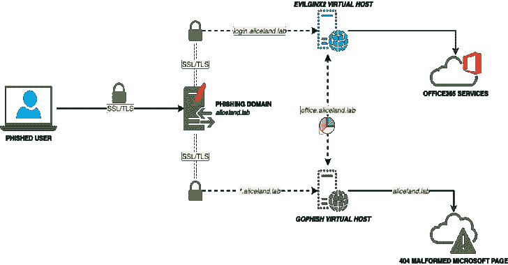

# evilgophish:evilginx 2 和 gophish 的组合

> 原文：<https://kalilinuxtutorials.com/evilgophish/>

.png)

**evilgophish** 是 Evilginx2 和 gophish 的组合

作为渗透测试人员或 red teamer，您可能听说过作为能够绕过`**two-factor/multi-factor authentication**`的代理中间人框架的`**evilginx2**`。退一步说，这很吸引我们，但是当试图将它用于社会工程项目时，会有一些问题。我将强调这个项目已经解决的两个主要问题，尽管在这个版本中已经修复了一些其他的错误，我将在后面强调。

*   缺乏跟踪-`**evilginx2**`不提供每个受害者的唯一跟踪统计数据(例如，打开的电子邮件、点击的链接等)。)，这对于在注册社会工程参与时想要/需要/支付这些统计数据的客户来说是有问题的。
*   使用 NAT 和代理覆盖会话–`**evilginx2**`基于远程 IP 地址的大量逻辑，并在受害者触发引诱路径后将 IP 列入白名单 10 分钟。如果再次触发 lure 路径(如果仍在 10 分钟窗口内)，则`**evilginx2**`将跳过为该 ip 地址创建新会话。如果我们的受害者都在防火墙后面，共享同一个公共 IP 地址，这就给我们带来了问题，因为`**evilginx2**`内的同一个会话将继续用多个受害者的数据覆盖，导致错过和丢失数据。这也给我们的代理设置带来了问题，因为`**localhost**`是请求 **`evilginx2`的唯一 IP 地址。**

## 背景

这个项目是基于这个博客，我鼓励你在开始之前阅读它。在此设置中，`**GoPhish**`用于发送电子邮件、跟踪打开的电子邮件，并为`**evilginx2**`活动统计数据提供仪表板，但它不用于任何登录页面。为了提供两者之间的跟踪，负责在`**GoPhish**`内部提供活动结果的功能已经修改，改为从与`**evilginx2**`相关的日志中获取点击链接事件详情和提交数据事件详情。您从`**GoPhish**`发送的钓鱼链接将指向一个`**evilginx2**`引诱路径，而`**evilginx2**`将用于登陆页面。这提供了仍然用`**evilginx2**`绕过`**2FA/MFA**`的能力，而不会丢失那些宝贵的统计数据。操作员还将被实时告知提交的数据事件。这将确保操作员不会耗尽使用捕获的 cookies 的时间，或者至少尽快得到通知。操作员仍然需要跳转到`**evilginx2**`终端来获取完整的`**JSON**`捕获令牌/cookie 字符串。

## 基础设施布局

*   `**evilginx2**`将在本地监听端口`**8443**`
*   `**GoPhish**`将在本地监听端口`**8080**`
*   `**Apache2**`将从外部监听端口`**443**`,并根据请求的子域名代理到本地`**GoPhish/evilginx2**`。`**Apache2**`为两个`**GoPhish/evilginx2**`服务器创建访问日志文件
    *   将根据重定向规则和 IP 黑名单配置在`**Apache2**`层过滤请求
        *   如果一个请求命中`**GoPhish**`服务器，未授权请求的功能仍然被嵌入到`**GoPhish**`中
        *   如果一个请求命中`**evilginx2**`服务器，针对未授权请求的重定向功能仍然被嵌入到`**evilginx2**`中

## setup.sh

假设您已经阅读了博客并理解了设置是如何工作的，`**setup.sh**`已经为您提供了所需的自动化配置。一旦运行了这个脚本，并且输入了正确的值，就应该准备开始了。下面是设置帮助(注意，证书设置是基于`**letsencrypt**`文件名):

**用法:
setup
根域–用于活动的根域
eviginx 2 子域–eviginx 2 子域的空格分隔列表，可以是一个如果只有一个
eviginx 2 根域 bool–对或错将根域代理到 eviginx 2
gophish 子域–gophish 子域的空格分隔列表， 可以是一个(如果只有一个)
gophish 根域 bool–true 或 false 将根域代理到 gophish
重定向 url–URL 以重定向未授权的 Apache 请求
推送消息 bool–true 或 false 以将推送消息设置到加密通道
rid 替换–用此值替换网络钓鱼 URL 中的 gophish 默认“rid”
示例:
。 /setup . sh example.com 登录假“下载 www”假 https://redirect.com/真 user_id**

重定向规则已被包括在内，以防止不必要的访问者访问网络钓鱼服务器和 IP 黑名单。黑名单包含 ProofPoint、Microsoft、TrendMicro 等拥有的 IP 地址/阻止。重定向规则将重定向已知的*“错误的”*远程主机名以及用户代理字符串。

## replace_rid.sh

如果您运行了一次`**setup.sh**`，并且已经在整个项目中替换了默认的`**RId**`值，则创建 **`replace_rid.sh`** 来再次替换`**RId**`值。

**用法:
replace _ rid
previous rid–被替换的前一个 rid 值
new rid–替换前一个
的新 rid 值示例:
replace _ rid . sh user _ id client _ id**

## 电子邮件活动设置

运行`**setup.sh**`后，接下来的步骤是:

*   在启动`**GoPhish**`之前，确保`**evilginx2**`的`**Apache2**`日志文件存在(启动`**Apache2**`会自动执行此操作)
*   启动`**GoPhish**`并配置电子邮件模板(参见下面关于电子邮件打开跟踪的注释)、电子邮件发送配置文件、虚假登录页面和群组
*   启动`**evilginx2**`并配置钓鱼和诱饵
*   确保`**Apache2**`服务器已启动
*   从 **`GoPhish`** 发起战役，将登陆网址作为`**evilginx2**`钓鱼者的引诱路径
*   **利润**

[**Download**](https://github.com/fin3ss3g0d/evilgophish#setupsh)