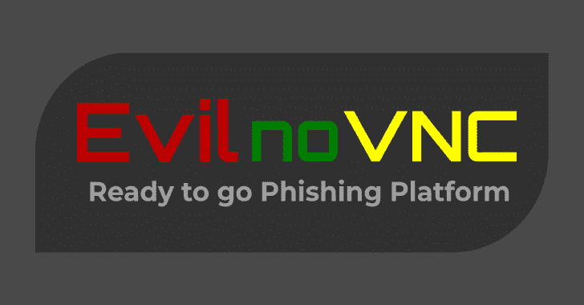

# evinnovc–随时可用的网络钓鱼平台

> 原文：<https://kalilinuxtutorials.com/evilnovnc/>

[](https://blogger.googleusercontent.com/img/b/R29vZ2xl/AVvXsEhexz-mxz3vDnKP96iHXd0NMEwp1_5uJZ4S7wiwOB8iweK1EcJFKhjTC1OrztPsTRTMNp1i_cpRiWS6gV39Hn_E-ytrfmBZPsu_jKy7W2eZU47HPk9yNl3lZ6UQN1X0CXS2ZyZN4HyK6wMKWu8R92oTM4DW8kV3x8f9zv8Kk4vP1gCnE6ooLgWyTJ2f/s728/EvilnoVNC.png)

evinnovnc 是一个现成的网络钓鱼平台。与其他网络钓鱼技术不同，EvilnoVNC 允许通过在 noVNC 连接上使用真正的浏览器来绕过 2FA。

此外，该工具允许我们实时查看受害者的所有操作、对其下载文件的访问以及整个浏览器配置文件，包括 cookies、保存的密码、浏览历史记录等等。

## **要求**

*   码头铬
*   [计] 下载

建议克隆完整的存储库或下载 zip 文件。另外，手工构建 Docker 是必要的。您可以通过运行以下命令来实现这一点:

git 克隆 https://github . com/jolgmsec/evilnovnc
evilnovnc 光盘；sudo chown -R 103 下载
sudo dock build-t jolgmsec/evilnovnc。

## **用途**

```
./start.sh -h

  _____       _ _          __     ___   _  ____ 
 | ____|_   _(_) |_ __   __\ \   / / \ | |/ ___|
 |  _| \ \ / / | | '_ \ / _ \ \ / /|  \| | |    
 | |___ \ V /| | | | | | (_) \ V / | |\  | |___ 
 |_____| \_/ |_|_|_| |_|\___/ \_/  |_| \_|\____| 

  ---------------- by @JoelGMSec --------------

Usage: ./start.sh $resolution $url

Examples:
        1280x720  16bits: ./start.sh 1280x720x16 http://example.com
        1280x720  24bits: ./start.sh 1280x720x24 http://example.com
        1920x1080 16bits: ./start.sh 1920x1080x16 http://example.com
        1920x1080 24bits: ./start.sh 1920x1080x24 http://example.com
```

## 功能和待办事项

*   将 Evil-Chromium 配置文件导出到主机
*   将下载文件保存在主机上
*   禁用 URL 中的参数(如密码)
*   禁用组合键(如 Alt+1 或 Ctrl+S)
*   禁止访问 Thunar
*   实时解密 cookies
*   将 cookie life 扩展到 99999999999999999
*   来自原始网站的动态标题
*   预加载页面的动态解析
*   复制真实的用户代理和其他东西
*   基本键盘记录器

[Click Here To Download](https://github.com/JoelGMSec/EvilnoVNC)