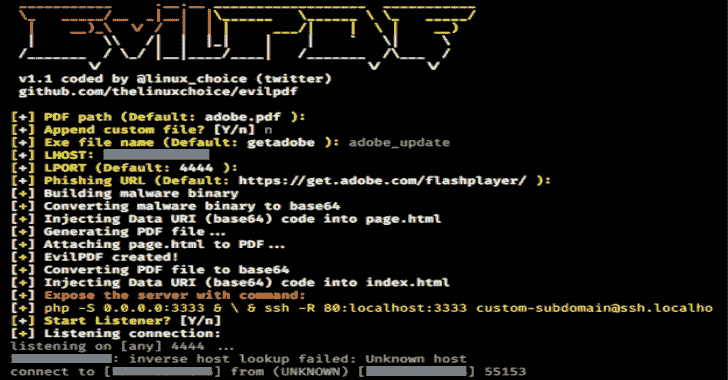

# EVI PDF–在 PDF 文档中嵌入可执行文件

> 原文：<https://kalilinuxtutorials.com/evilpdf/>

**EVI PDF**是一个隐藏在 PDF 文档中的可执行文件。

**用途**

**git 克隆 https://github.com/thelinuxchoice/evilpdf
CD evil pdf
python-m pip 安装 pypdf2
python evilpdf.py**

**免责声明**

未经双方同意，使用 EvilPDF 攻击目标是非法的。最终用户有责任遵守所有适用的地方、州和联邦法律。开发人员不承担任何责任，也不对本程序造成的任何误用或损坏负责。

[**Download**](https://github.com/thelinuxchoice/evilpdf)