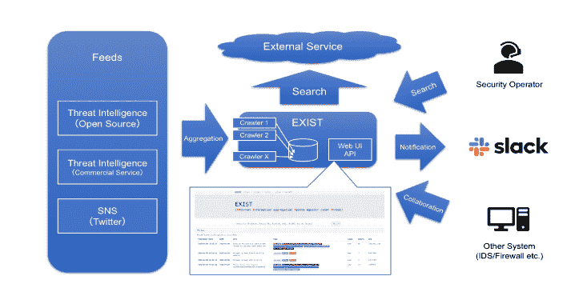
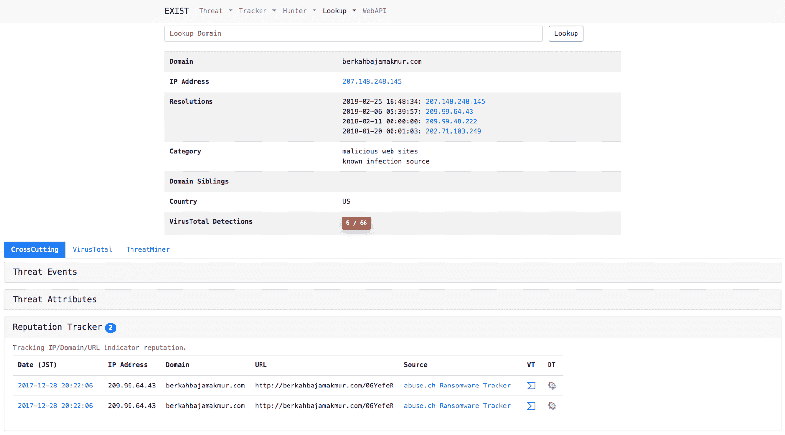
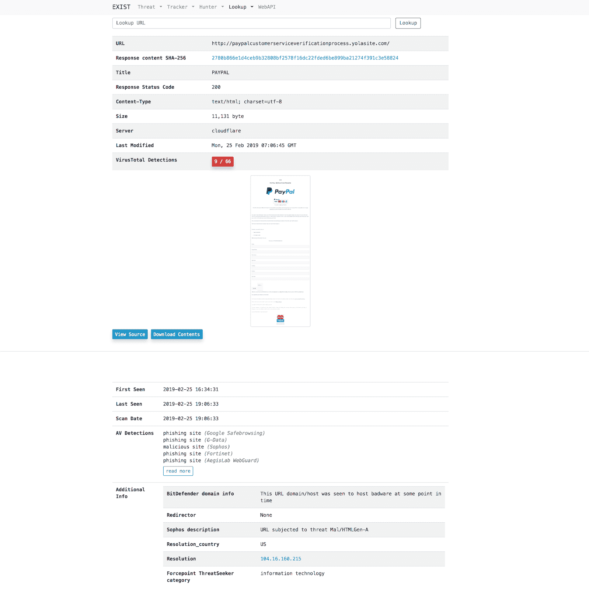

# Exist:用于收集和分析网络威胁情报的 Web 应用程序

> 原文：<https://kalilinuxtutorials.com/exist-web-app-aggregating-analyzing-cyber-threat-intelligence/>

[](https://1.bp.blogspot.com/-ObReKb8bKBA/XfdrKCBeOHI/AAAAAAAAD-w/fYyfcan_mRkumYyjb462QitY096V2AgqQCLcBGAsYHQ/s1600/EXIST-1%25281%2529.png)

**EXIST** 是一个用于聚合和分析 CTI(网络威胁情报)的 web 应用。它是由以下软件编写的。

*   Python 3.5.4
*   2022 年 11 月 1 日姜戈

它通过 API 和 feeds 自动从几个 CTI 服务和 Twitter 获取数据。您可以通过 web 界面和 API 交叉搜索指标。

如果您有记录客户端网络行为的服务器(例如，DNS 和 HTTP 代理服务器的日志等。)，您将能够通过关联 EXIST 上的数据来分析日志。如果使用 API 实现一些程序，就可以实现自动化的 CTI 驱动的安全运营中心。

**也可理解为—[RTTM:实时威胁监控工具](https://kalilinuxtutorials.com/rttm/)**

**用例**

***情况 1:调查 IDS* 检测到的域**

只需在搜索表单中输入域名。



***第二种情况:代表用户访问恶意网址，获取浏览器的显示图像和要下载的内容***

只需在搜索表单中键入 url。



***情况 3:监控网络威胁***

只需在威胁猎人或 Twitter 猎人中添加关键字。


**特性**

**追踪器**

Tracker 自动收集来自多个 CTI 服务的数据。

*   威胁跟踪器
*   声誉跟踪者
*   推特追踪器
*   漏洞跟踪器
*   新闻追踪
*   Vuln 跟踪器

**猎人**

Hunter 使我们能够设置从几个 CTI 服务和 Twitter 收集数据的查询。

*   推特猎人
*   威胁猎人
*   新闻猎人

**查找**

Lookup 从多个互联网服务(如 whois)中检索与特定信息(如 IP 地址、域名)相关的信息。

*   IP 地址；网络地址
*   领域
*   统一资源定位器
*   文件散列

**Web API**

通过 Web API 提供存储在现有数据库中的数据。

*   名声
*   推特
*   剥削
*   威胁事件
*   威胁属性
*   新闻
*   损伤

**入门**

之后，我假设 CentOS 7 或 Ubuntu 18.04 LTS 的环境。部署到其他环境时，请自行决定。

**安装 python 模块**

**$ sudo pip 安装要求. txt**

**安装 MariaDB**

*   CentOS 7

**$ curl-sS https://downloads.mariadb.com/MariaDB/mariadb_repo_setup | sudo bash
$ sudo yum 安装 Maria db-server Maria db-client**

*   Ubuntu 18.04 lt

**$ sudo 安装 Maria db-服务器 Maria db-客户端**

**运行数据库**

**$ sudo systemctl 启动 mariadb
$ sudo systemctl 启用 mariadb**

**数据库设置**

*   创建数据库和用户。
*   参照[intelligence/settings.py . template](https://github.com/nict-csl/exist/blob/master/intelligence/settings.py.template)创建 intelligence/settings . py。并根据您的数据库设置进行编辑。

**迁移数据库**

**$ python manage . py make migrations 利用声誉威胁 threat _ hunter Twitter _ hunter news news _ hunter vuln
$ python manage . py migrate**

安装重定向服务器

信誉跟踪者使用 redis 作为芹菜缓存服务器后端。

*   CentOS 7

**$ sudo yum install redis
$ sudo system CTL start redis
$ sudo system CTL enable redis**

*   Ubuntu 18.04 lt

**$ sudo apt install redis-server
$ sudo system CTL start redis-server
$ sudo system CTL enable redis-server**

**设置芹菜**

信誉跟踪程序使用 Celery 作为异步任务作业队列。

*   创建芹菜配置。我建议在以下路径上设置配置:
    *   **CentOS 7:/etc/sys config/celery**
    *   **Ubuntu 18.04 LTS:/etc/celery . conf**

```
# Name of nodes to start
# here we have a single node
CELERYD_NODES="w1"
# or we could have three nodes:
#CELERYD_NODES="w1 w2 w3"

# Absolute or relative path to the 'celery' command:
CELERY_BIN="/path/to/your/celery"

# App instance to use
# comment out this line if you don't use an app
CELERY_APP="intelligence"
# or fully qualified:
#CELERY_APP="proj.tasks:app"

# How to call manage.py
CELERYD_MULTI="multi"

# Extra command-line arguments to the worker
CELERYD_OPTS="--time-limit=300 --concurrency=8"

# - %n will be replaced with the first part of the nodename.
# - %I will be replaced with the current child process index
# and is important when using the prefork pool to avoid race conditions.
CELERYD_PID_FILE="/var/run/celery/%n.pid"
CELERYD_LOG_FILE="/var/log/celery/%n%I.log"
CELERYD_LOG_LEVEL="INFO" 
```

*   在`/etc/systemd/system/celery.service`上创建一个芹菜服务管理脚本。另外，您必须将芹菜配置路径设置为`EnvironmentFile`。

```
[Unit]
Description=Celery Service
After=network.target

[Service]
Type=forking
User=YOUR_USER
Group=YOUR_GROUP
EnvironmentFile=/etc/sysconfig/celery
WorkingDirectory=/path/to/your/exist
ExecStart=/bin/sh -c '${CELERY_BIN} multi start ${CELERYD_NODES} \
-A ${CELERY_APP} --pidfile=${CELERYD_PID_FILE} \
--logfile=${CELERYD_LOG_FILE} --loglevel=${CELERYD_LOG_LEVEL} ${CELERYD_OPTS}'
ExecStop=/bin/sh -c '${CELERY_BIN} multi stopwait ${CELERYD_NODES} \
--pidfile=${CELERYD_PID_FILE}'
ExecReload=/bin/sh -c '${CELERY_BIN} multi restart ${CELERYD_NODES} \
-A ${CELERY_APP} --pidfile=${CELERYD_PID_FILE} \
--logfile=${CELERYD_LOG_FILE} --loglevel=${CELERYD_LOG_LEVEL} ${CELERYD_OPTS}'

[Install]
WantedBy=multi-user.target 
```

*   创建芹菜日志和运行目录。

**$ sudo mkdir/var/log/celery；sudo chown YOUR _ USER:YOUR _ GROUP/var/log/celery
$ sudo mkdir/var/run/celery；sudo chown YOUR _ USER:YOUR _ GROUP/var/run/celery**

*   在/etc/tmpfiles.d/exist.conf 中创建一个配置文件

**# Type Path Mode UID GID Age Argument**
d/var/run/celery 0755 YOUR _ USER YOUR _ GROUP——

*   运行芹菜

**$ sudo systemctl 启动芹菜.服务
$ sudo systemctl 启用芹菜.服务**

**运行网络服务器**

**$ python manage . py runserver 0 . 0 . 0 . 0:8000**

*   用浏览器访问 http://[YourWebServer]:8000。
*   WebAPI:http://[your web server]:8000/API/

> **注意:**我推荐在生产环境下运行时使用 Nginx 和 uWSGI。

**收集饲料**

将 feed 插入数据库的脚本是[scripts/insert 2 db](https://github.com/nict-csl/exist/blob/master/scripts/insert2db)/*/insert 2 db . py。

**配置 insert2db**

*   配置文件为[scripts/insert 2db/conf](https://github.com/nict-csl/exist/blob/master/scripts/insert2db/conf)/insert 2db . conf，参照 insert2db.conf.template 创建。
*   如果使用 [MISP](https://www.misp-project.org/) ，编写 MISP URL 和 API 密匙到 insert2db.conf
*   如果您使用 [Malshare](https://malshare.com/) ，请将您的 API 密钥写入 insert2db.conf。
*   在[https://developer.twitter.com/](https://developer.twitter.com/)创建您的 Twitter API 帐户，以便使用 EXIST 进行跟踪。
*   为 EXIST 创建应用程序。
*   获取消费者 API 密钥(CA)、消费者 API 秘密密钥(CS)、访问令牌(AT)、访问令牌秘密(AS)。
*   将 CA，CS，AT，AS 写成 insert2db.conf。

**运行脚本**

**$ python scripts/insert 2db/reputation/insert 2db . py
$ python scripts/insert 2db/Twitter/insert 2db . py
$ python scripts/insert 2db/exploit/insert 2db . py
$ python scripts/insert 2db/threat/insert 2db . py
$ python scripts/insert 2db/news/insert 2db . py
$ python scripts/insert 2db/vuln/insert 2db . py**

> **注意:**要自动收集信息，请将它们写入您的 cron。

**设定猎人**

**推特猎手**

Twitter Hunter 可以检测包含特定关键字和用户 ID 的推文。如果有必要，您可以通知 slack。

*   配置文件为[scripts/hunter/conf](https://github.com/nict-csl/exist/blob/master/scripts/hunter/conf)/hunter . conf，参照 hunter.conf.template 创建。
*   如果使用 slack，将 slack 令牌写入 hunter.conf。
*   在[https://developer.twitter.com/](https://developer.twitter.com/)创建你的 Twitter API 账户。
*   为 EXIST 创建 18 个应用程序。
*   获取 18 个消费者 API 密钥(CA)、消费者 API 秘密密钥(CS)、访问令牌(AT)、访问令牌秘密(AS)。
*   将 CA，CS，AT，AS 写入 auth-hunter[00-18]到 hunter.conf。
*   使用 cron 让[脚本/Hunter/Twitter](https://github.com/nict-csl/exist/blob/master/scripts/hunter/twitter)/tw _ watch Hunter . py 每分钟运行一次，让 Twitter Hunter 持久化。

**威胁猎人**

Threat Hunter 可以检测包含特定关键字的威胁事件。如果有必要，您可以通知 slack。

*   配置文件为[scripts/hunter/conf](https://github.com/nict-csl/exist/blob/master/scripts/hunter/conf)/hunter . conf，参照 hunter.conf.template 创建。
*   如果使用 slack，将 slack 令牌写入 hunter.conf。
*   使用 cron 让[脚本/猎人/威胁](https://github.com/nict-csl/exist/blob/master/scripts/hunter/threat) /th_watchhunter.py 每分钟运行一次，让威胁猎人持久化。

**其他需求工具&设置**

**VirusTotal API**

现有使用 [VirusTotal API](https://www.virustotal.com/ja/documentation/public-api/) 。

*   创建您的 VirusTotal 帐户。
*   将您的 API-key 写入 conf/vt.conf。

> 注意:如果你有私有的 API 密匙，你会得到更多的信息。

**地理信息数据库**

查找 IP /域使用 [GeoLite2 数据库](https://dev.maxmind.com/geoip/geoip2/geolite2/)。

*   从[http://geolite . maxmind . com/download/GeoIP/database/geolite 2-city . MMDB . gz](http://geolite.maxmind.com/download/geoip/database/GeoLite2-City.mmdb.gz)下载 GeoIP DB
*   在 conf/geoip.conf 中写入 GeoLite2-City.mmdb 的路径。

**wkhtmltopdf 和 Xvfb**

查找 URL 使用 [wkhtmltopdf](https://wkhtmltopdf.org/) 和 Xvfb。

*   从[https://wkhtmltopdf.org/downloads.html](https://wkhtmltopdf.org/downloads.html)下载并安装 wkhtmltopdf
*   安装 Xvfb。

**$ sudo yum 安装 xorg-x11-server-Xvfb**

如果你在 Ubuntu 18.04 LTS 上部署 EXIST，你可以使用 apt 来安装这些包。

**$ sudo 安装 wkhtmltopdf xvfb**

**刷新旧数据**

*   配置文件为[脚本/url](https://github.com/nict-csl/exist/blob/master/scripts/url) /url.conf，参照 url.conf.template 创建。
*   让[脚本/url](https://github.com/nict-csl/exist/blob/master/scripts/url) /delete_webdata.sh 每天运行，使用 cron 刷新旧的查找 url 数据。
*   让[脚本/URL](https://github.com/nict-csl/exist/blob/master/scripts/url)/delete _ oldtaskresult . sh 每天运行，使用 cron 刷新旧的芹菜数据。

**信用:MaxMind**

[**Download**](https://github.com/nict-csl/exist)