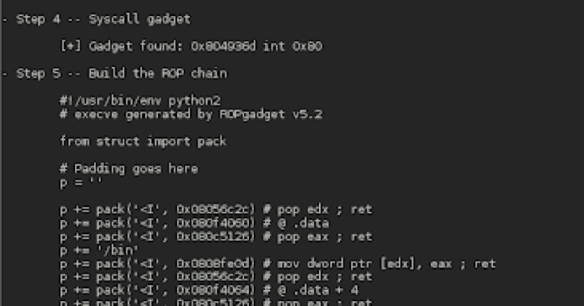

# Exrop:自动 rop 链生成

> 原文：<https://kalilinuxtutorials.com/exrop/>

.png)

Exrop 是一个自动 rop 链生成器工具，它可以根据给定的二进制和约束自动构建小工具链

要求:Triton，ROPGadget

目前只支持 x86-64！

# 特征

*   处理不返回的小工具(jmp 注册，调用注册)
*   设置寄存器(`r**di=0xxxxxx, rsi=0xxxxxx**`)
*   设置寄存器为寄存器( **`rdi=rax` )**
*   写入内存
*   将字符串/字节写入内存
*   函数调用(`**open('/etc/passwd',0)**`)
*   在函数调用(`**read('rax', bss, 0x100)**`)中传递寄存器
*   避免坏人
*   堆叠旋转( **`Exrop.stack_pivot` )**
*   系统调用(`**Exrop.syscall**`)
*   参见示例

# 装置

*   安装 python(推荐并测试了 3.6 版本)
*   安装 triton(https://triton . quarkslab . com/documentation/doxygen/index . html # Linux _ install _ sec)，确保添加`-**DPYTHON36=on**`作为 cmake 选项
*   安装 ROP gadget(https://github.com/JonathanSalwan/ROPgadget)
*   要安装 exrop，很容易在您的`**.bashrc**`中添加`**export PYTHONPATH=/path/to/exrop:$PYTHONPATH**`(取决于您的 shell)

# 演示

**从 Exrop 导入 ex ROP
ROP = ex ROP("/bin/ls ")
ROP . find _ gadgets(cache = True)
print(" write-regs gadgets:rdi = 0x 41414141，rsi:0x42424242，rdx: 0x43434343，rax:0x4444444，rbx = 0x 45454545 ")
chain = ROP . set _ regs({ ' rdi\ n \ " "
chain = ROP . set _ string({ 0x 41414141:" Hello world！\ n " })
chain . dump()
print(" func-call gadgets 0x 41414141(0x20，0x30，" Hello \ ")"
chain = ROP . func _ call(0x 41414141，(0x 20，0x30，" Hello ")，0x 7 fffff 00)
chain . dum**p()

输出:

**书写规则小工具:rdi=0x41414141，RSI:0x 4244242，RDX:0x 433443，rax:0x44444，rbx = 0x 4545454545
$ RSP+0x 0000:0x 00000060d 0 # pop rbx；ret
$ RSP+0x 0008:0x 0000000044444
$ RSP+0x 0010:0x 000000014852 # mov rax，rbxpop rbxret
$ RSP+0x 0018:0x 0000000000
$ RSP+0x 0020:0x 0000004 ce 5 # pop rdi；ret
$ RSP+0x 0028:0x 00000000414141
$ RSP+0x 0030:0x 000000629 c # pop RSI；ret
$ RSP+0x 0038:0x 00000000424242
$ RSP+0x 0040:0x 0000003 a 62 # pop RDX；ret
$ RSP+0x 0048:0x 000000004344343
$ RSP+0x 0050:0x 00000060d 0 # pop rbx；ret
$ RSP+0x 0058:0x 000000004544545
写-什么地方小工具:[0x 414141]= 0 xdeadbeeff，[0x 4343]= 0x 110011
$ RSP+0x 0000:0x 0000004 ce 5 # pop rdi；ret
$ RSP+0x 0008:0x 000000 deabeeff
$ RSP+0x 0010:0x 000000 d91 f # mov rax，rdiret
$ RSP+0x 0018:0x 0000004 ce 5 # pop rdi；ret；$ RSP+0x 0020:0x 0000000041414139；$ RSP+0x 0028:0x 000000 e 0x FB # mov qword ptr[rdi+8]，raxret
$ RSP+0x 0030:0x 0000004 ce 5 # pop rdi；ret
$ RSP+0x 0038:0x 0000000000110011
$ RSP+0x 0040:0x 000000 d91 f # mov rax，rdiret
$ RSP+0x 0048:0x 0000004 ce 5 # pop rdi；ret
$ RSP+0x 0050:0x 00000000434433 b
$ RSP+0x 0058:0x 000000 e 0x FB # mov qword ptr[rdi+8]，raxret
书写字串小工具 0x 414141 = " hello world！\ n "
$ RSP+0x 0000:0x 0000004 ce 5 # pop rdi；ret
$ RSP+0x 0008:0x 6 f 77206 F6 c6c 6548
$ RSP+0x 0010:0x 000000 d91 f # mov rax，rdiret
$ RSP+0x 0018:0x 0000004 ce 5 # pop rdi；ret【$ RSP+0x 0020:0x 0000000041414139】【RSP+0x 0028:0x 000000 e 0x FB # mov qword ptr[rdi+8]，raxret
$ RSP+0x 0030:0x 0000004 ce 5 # pop rdi；ret
RSP+0x 0038:0x 00000000 a 21646 c 72
RSP+0x 0040:0x 000000 d91 f # mov rax，rdiret
$ RSP+0x 0048:0x 0000004 ce 5 # pop rdi；ret【$ RSP+0x 0050:0x 00000000414141】
$ RSP+0x 0058:0x 000000 e 0x FB # mov qword ptr[rdi+8]，raxret
func-call 小工具 0x 414141(0x 20.0x 30，“hello”)
$ RSP+0x 0000:0x 0000004 ce 5 # pop rdi；ret
$ RSP+0x 0008:0x 0000006 F6 c6c 6548
$ RSP+0x 0010:0x 000000 d91 f # mov rax，rdiret
$ RSP+0x 0018:0x 0000004 ce 5 # pop rdi；ret
$ RSP+0x 0020:0x 000000007 ffffef 8
【RSP+0x 0028:0x 000000 e 0x FB # mov qword ptr[rdi+8]，raxret
$ RSP+0x 0030:0x 0000004 ce 5 # pop rdi；ret
$ RSP+0x 0038:0x 0000000020
$ RSP+0x 0040:0x 000000629 c # pop RSI；ret
$ RSP+0x 0048:0x 0000000030
$ RSP+0x 0050:0x 0000003 a 62 # pop RDX；ret
$ RSP+0x 0058:0x 000000007 fff 00
【RSP+0x 0060:0x 00000014141】
python 3 测试. py 1.48s 用户 0058 系统 97% CPU 1.566 总计**

另一个例子:开放读写小工具！

**从 pwn 导入*
导入时间
从 Exrop 导入 ex ROP
binname = "/lib/x86 _ 64-Linux-GNU/libc . so . 6 "
libc = ELF(binname，checksec = False)
open = libc . symbols[' open ']
read = libc . symbols[' read ']
write = libc . symbols[' write ']
BSS = libc . BSS()
t = t
chain = rop.func_call(read，(' rax '，bss，0x 100))
chain . set _ base _ addr(0x 00007 ffff 79 e 4000)
chain . dump()
print(" write(1，bss，0x 100)")
chain = ROP . func _ call(write，(1，bss，0x 100))
chain . set _ base _ addr(0x 00007 fff 79 e 4000format(time . mktime(time . gmtime())–t))**

输出:

**打开('/etc/passwd '，0)
$ RSP+0x 0000:0x 00007 fff 7a 05 ~ 45 # pop r13；ret；$ RSP+0x 0008:0x 00000000003 EC 860；$ RSP+0x 0010:0x 00007 ffff 7 a 7630 c# xorg EDI，EDI；pop rbxmov rax，rdimm；pop rbppop R12；ret
$ RSP+0x 0018:0x 00007 fff 7a 0555 f
$ RSP+0x 0020:0x 000000
$ RSP+0x 0028:0x 0000000000
$ RSP+0x 0030:0x 00007 fff 7a 06 b8a # mov r9，r13；呼叫 rbx:next->(0x 0002155 f)# pop rdi；ret
$ RSP+0x 0038:0x 00007 fff 7a 0555 f # pop rdi；ret
$ RSP+0x 0040:0x 7361702 f 6374265 f
$ RSP+0x 0048:0x 00007 fff 7b 251 c 7 # mov qword ptr[r9]，rdiret
$ RSP+0x 0050:0x 00007 fff 7a 05 ~ 45 # pop r13；ret
$ RSP+0x 0058:0x 00000000003 EC 868
$ RSP+0x 0060:0x 00007 ffff 7 a 7630 c # xorg EDI，EDI；pop rbxmov rax，rdimm；pop rbppop R12；ret
$ RSP+0x 0068:0x 00007 fff 7a 0555 f
$ RSP+0x 0070:0x 0000000000
$ RSP+0x 0078:0x 0000000000
$ RSP+0x 0080:0x 00007 fff 7a 06 b8 a # mov r9，r13；呼叫 rbx:next->(0x 0002155 f)# pop rdi；ret
$ RSP+0x 0088:0x 00007 fff 7a 0555 f # pop rdi；ret
$ RSP+0x 0090:0x 0000000000647773
$ RSP+0x 0098:0x 00007 ffff 7b 251 c 7 # mov qword ptr[r9]，rdiret
$ RSP+0x 00 a 0:0x 00007 ffff 7 a 62 c 70 # xorg ESI，ESI；mov rax、rsiret
$ RSP+0x 00 a 8:0x 00007 fff 7a 0555 f # pop rdi；ret
$ RSP+0x 00 B0:0x 00000000003 EC 860
$ RSP+0x 00 b8:0x 000000000010 fc 40
读取(' rax '，bss，0x 100)
$ RSP+0x 0000:0x 00007 ffff 7 a 71236 # mov，dh，0x xc 5；pop rbxpop rbppop R12；ret
$ RSP+0x 0008:0x 0000000000
$ RSP+0x 0010:0x 0000000000
$ RSP+0x 0018:0x 00007 ff7a 0555 f
$ RSP+0x 0020:0x 00007 ff7a 899 # mov r8，rax 呼叫 R12:next->(0x 0002155 f)# pop rdi；ret【
$ RSP+0x 0028:0x 00007 ffff 7a 3 B1 # pop rax；持久性有机污染物 rdxpop rbxret
$ RSP+0x 0030:0x 00007 fff 79 e 5b 96
$ RSP+0x 0038:0x 0000000000
$ RSP+0x 0040:0x 00000000000
$ RSP+0x 0048:0x 00007 fff 7 a 7 fa 08 # mov rdi，r8；呼叫 rax:next->(0x 00001 b96)# pop RDX；ret
$ RSP+0x 0050:0x 00007 ffff 79 e 5b 96 # pop RDX；ret
$ RSP+0x 0058:0x 0000000100
【RSP+0x 0060:0x 00007 ffff 7 a07 e 6a # pop RSI；ret
RSP+0x 0068:0x 00000000003 EC 860
【RSP+0x 0070:0x 0000000000070】
写入(1，bss，0x 100)
【RSP+0x 0000:0x 00007 ff7a 0555 f # pop rdi；ret
$ RSP+0x 0008:0x 0000000001
$ RSP+0x 0010:0x 00007 ffff 79 e 5b 96 # pop RDX；ret
$ RSP+0x 0018:0x 0000000100
$ RSP+0x 0020:0x 00007 ffff 7 a07 e 6a # pop RSI；ret
$ RSP+0x 0028:0x 00000000003 EC 860
$ RSP+0x 0030:0x 0000000000140
在 3**中完成。0s(运行于:a9-942 radeon r2c+3g(2)@ 3，000GHz(使用缓存))

[**Download**](https://github.com/d4em0n/exrop)