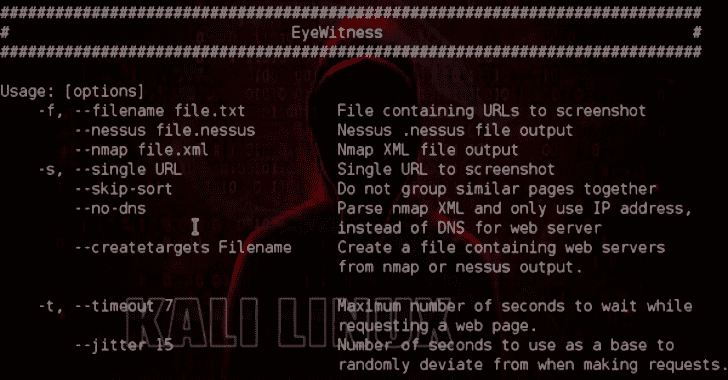

# 目击者:旨在截图网站

> 原文：<https://kalilinuxtutorials.com/eyewitness-designed-take-screenshots-websites/>

**witness**旨在获取网站截图，提供一些服务器标题信息，并识别默认凭据(如果已知)。

它被设计为在 Kali Linux 上运行。它会自动检测您用-f 标志给它的文件，要么是每行都有 URL 的文本文件，要么是 nmap XML 输出，要么是 nessus XML 输出。

–time out 标志是完全可选的，它允许您在尝试呈现和截屏网页时提供等待的最长时间。

**设置**

1.  导航到安装目录
2.  运行 setup.sh 脚本

**也可以理解为-[fail 2 Ban:守护进程禁止导致多个认证错误的主机](http://kalilinuxtutorials.com/fail2ban/)**

**用途**

**。/witness . py-f filename–超时选项 time out–open(可选)**

**例题**

**。/witness-f URLs . txt–web

。/witness-x URLs . XML–超时 8–无头**

**码头工人**

现在您可以在 docker 容器中执行它，并防止在您主机上安装不必要的依赖项。

*   **Note1:** 执行 docker run，使用主机中保存结果的文件夹路径( **/path/to/results** )
*   **Note2:** 如果你想从一个文件中扫描 URL，确保你把它放在卷文件夹中(如果你把 urls.txt 放在/path/to/results 中，那么参数应该是-f/tmp/witness/URLs . txt)

**用途**

docker build–build-arg USER = $ USER–tag witness。
docker run \
–RM \
-it \
-e DISPLAY = $ DISPLAY \ #可选标志以便使用 vnc 协议
-v/tmp/. X11-UNIX:/tmp/. X11-UNIX \ #可选标志以便使用 vnc 协议
-v/path/to/results:/tmp/witness \
witness \
witness _ flags _ and _ input

**示例# 1–无头捕捉**

docker run \
–RM \
-it \
-v ~/witness:/tmp/witness \
witness \
–web \
–单身 http://www.google.com

[**Download**](https://github.com/FortyNorthSecurity/EyeWitness)