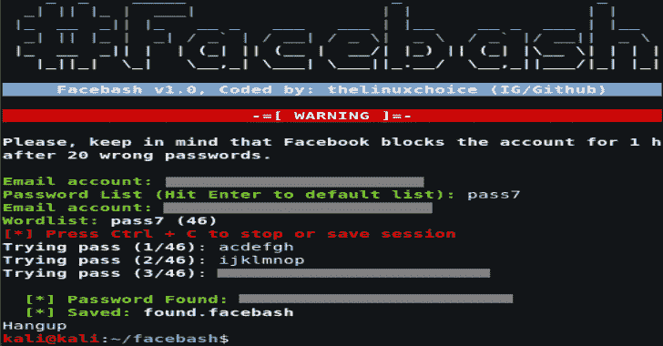

# Facebash:使用 TOR 的 Shellscript 中的脸书蛮力

> 原文：<https://kalilinuxtutorials.com/facebash-facebook-brute-forcer-shellscript/>

Facebash 是使用 TOR 的 shellscript 中的 facebook Brute Forcer 的工具。

**警告:**脸书在 20 次错误密码后封锁账户 1 小时，因此该脚本每小时只能执行 20 次

**特性**

*   保存/恢复会话
*   通过 TOR 的匿名攻击
*   默认密码列表(+39k)

**也可阅读-[H2 buster:一个基于 HTTP/2](https://kalilinuxtutorials.com/h2buster/)** 的线程化递归网页目录暴力扫描器

**用途**

**git 克隆 https://github . com/thelinuxxchoice/facebash
CD insta shell
chmod+x facebash . sh
service gate start
sudo。/facebash.sh**

**安装要求(卷曲、Tor):**

**chmod +x install.sh
sudo。/install.sh**

**免责声明**

未经双方事先同意，使用此工具攻击目标是非法的。最终用户有责任遵守所有适用的地方、州和联邦法律。开发人员不承担任何责任，也不对本程序造成的任何误用或损坏负责。

[**Download**](https://github.com/thelinuxchoice/facebash)