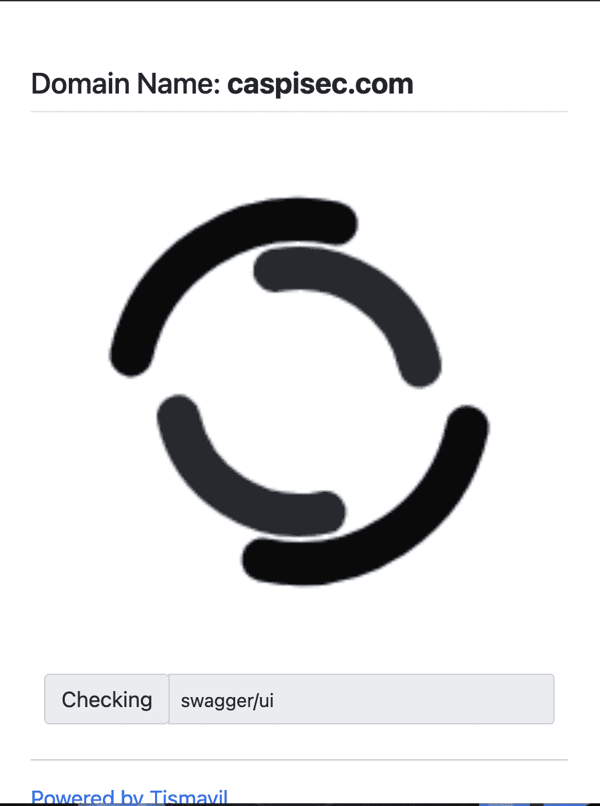
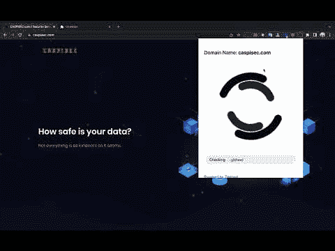

# 使用 chrome 扩展的站点快速模糊化

> 原文：<https://kalilinuxtutorials.com/fastfuz-chrome-ext/>

.png)

Fastfuz-Chrome-Ext 是一个带有 Chrome 扩展的快速模糊网站。

**截图**

**安装**

### 添加您的自定义文件

*   打开 files.txt
*   逐行粘贴您的文件名或目录名
*   狩猎愉快

[**Download**](https://github.com/tismayil/fastfuz-chrome-ext)