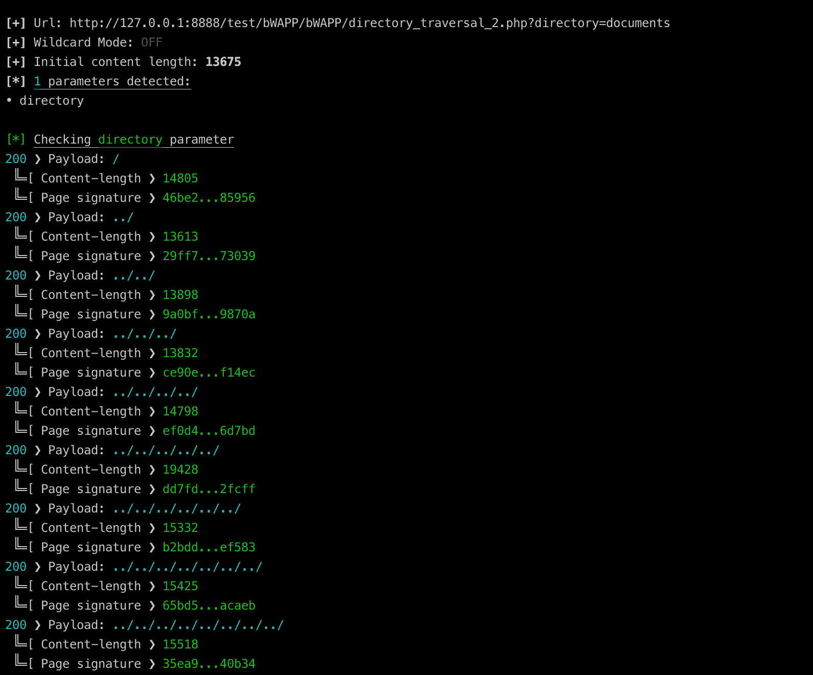
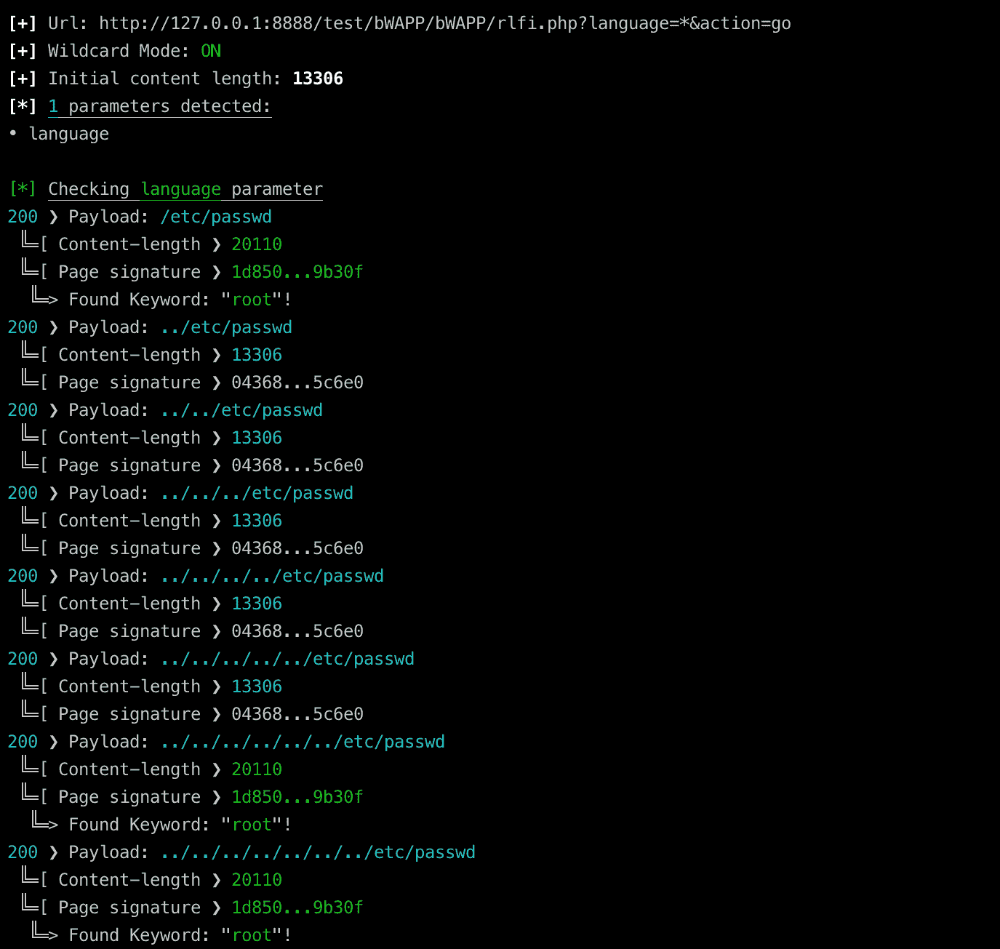
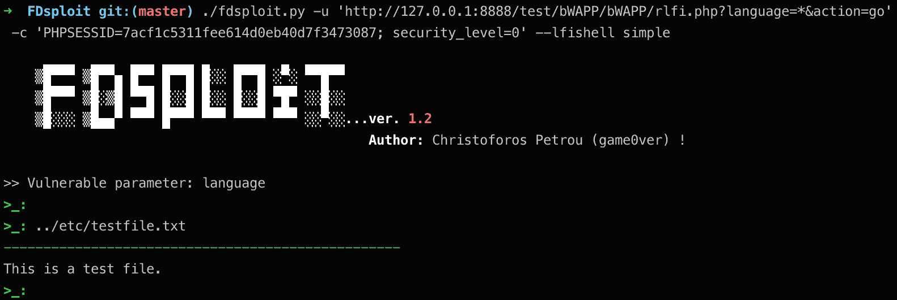

# FDSploit:文件包含和目录遍历模糊化、枚举和利用工具

> 原文：<https://kalilinuxtutorials.com/fdsploit-file-inclusion-directory-traversal-fuzzing/>

**FDSploit** 是一个文件包含&目录遍历模糊化、枚举&的漏洞利用工具。它可用于自动发现和利用本地/远程文件包含和目录遍历漏洞。

如果发现 LFI 漏洞，可以使用–lfi shell 选项来利用它。目前，支持 3 种不同类型的 LFI 外壳:

*   简单:这种类型的 shell 允许用户轻松地阅读文件，而不必每次都键入 url。此外，它只提供文件的输出，而不是页面的全部 html 源代码，这使得它非常有用。
*   **Expect** :这种外壳是一种半交互式外壳，允许用户通过 PHP 的 expect:// wrapper 执行命令。
*   **Input** :这种 shell 是一种半交互式的 shell，它也允许用户通过 PHP 的 php://input 流执行命令。

到目前为止，只有两个 lfi-shell 内置命令:

*   **清除**
*   **退出**

**也读作-[SysAnalyzer:自动化恶意代码分析系统](https://kalilinuxtutorials.com/sysanalyzer-automated-malcode-analysis-system/)**

**特性**

*   LFI-shell 接口只提供读取的文件或发出的命令的输出，而不提供所有的 html 代码。
*   可以指定 3 种不同类型的 LFI 壳。
*   支持 GET/POST 请求。
*   GET 参数的自动检测。
*   可以使用通配符(*)为测试指定某些参数。
*   可以指定和使用可选的会话 cookies。
*   可以使用 PHP 函数自动检查 RCE。
*   额外使用 sha-256 哈希来识别潜在的漏洞。
*   base64/urlencoding 支持。

**一些例子**

1.  **目录遍历漏洞发现:**
    从下面的输出看来，目录参数很可能容易受到目录遍历漏洞的攻击，因为每个请求都带有../ as 负载产生不同的 sha-256 哈希。
    每个请求的内容长度也不同:

**。/FDS loit . py-u ' http://127 . 0 . 0 . 1:8888/test/bw app/bw app/directory _ traversal _ 2 . PHP？directory = documents '-c ' PHPSESSID = 7 ACF 1c 5311 fee 614d 0 EB 40 D7 f 3473087；security_level=0' -d 8**

2. **LFI 漏洞发现:**
同样，语言参数自使用以来似乎易受 LFI 攻击../etc/passwd 等..作为有效负载，每个标有绿色的请求都会产生一个不同的散列，一个与初始内容不同的内容长度，并且在响应中可以找到指定的关键字:

**。/FDS loit . py-u ' http://127 . 0 . 0 . 1:8888/test/bw app/bw app/rlfi . PHP？language = *&action = go '-c ' PHPSESSID = 7 ACF 1c 5311 fee 614d 0 EB 40 d7f 3473087；security _ level = 0 '-D7-k root-p/etc/passwd**

3.利用简单外壳的 LFI 漏洞:
利用简单外壳的上述 LFI 漏洞:

**注释**

*   当使用 POST 动词时，还必须指定–params 选项。
*   要测试目录遍历漏洞，必须将–payload 选项保留为默认值(无)。
*   当–file 选项用于多 URL 测试时，则仅支持 GET 请求。
*   当同时设置了–file & cookie 选项时，由于每次只能指定一个 cookie，因此 URL 必须指向同一个域，或者可以在没有 cookie 的情况下访问(这将在未来的更新中修复)。
*   输入外壳与后置动词不兼容。

**要求:**

注意:要安装要求:

**pip install-r requirements . txt–升级–用户**

**免责声明**

该工具仅用于测试和学术目的，并且只能在严格同意的情况下使用。请勿用于非法目的！最终用户有责任遵守所有适用的地方、州和联邦法律。

开发人员不承担任何责任，也不对该工具和软件造成的任何误用或损坏负责。

[Download](https://github.com/chrispetrou/FDsploit)