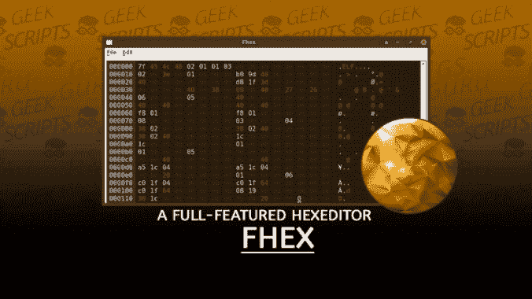
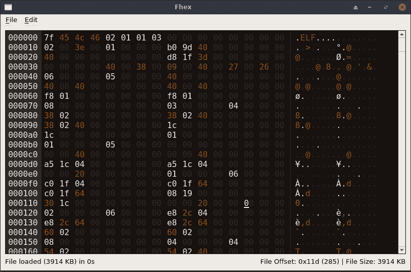
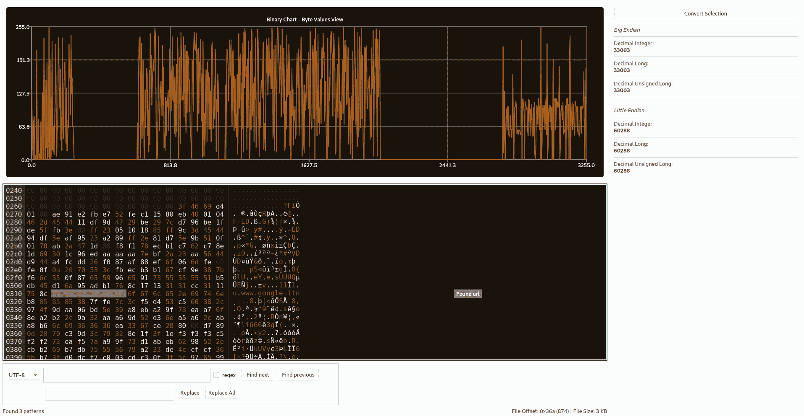
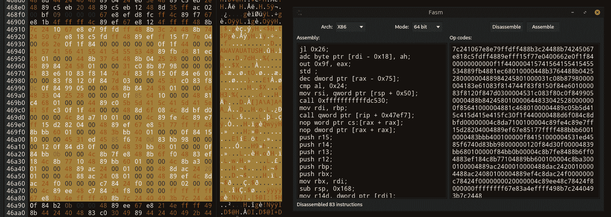

# Fhex:一个全功能的 HexEditor

> 原文：<https://kalilinuxtutorials.com/fhex/>

Fhex 诞生的目的是开发一个轻量级但有用的工具。原因是现有的十六进制编辑器有一些不同的限制(例如，太多的依赖性，缺少十六进制着色功能等。).

该项目基于 **qhexedit2** 、**顶石**和**楔石**发动机。未来可能会添加新功能，欢迎 PRs。

**特色**

*   块加载器——用于只加载大文件的一部分，而不会耗尽内存(使用 alt +左/右箭头键在块之间移动)。请注意，在块模式下，除文件保存(保存整个文件)外，所有操作(如搜索)仅适用于当前块。但是，每次编辑一个块时，在移动到另一个块之前保存它，否则您将丢失您的更改。
*   搜索和替换(支持 UTF-8、十六进制、正则表达式、反向搜索)[`**CTRL + F**`]
*   彩色输出(空白、ASCII 字符、0xFF、UTF-8 和空字节具有不同的颜色)
*   将所选字节解释为整数、长整型、无符号长整型[ `**CTRL + B**` ]
*   复制并粘贴[ `**CTRL + C**`和`**CTRL + V**`
*   复制选定的 unicode 字符[ `**CTRL + Space**` ]
*   将所有选中的字节[ `**Delete**`或`**CTRL + D**` ]清零
*   撤消和重做[ `**CTRL + Z**`和`**CTRL + Y**`
*   拖放(*提示:*拖动&放下两个文件以区别它们)
*   覆盖相同的文件或创建一个新文件[`**CTRL + S**`]
*   转到偏移[ `**CTRL + G**` ]
*   支持插入模式，以便插入新字节，而不是覆盖现有字节[`**INS**`
*   创建新实例[ `**CTRL + N**` ]
*   所选文本的基本文本查看器[ `**CTRL + T**` ]
*   重新加载当前文件[ `**F5**` ]
*   在字节级别比较两个不同的文件
*   可浏览的二进制图表(详见下文)[ `**F1**` ]
*   十六进制-十进制数字转换器[ `**F2**` ]
*   十六进制字符串转义符(例如从 010203 到\x01\x02\x03) [ `**F3**` ]
*   模式匹配引擎(详见下文)
*   基于顶点引擎的反汇编器[ `**F4**` ]
*   基于 Keystone 引擎的汇编程序[ `**F4**` ]
*   缩小/放大字节视图(`**CTRL + Up/Down**`或`**CTRL + -/+**`)
*   所有这些功能的快捷方式

**模式匹配引擎**

Fhex 可以在启动时加载一个 JSON 格式的配置文件(来自`**~/fhex/config.json**`),其中有一个要突出显示的字符串或字节列表，以及一个要添加到匹配项附近的注释/标签。

示例:

{
" pattern matching ":
[
{
" string "://www。"、
"color" : "rgba(250，200，200，50)"、
"message ":"找到 url"
}、
{
"bytes" : "414243 "、
"color" : "rgba(250，200，200，50)"、
"message ":"找到 ABC "
}
**}
}**。

要激活模式匹配，最后按`**CTRL + P**`，Fhex 还将显示一个带有所有结果参考的偏置列表。**注意:**只有在窗口最大化时，才会添加带注释的标签，如果标签显示不正确，请再次尝试运行模式匹配。

**双星图**

Fhex 具有绘制加载的二进制文件的特性(*注意:*为了编译项目，现在你还需要在系统上安装`qt5-charts`)。y 轴范围为 0 至 255(十六进制 0x0 和 0xff，即字节值)。x 轴范围介于 0 和文件大小之间。

该图表绘制了二进制文件的字节值，让您只关注相关部分。例如，如果在一个二进制文件中有一个充满空字节的区域，您可以很容易地从图表中检测出来。

[**Download**](https://github.com/echo-devim/fhex)