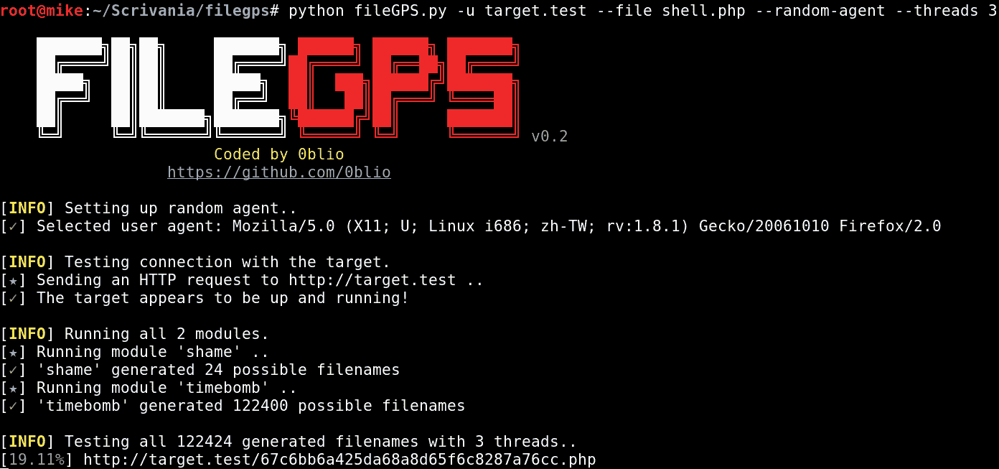
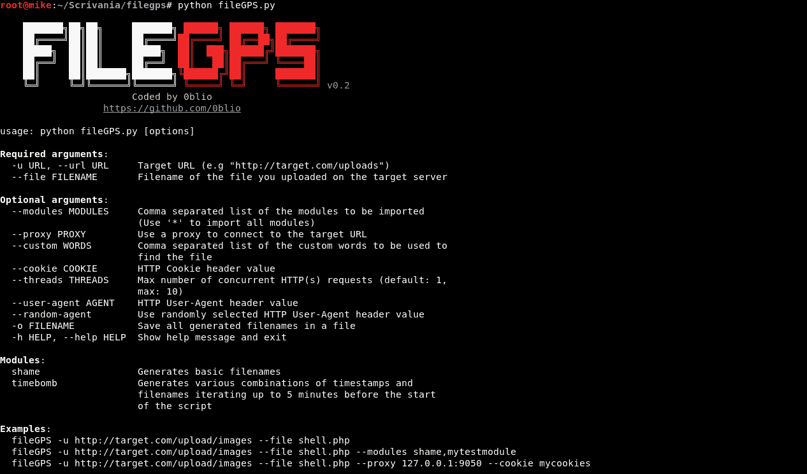

# FileGPS:一个帮助您猜测您 Shell 是如何被重命名的工具

> 原文：<https://kalilinuxtutorials.com/filegps/>

**FileGPS** 是一个在服务器端脚本重命名并保存文件名后，使用各种技术来查找新文件名的工具。

当您使用文件上传功能在 web 服务器上上传 shell 时，通常会以各种方式对文件进行重命名，以防止直接访问文件、RCE 和文件覆盖。

fileGPS 使用的一些技术有:

*   文件名的各种散列
*   各种时间戳技巧
*   文件名+ PHP 时间()脚本开始前 5 分钟
*   这么多

**特性**

*   使用方便
*   多线程
*   HTTP(s)代理支持
*   用户代理随机化
*   超过 100，000 个文件名组合

另请阅读-[EMAGNET:97.1%准确抓取邮件+密码的泄露数据库](https://kalilinuxtutorials.com/emagnet-leaked-databases-grab-mail-password/)

**安装**

在帕罗托斯:

**sudo 安装文件 gps**

在 BlackArch Linux 上:

**pacman -S 文件 gps**

在其他发行版上:

**git 克隆 https://github.com/0blio/filegps**

**如何写一个模块**

编写一个模块相当简单，并允许您实现生成文件名组合的自定义方式。

以下是您的模块模板:

#!/usr/bin/env python
#-*-编码:utf-8 -*-
"""
模块名称:测试
编码:你的名字/昵称
版本:X.X
描述:
这个模块毁灭世界。
" "
output =[]
#在这里做一些计算
output = ["filename1.php "，" filename2.asp "，" filename3.jar"]

变量`url`和`filename`是从核心脚本中自动导入的，因此您可以在您的模块中调用它们。

一旦你完成了你的模块的编写，你必须把它保存在`Modules/`中，一旦主脚本启动，它将被自动导入。

你可以使用模块 [shame](https://github.com/0blio/fileGPS/blob/master/Modules/shame.py) 作为你的模块的模板。

**信用；michele.cisternino@protonmail.com**T2

[**Download**](https://github.com/0blio/filegps)