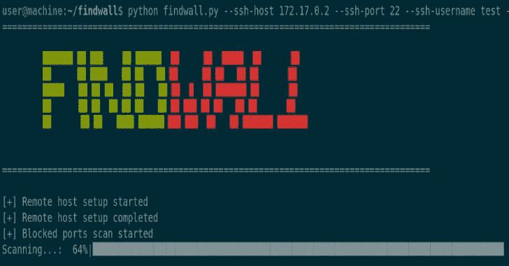

# Findwall:检查您的提供商是否阻止了您

> 原文：<https://kalilinuxtutorials.com/findwall/>

**FindWall** 是 Python 脚本，允许了解您的网络提供商是否通过阻止任何 TCP/UDP 端口来限制您对互联网的访问。为了执行此检查，FindWall 需要连接您酒店的公共 VPS。FindWall 执行以下操作:

*   通过 SSH 连接到 VPS
*   在监听模式下打开端口
*   尝试从本地机器连接到该端口
*   关闭端口

## 你如何使用它？

要使用 FindWall，您只需要一个公共 VPS 帐户。如果您想要测试范围`**1-1024**`内的端口，该帐户必须具有 root 访问权限。root 帐户也需要自动安装工具`**nc**`来打开端口。

**$ pip install -r 需求
$ python find wall . py–help
███████╗██╗███╗██╗██████╗██╗██╗█████╗██╗██╗
██╔════╝██║████╗██║██╔══██╗██║██║██╔══██╗██║██║
█████╗██║██╔██╗██║██║██║██║█╗██║███████║██║██║
██╔══╝██║██║╚██╗██║██║██║██║███╗██║██╔══██║██║██║
██║██║██║╚████║██████╔╝╚███╔███╔╝██║██║███████╗███████╗
╚═╝╚═╝╚═╝╚═══╝╚═════╝╚══╝╚══╝╚═╝╚═╝╚══════╝╚══════
用法:find wall . py[-h]–ssh-host ssh _ host[–ssh-port ssh _ port]–ssh-username ssh _ username[–ssh-password ssh _ password][–ssh-key ssh _ key]–ports ports[–UDP]
可选参数:
-h，–help 显示此帮助消息并退出
–ssh-HOST ssh _ HOST 远程主机
–SSH-PORT SSH _ PORT 远程 SSH 端口
–SSH-USERNAME SSH _ USERNAME
远程 SSH 用户名
–SSH-PASSWORD SSH _ PASSWORD
远程 SSH 密码
–Ask-SSH-pass 询问远程 SSH 密码
–SSH-KEY SSH _ KEY**

举个例子:

**$ python find wall . py–ssh-host 172 . 17 . 0 . 2–ssh-端口 22–ssh-用户名测试–ssh-密码测试–端口 8000-8010–线程 3**

[**Download**](https://github.com/Peco602/findwall)