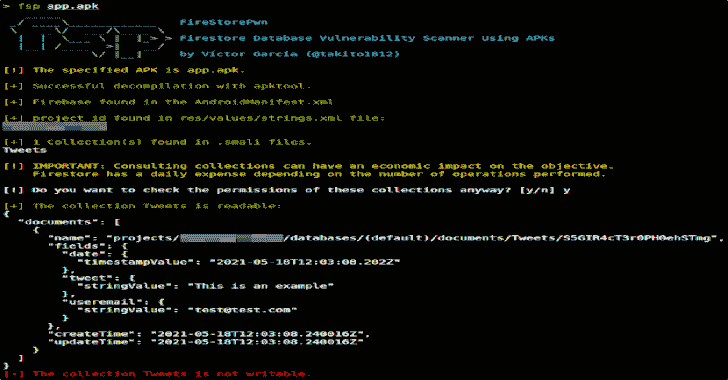
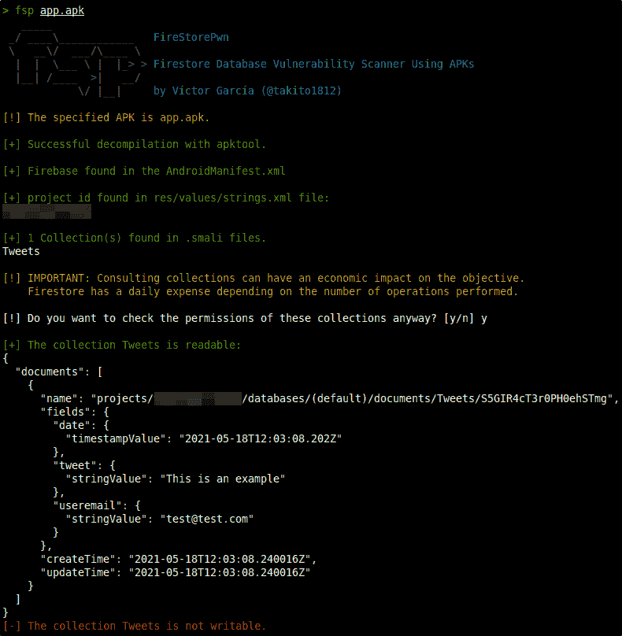

# FireStorePwn:使用 APKs 的 Firestore 数据库漏洞扫描器

> 原文：<https://kalilinuxtutorials.com/firestorepwn/>

FireStorePwn 会扫描 APK，并检查 Firestore 数据库中是否有不安全的规则，测试有无身份验证。

如果安全规则有问题，攻击者可以窃取、修改或删除数据，并提高账单。

**工作原理**

**安装 FSP**

**sudo wget https://raw . githubusercontent . com/takito 1812/FireStorePwn/main/FSP-O/bin/FSP
sudo chmod+x/bin/FSP**

**运行 fsp**

扫描未经认证的 APK

**fsp app.apk**

通过身份验证扫描 APK

有电子邮件和密码。

**FSP app . apk test @ test . com:123456**

用代币。

**FSP app . apk eyjhbgio…**

[**Download**](https://github.com/takito1812/FireStorePwn)