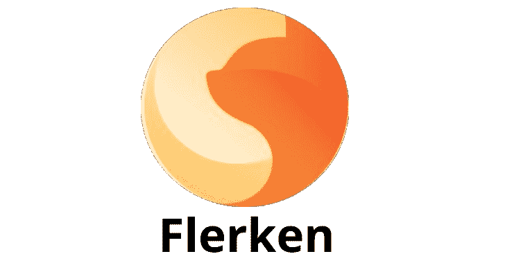
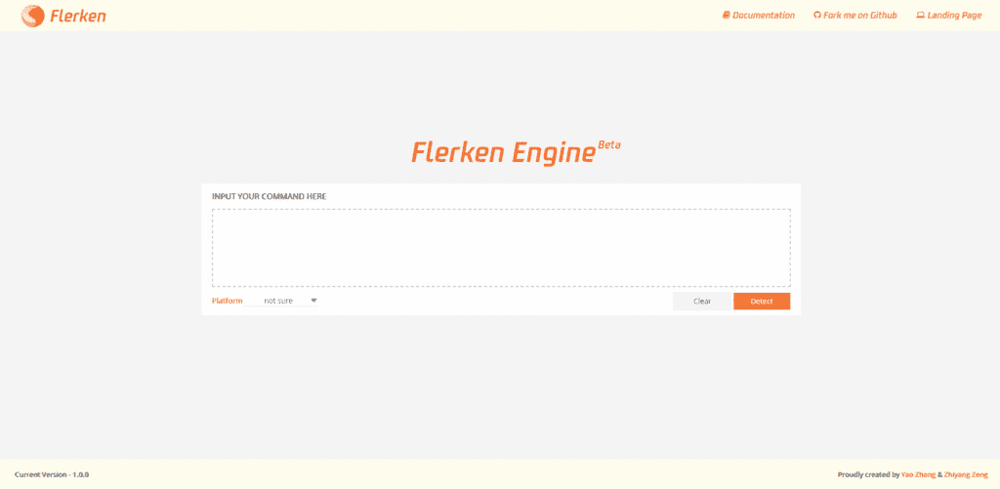

# 模糊命令检测工具

> 原文：<https://kalilinuxtutorials.com/flerken-obfuscated-command-detection/>

Flerken 是一个开源的混淆命令检测工具。命令行混淆已被证明是无文件恶意软件或“生活在陆地上”的恶意行为者的一个不可忽视的因素。

为了绕过基于签名的检测，红队渗透甚至 APT 活动都会使用专用的混淆技术。

同时，许多混淆器(即执行语法转换的工具)都是开源的，因此使得混淆给定的命令变得越来越容易。

然而，合适的防御的数量仍然很少。对于 Linux 命令行混淆，我们几乎找不到任何检测工具。

关于对 Windows 命令混淆的防御，现有的方案要么缺乏工具化，要么只能部分解决整个问题，有时甚至不准确。

为了更好地促进模糊检测，我们提出了 Flerken，这是一个工具化的平台，可用于检测 Windows (CMD 和 Powershell)和 Linux (Bash)命令。

弗勒肯的名字灵感来自漫威世界的一种类似猫但极其强大的生物。Flerken 是在精心收集黑/白样本的基础上构建的，可以分为两个子方案，分别是 Kindle (Windows 混淆检测器)和 Octopus (Linux 混淆检测器)。

为了帮助优化 Flerken 的分类性能，我们采用了机器学习、双向特征过滤环、脚本沙箱等技术。

另请阅读: [NAXSI : WAF For NGINX](https://kalilinuxtutorials.com/naxsi-waf-nginx/)

**快速启动:安装**

*   步骤 1:确保您的服务器上已经安装了 python 3.x，您可以使用以下命令来检查它。

**【root @ server:~ $】python-V**

*   第二步:安装需要的组件，所有的必备组件都已经在 requirement.txt 中声明了。

**[root @ server:~ $]pip install-r requirement . txt**

*   步骤 3:登录 MySQL 控制台，导入数据库

**source/your path/fler ken/fler ken/lib/fler ken . SQL**

*   第四步:自定义你的 Flerken 应用程序配置。

**路径:fler ken/config/global _ config . py**

*   第五步:现在你可以运行它了！

**【root @ server:~ $】python runapp . py**

*   步骤 6(可选):您可以构建自己的白名单来降低误报率。

**路径:flerken/config/whitelists/**

**如何使用**

如下图所示非常好用，我们也会尽快发布 API 接口。\

**内置第三方**

*   瓶
*   烧瓶-WTF
*   烧瓶限制器
*   弗兰基-黄/pythonMySQL
*   jQuery
*   Swiper

**演职员表**:张尧、曾志扬

[Download](https://github.com/We5ter/Flerken)