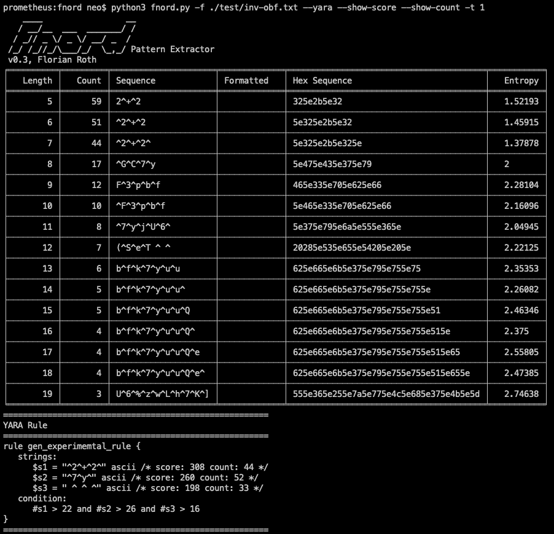
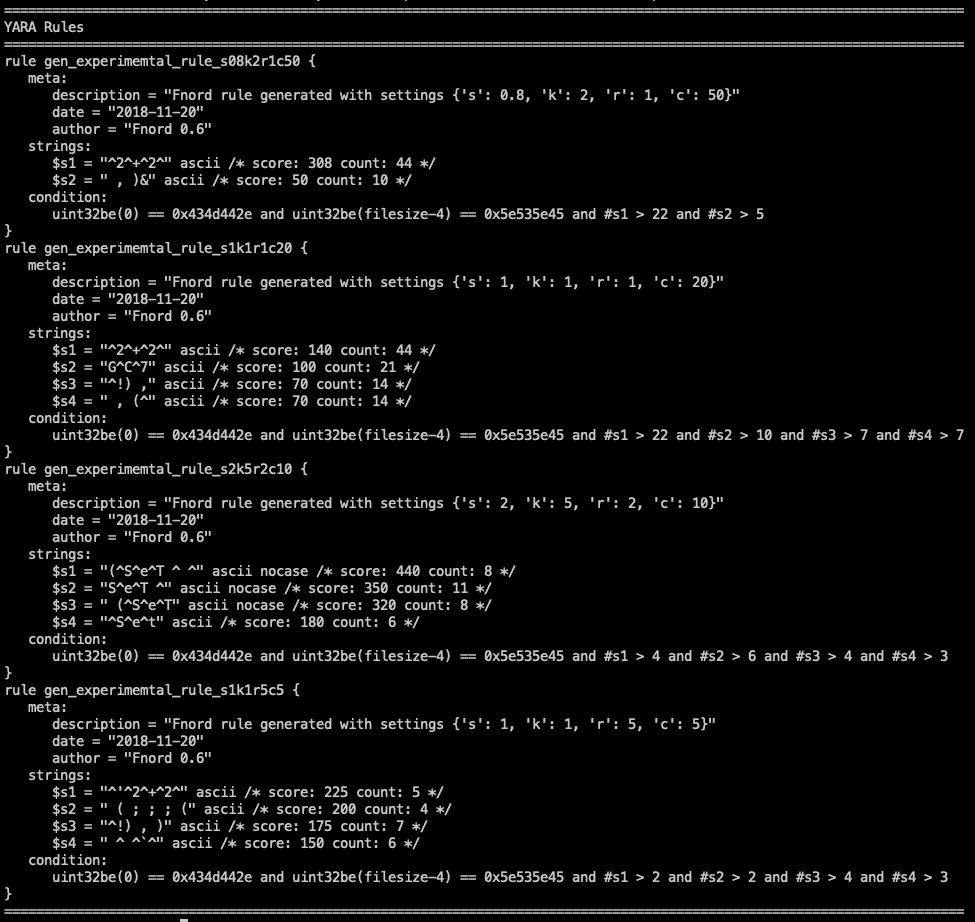
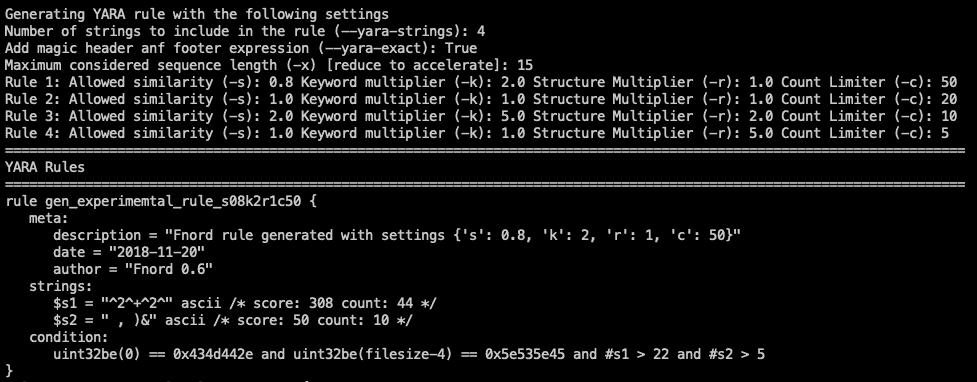

# 模糊代码的模式提取器

> 原文：<https://kalilinuxtutorials.com/fnord-pattern-extractor/>

Fnord 是混淆代码的模式提取器。它有两个主要功能:

*   提取字节序列并创建一些统计数据
*   使用这些统计数据，结合长度，出现次数，相似性和关键字来创建一个 YARA 规则。

Fnord 使用大小不同的滑动窗口处理文件，以提取最小长度`-m X`(默认值:4)到最大长度`-x X`(默认值:40)的所有序列。

对于每个长度，Fnord 将在表格中显示最频繁出现的序列`-t X`(默认值:3)。

表格中的每一行包含:

*   长度
*   出现次数
*   序列(字符串)
*   格式化(ascii/wide/hex)
*   十六进制编码形式
*   熵

**也可以理解为:**[ProcDump:ProcDump Sysinternals 工具的 Linux 版本](https://kalilinuxtutorials.com/procdump-linux-version/)

**用途**

用法:fnord . py[-h][-f file][-m min][-x max][-t top][-n min-OCC]
[-e min-entropy][–strings][–include-padding][–debug]
[–no yara][-s similarity][-k keywords-multiplier]
[-r structure-multiplier][-c count-limiter][–yara-exact]
[–yara-strings max][–show-score][–score][–s]

**Fnord–混淆代码的模式提取器
可选参数:** -h，–帮助显示此帮助消息并退出
-f file 文件以处理
-m 最小序列长度
-x 最大序列长度
-t 最大列表中的项目数
-n min-occ 要显示的最小出现次数
-e min-熵最小熵
–字符串仅显示字符串
–Include-填充包括 0x00 和 0x20

**YARA 规则创建:** –诺亚拉不生成实验性的 YARA 规则
-s 相似度允许的相似度(使用 0.1 =低和
10 =高之间的值，默认值=1.5)
-k 关键字-乘数
关键字乘数(如果找到
关键字，则乘以序列的分数)
默认值= 2.0
-r 结构-乘数
结构乘数(如果是
，则乘以序列的分数) default = 2.0)
-c Count-limiter 计数限制器(通过
将计数限制在某个数量来限制计数的影响)(最佳使用值
在 5 到 100 之间，默认值= 20)
–yara-exact 向
规则添加魔术标题和魔术页脚限制
–yara-strings max 最大序列长度
–Show-score 在 yara 规则的注释中显示分数
–Show-Count 在 yara 规则的注释中显示样本计数【T21

**入门**

git 克隆 https://github.com/Neo23x0/Fnord.git 和 CD Fnord
pip 3 install-r ./requirements . txt
python 3。/fnord . py–help

**例题**

python 3 fnord . py-f ./test/wraeop . SCT–yara-strings 10
python 3 fnord . py-f ./test/VBS . txt–show-score–show-count-t 1-x 20
python 3 fnord . py-f ./test/inv-obf . txt–show-score–show-count-t 1–yara-strings 4–yara-exact

**截图**

[**Download**](https://github.com/Neo23x0/Fnord)