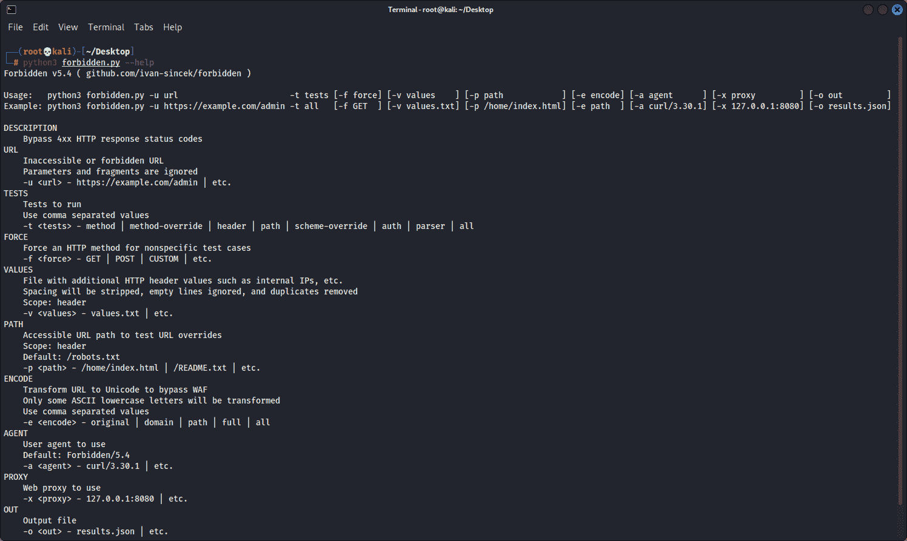

# 禁止:绕过 4Xx HTTP 响应状态代码

> 原文：<https://kalilinuxtutorials.com/forbidden/>

**禁止**是绕过 4xx HTTP 响应状态码。基于`**PycURL**`。

脚本使用多线程，并基于暴力，所以可能会有一些误报。脚本使用彩色输出。

结果将按 HTTP 响应状态代码升序、内容长度降序和 ID 升序排序。

为了过滤掉误报，使用提供的`**cURL**`命令手动检查每个内容的长度。如果它没有导致绕过，只需忽略具有相同内容长度的所有其他结果。

| 试验 | 范围 |
| --- | --- |
| 各种 HTTP 方法 | 方法 |
| 具有“Content-Length: 0”标头的各种 HTTP 方法 | 方法 |
| 使用 HTTP TRACE 和 TRACK 方法的跨站点跟踪(XST) | 方法 |
| 使用 HTTP PUT 方法上传文件 | 方法 |
| 各种 HTTP 方法覆盖 | 方法覆盖 |
| 各种 HTTP 头 | 页眉 |
| 各种 URL 覆盖 | 页眉 |
| 带有两个“主机”标题的 URL 替代 | 页眉 |
| 各种 URL 路径绕过 | 小路 |
| 各种 URL 方案覆盖 | 方案-覆盖 |
| 包括空会话的基本身份验证/授权 | 作家（author 的简写） |
| 损坏的 URL 解析器 | 句法分析程序 |

根据你的喜好扩展这个脚本。

HTTP 头的良好来源:

*   常见 HTTP 响应标头

在 Kali Linux v2021.4 (64 位)上测试。

为教育目的制作的。希望有帮助！

未来计划:

*   添加只测试允许的 HTTP 方法的选项，
*   添加选项以测试所有域/子域的特定/自定义 HTTP 头，
*   添加选项来测试不太常见/特定于应用程序的 HTTP 头，
*   将 HTTP 报头分类以减少误报结果，
*   不要忽略 URL 参数和片段。

**如何运行**

从/src/打开您的首选控制台，并运行下面显示的命令。

安装所需工具:

**易得安装-y 卷曲**

安装所需的软件包:

**pip 3 install-r requirements . txt**

运行脚本:

**python3 forbidden.py**

请注意速率限制。在为同一个域再次运行脚本之前，请等待一段时间，以便获得更好的结果。

有些网站需要用户代理标题。从[这里](https://github.com/danielmiessler/SecLists/blob/master/Fuzzing/User-Agents/UserAgents.fuzz.txt)下载用户代理列表。

**自动化**

绕过`**403 Forbidden**` HTTP 响应状态代码:

**count = 0；对于$(cat subdomains_403.txt)中的子域；do count=$((计数+1))；echo“# $ { count } | $ { subdomain }”；python 3 forbidden . py-u " $ { subdomain } "-t method，method-override，header，path，scheme-override-f GET-o " forbidden _ 403 _ results _ $ { count }。JSON”；完成**

绕过`**401 Unauthorized**` HTTP 响应状态代码:

**count = 0；对于子域在$(猫子域**_**401 . txt)；do count=$((计数+1))；echo“# $ { count } | $ { subdomain }”；python 3 forbidden . py-u " $ { subdomain } "-t auth-f GET-o " forbidden _ 401 _ results _ $ { count }。JSON”；完成**

损坏的 URL 解析器检查:

**count = 0；对于$(cat subdomains_live_long.txt)中的子域；do count=$((计数+1))；echo“# $ { count } | $ { subdomain }”；python 3 forbidden . py-u " $ { subdomain } "-t parser-f GET-o " forbidden _ parser _ results _ $ { count }。JSON”；完成**

**HTTP 方法**

**ACL
任意
基线-控制
绑定
check in
check out
CONNECT
COPY
DELETE
GET
HEAD
INDEX
LABEL
LINK
LOCK
MERGE
MKACTIVITY
MKCALENDAR
MKCOL
MKREDIRECTREF
MKWORKSPACE
MOVE
OPTIONS
order PATCH** 

**HTTP 报头**

方法覆盖 HTTP 头:

**X-HTTP-方法
X-HTTP-方法-覆盖
X-方法-覆盖**

HTTP 头:

**Client-IP
Cluster-Client-IP
Connection
Contact
Forwarded
Forwarded-For
Forwarded-IP
From
Host
Origin
Referer
Stuff
True-Client-IP
X-Client-IP
X-Custom-IP-Authorization
X-Forwarded
X-Forwarded
X-Forwarded-By
X-Forwarded-For**

方案覆盖 HTTP 头:

**X-Forwarded-Proto
X-Forwarded-Protocol
X-Forwarded-Scheme
X-Url-Scheme
X-Url Scheme**

**URL 路径**

在 URL 路径的前面、后面、前后都注入；有和没有前置和附加斜线。

**/
//
% 09
% 20
% 2e

..
；
。；
..；
；foo = bar**

在 URL 路径后面插入。

~
随机
*
* *
*** *随机
# # #随机
？
？？
？？随机**

仅当 URL 路径不以“/”结尾时，才在 URL 路径后面插入。

**。php
。jsp
。jspa
。jspx
。jhtml
。html
。sht
。shtml
。xhtml
。asp
。aspx
。esp**

结果格式

 **{
【id】:501，
【URL】:“http://example . com:80/admin”，
【方法】:“GET”，
【headers】:[
“Host:127 . 0 . 0 . 1”
，
【Agent】:“Forbidden/5.4”,
“proxy”:null，
【data】:null，
【command】:“curl-1
" command ":" curl-m 5–connect-time out 5-I-s-k-L–path-as-is-H ' Host:127 . 0 . 0 . 1:80 '-H ' User-Agent:Forbidden/5.4 '-X ' GET ' ' http://example . com:80/admin ' "，
"code":200，
" length ":255408
}
]**

**图像**

[**Download**](https://github.com/ivan-sincek/forbidden)