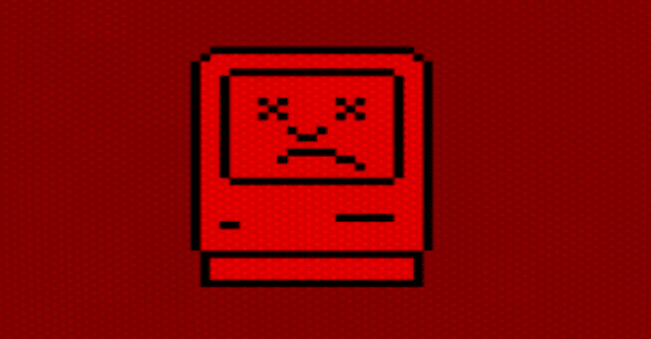

# forblaze:Python Mac 隐写术有效载荷生成器

> 原文：<https://kalilinuxtutorials.com/forblaze/>

**Forblaze** 是一个旨在为 Mac OS 有效负载提供隐写功能的项目。使用 python3，它将为您构建一个 Obj-C 文件，该文件将被编译以从 stego 文件中提取所需的加密 URL，通过 https 提取有效负载，并直接在内存中执行它们。它利用自定义加密-它不是密码安全，但纯粹是为了阻挠反病毒引擎的分析。这是对我以前为 Windows 构建的自定义加密(称为 Rubicon)的一个微小的偏离，并且在实践中更加简单。Forblaze 利用头字节和尾字节来识别加密字节在隐写文件中的位置，然后使用 compile_forblaze.m 中的硬编码密钥对其进行解密。该密钥可以保存并重复使用，其效果是可以使用不同的 URL 来获取不同的有效载荷，并且相同的已编译 forblaze 仍然能够执行和处理它(前提是头字节和尾字节没有改变，并且新的隐写文件被上传到正确的位置)。

**要求**

Python3(只在 Python3.9+上测试过)和一些相关的 Python 库——pip 3 应该负责你需要的任何 Python 依赖。另外编译会用 clang，forblaze 要在 mac 上运行，这样 forblaze 才能正确编译。

**用途**

用法:for blaze _ URL . py[-h][-innocent _ PATH PATH][-o OUTPUT][-len _ KEY LENGTH _ OF _ KEY][-COMPILE _ FILE COMPILE _ FILE][-URL _ to _ encrypt URL][-supply _ KEY SUPPLIED _ KEY][-STEGO _ LOCATION STEGO _ LOCATION][-COMPILED _ BINARY 编译 _BINARY]

为植入物生成隐写。

可选参数:

-h，–help 显示此帮助消息并退出

-innocent_path PATH 提供要使用的无辜文件的完整路径。

-o OUTPUT 提供放置隐写文件的路径。

-len_key LENGTH_OF_KEY 提供一个正整数，它将是以字节为单位的密钥长度。默认值为 16。必须介于 10 到 150 个字节之间。您可以自己更改，只是要小心较大的密钥大小会增加您的有效负载，并且不一定会使您的加密更强

-compile_file COMPILE_FILE 提供要编辑的 C++文件的路径。

-url_to_encrypt url 提供您想要放在编译文件中的 URL。

-supply_key SUPPLIED_KEY 如果您希望使用特定的密钥，请在此处提供。它必须采用以下格式:-supply _ key " \ x6e \ X60 \ x…"–也就是说，每个字节之间需要两个双斜线，否则它将不起作用。

-stego_location STEGO_LOCATION 您必须在目标上提供一个位置，在此位置上将存放隐写文件。遵循严格的完整路径是明智的，例如:/Users/ <> /Documents/file.jpg。

-COMPILED _ BINARY COMPILED _ BINARY 给出编译的二进制文件的名称，以便从 stego 文件中提取 URL 并在内存中运行代码。默认值为 forblaze。

**Opsec 关注点**

老实说，不太多。Mac OS 检测仍然很差，尤其是内存中的活动。然而，作为一个警告，这种方法(几乎完全基于[https://blogs . blackberry . com/en/2017/02/running-executables-on-MAC OS-from-memory](https://blogs.blackberry.com/en/2017/02/running-executables-on-macos-from-memory))对 GO 编译的 MACHOS 不起作用。我测试过的其他所有 macho 都工作正常，所以如果你真的想使用 Mythic 之类的 Go C2s，我建议制作一个自定义的 macho，它的功能类似于 osascript，并直接在内存中调用 jxa 有效负载。作为对读者的一个练习，您也可以直接调用有效负载字节而不是 URL，只需对这段代码稍加修改。

我建议像从缺省值生成的随机字节数一样更改它，并更改 forblaze 用来在隐写文件中查找有效负载的缺省头和尾字节(以及那些头和尾字节的长度，可能更不合理)。

**检测/预防**

隐写术很难检测。如果您知道隐写文件在哪里，您可以在正常文件 EOF 的结尾之后开始提取可疑字节(例如，在 jpegs 的“FFD9”之后)。这些可疑字节仍然包括实际加密的有效载荷和无意义的随机字节，除非您拥有 Forblaze 指定的头部和尾部字节，否则很难区分它们。您可以查看这些字节，寻找重复字节的模式，因为这是 forblaze 的页眉和页脚字节的工作方式，但是一个熟练的操作者可以使其比缺省值更难找到。如果一个有效载荷被捕获，你可以很明显地再调用二进制文件并尝试定位隐写文件，然后尝试使用硬编码的键和头/尾来反转被调用的 URL(或其他字节)。但这都是假设你通过其他方式找到了二进制文件。

**测试**

这个工具已经在各种版本的 Mac OS 上进行了测试，包括 Big Sur 和 Catalina (x64 系统)。如果你有问题，请让我知道。

**技术细节**

自定义加密是一个基本的凯撒密码，其中不同的密钥字节用于移动明文字节。这就是为什么更大的密钥不一定对你的加密更好——它取决于你的明文的长度。如果您的明文是 50 个字节，并且您使用 150 个字节的密钥，那么将只使用您密钥的前 50 个字节。但是，如果您的明文大于 150 个字节，那么越长的密钥越安全。

隐写术非常简单:原始无害文件的字节保持不变，随机字节(以及加密的有效载荷字节)附加在这些字节之后。默认情况下，这些随机字节的长度在 2 到 2000 之间(这应该可以更改以适合您的明文大小->更大的明文应该意味着生成更多的随机字节)。

内存中的执行部分完全遵循[https://blogs . blackberry . com/en/2017/02/running-executables-on-MAC OS-from-memory](https://blogs.blackberry.com/en/2017/02/running-executables-on-macos-from-memory)，简单的变化是，它们不是从磁盘文件中读取有效负载字节，而是通过 http/https 读取。稍后，我可能会添加一项技术，允许您执行 Go 编译的二进制文件(有其他来源也可以帮助这一点)，但对于这个默认版本，Go 编译的二进制文件将无法工作。这是因为出于某种奇怪的原因，Go 编译的 macho 不像大多数 macho 那样在镜像的 load 命令中使用 LC_MAIN(如果有人知道为什么，我洗耳恭听)。

[**Download**](https://github.com/asaurusrex/Forblaze)