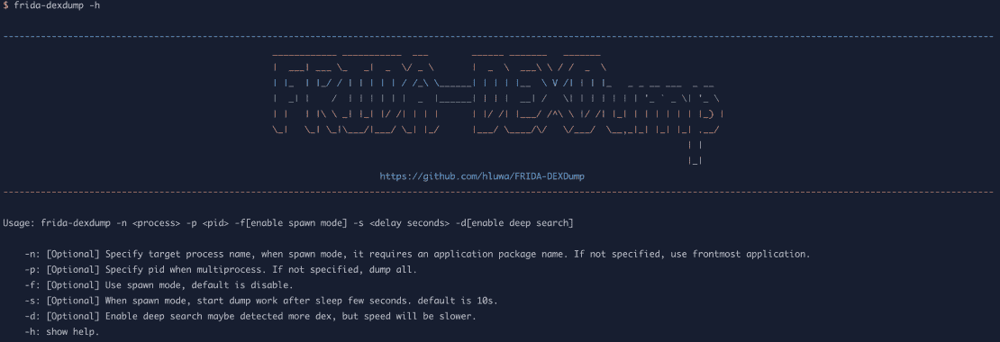

# FRIDA-DEXDump:快速搜索并将索引转储到内存中

> 原文：<https://kalilinuxtutorials.com/frida-dexdump-fast-search-and-dump-dex-on-memory/>

**FRIDA-DEXDump** 是一个在内存上快速搜索和转储 Dex 的工具。

**特性**

*   支持模糊搜索断头索引。
*   修复索引头的结构数据。
*   兼容所有安卓版本(支持 frida)。
*   支持加载为异议插件~
*   pypi 包已经发布~

**需要**

*   【菲烈达】T2:`**pip install frida**`
*   【可选】[点击](https://pypi.org/project/click/) `**pip install click**`

**安装**

**来自 pypi**

安装 Frida-dex dump
Frida-dex dump-h

**来源于**

**git 克隆 https://github.com/hluwa/FRIDA-DEXDump
CD FRIDA-dex dump/FRIDA-dex dump
python 3 main . py-h**

**用途**

*   运行`**frida-dexdump**`或`**python3 main.py**`以连接当前最前端的应用程序并转储索引。
*   或者，使用命令参数:

**-n:[可选]指定目标进程名，在 spawn 模式下，需要一个应用包名。如果没有指定，使用最前面的应用程序。
-p:[可选]指定多重处理时的 pid。如果未指定，则全部转储。
-f:[可选]使用繁殖模式，默认为禁用。
-s:[可选]产卵模式下，休眠几秒后开始转储工作。默认值为 10s。
-d:[可选]启用深度搜索可能会检测到更多 dex，但速度会更慢。
-h:显示帮助。**

或者，作为异议插件加载

*   克隆这个 repo 并将`**frida_dexdump**`移动到你的插件文件夹中，例如:

**git 克隆 https://github.com/hluwa/FRIDA-DEXDump ~/Downloads/FRIDA-dex dump；
mv ~/Downloads/FRIDA-dex dump/FRIDA _ dex dump ~/。异议/插件/dexdump**

从`-P`或`--plugin-folder`你的插件文件夹开始反对，例如:

**反对-g com.app.name 探索-P ~/。异议/插件**

运行命令:

*   `**plugin dexdump search**`搜索并打印所有索引
*   `**plugin dexdump dump**`转储所有找到的 dex。