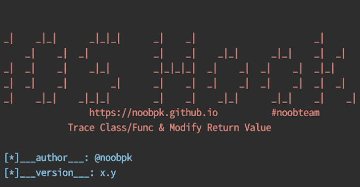

# 一个帮助你轻松跟踪类、函数和修改返回值的工具

> 原文：<https://kalilinuxtutorials.com/frida-ios-hook/>

.png)

Frida-Ios-Hook ，一个帮助你轻松使用 Frida 的工具。它支持在 iOS 平台上跟踪类、函数和修改方法的返回值的脚本。

## 环境操作系统支持

| 操作系统（Operating System） | 支持 | 著名的 |
| --- | --- | --- |
| 马科斯 | 981 号房 | 主要的 |
| Linux 操作系统 | 981 号房 | 潜水艇 |
| Windows 操作系统 | 981 号房 | 潜水艇 |

## 兼容于

| ios | 弗里达 | 支持 |
| --- | --- | --- |
| 13.2.3 | 14.2.13 | 981 号房 |
| 14.4.2 | 14.2.13 | 981 号房 |
| 14.4.2 | 15.0.18 | 981 号房 |

## 功能

使用 python3.x 运行

支持生成和附加脚本到进程。

**[+]选项:
-p(–package)应用的标识符 ex:com . apple . app store
-n(–Name)应用的名称 ex:app store
-s(–script)使用脚本格式 script . js
-c(–Check-version)检查最新版本
-u(–upadte)更新到最新版本
[ *] Dump 解密 IPA: -d，–Dump Dump 解密 application.ipa -o OUTPUT_IPA、 –OUTPUT = OUTPUT _ IPA 指定解密的 IPA 的名称[*]Dump memory of Application:
–Dump-memory Dump memory of Application
[*]hex byte Scan IPA:–hex byte-用字节模式扫描或修补 IPA–PATTERN = hex bytes can 的模式模式–ADDRESS = hex bytes can-t 任务的地址， –TASK = TASK TASK for hexbytescan[*]信息:
–List-Devices 列出所有设备
–List-Apps 列出已安装的应用
–List-appinfo 列出 Itunes 上应用的信息
–List-Scripts 列出所有脚本
–logcat 显示设备的系统日志
–shell，–ssh 获取连接设备的 shell
[*]快捷方法:
-m(–method)支持常用方法
app-静态**

## 安装

**[+]最新版本
https://github.com/noobpk/frida-ios-hook/releases
[+]开发版
git clone-b dev https://github.com/noobpk/frida-ios-hook**

## 建设

*   c **d frida-ios-hook/**
*   **pip 3 install-r requirements . txt**
*   **python3 setup.py**
*   **cd frida-ios-hook**

## 使用

如果运行了脚本却不工作，可以尝试以下:`**frida -U -f package -l script.js**`

## 演示功能

| 标题 | 环 |
| --- | --- |
| Frida iOS Hook &#124;基本用法&#124;安装–列出设备–列出应用程序–列出脚本–Logcat–Shell | https://youtu.be/xSndHgTdv4w |
| Frida iOS Hook &#124;基本用法&#124;转储解密 IPA–转储内存应用程序–Hexbyte-扫描 IPA | https://youtu.be/AUsJ9_gnWAI |
| Frida iOS Hook &#124;基本用法&#124; App Static–绕过越狱–绕过 SSL–拦截 URL +加密 | https://youtu.be/nWhKDSzArf8 |

## 弗里达脚本

更新了一些 frida 脚本，以帮助您使用 pentest ios 应用程序。使用 spawn 或 attach 过滤脚本

| 普通 | 繁殖/附加 | 脚本名称 | 脚本描述 | 脚本版本 |
| --- | --- | --- | --- | --- |
| one | S | backtrace.js | 追踪 | One |
| Two | S | bypass-flutter-ssl.js | 颤振旁路 ssl 引脚连接 | One |
| three | S | bypass-jailbreak-1.js | 基本旁路越狱检测 | One |
| four | S | bypass-ssl-ios13.js | iOS 13 绕过 ssl 锁定 | One |
| five | S | dump-ios-url-scheme.js | 调用“openURL”时转储 iOS url 方案 | One |
| six | S | dump-ui.js | 转储当前屏幕上的用户界面结构 | One |
| seven | S+A | 查找所有类方法 | 转储所有类中的所有方法 | One |
| eight | S+A | find-all-class . js | 转储应用程序使用的所有类 | One |
| nine | S+A | find-app-classes-methods.js | 仅转储应用程序拥有的类中的所有方法 | One |
| Ten | S+A | find-app-classes.js | 仅转储应用程序拥有的类 | One |
| Eleven | S+A | 查找特定方法. js | 在所有类中找到一个特定的方法 | One |
| Twelve | S+A | 颤振 _ 跟踪 _ 功能. js | iOS 颤振跟踪功能 | One |
| Thirteen | S+A | hook-all-methods-of-all-class-app-only . js | 挂钩应用程序拥有的所有类的所有方法 | One |
| Fourteen | S+A | hook-all-methods-of-specific-class . js | 挂接特定类的所有方法 | One |
| Fifteen | S+A | hook 特定的类方法. js | 挂钩特定类的特定方法 | One |
| Sixteen | S+A | 截击-nslog.js | 拦截对苹果 NSLog 日志功能的调用 | One |
| Seventeen | S+A | ios-app-static-analysis.js | iOS 应用程序静态分析 | One |
| Eighteen | S | IOs-生物识别-bypass.js | iOS 生物识别旁路 | One |
| Nineteen | S+A | IOs-截击-加密-2.js | iOS 拦截加密操作 2 | One |
| Twenty | S+A | ios-intercept-crypto.js | iOS 拦截加密操作 | One |
| Twenty-one | S+A | ios-list-apps.js | iOS 列表应用程序 | One |
| Twenty-two | S+A | ios-url-scheme-fuzzing.js | iOS URL 方案模糊化 | One |
| Twenty-three | S+A | 剪贴板-monitoring.js | 监控纸板的使用。用于显示允许数据复制的敏感字段缺少安全属性。 | One |
| Twenty-four | S+A | raptor _ Frida _ IOs _ auto intercept . js | 猛禽弗里达 ios 自动拦截 | One |
| Twenty-five | S+A | raptor_frida_ios_bypass1.js | 猛禽弗里达 ios 旁路 1 | One |
| Twenty-six | S+A | raptor_frida_ios_bypass2.js | 猛禽弗里达 ios 旁路 2 | One |
| Twenty-seven | S+A | raptor_frida_ios_call.js | Raptor frida ios 调用 | One |
| Twenty-eight | S+A | raptor_frida_ios_debug.js | Raptor frida ios 调试 | One |
| Twenty-nine | S+A | raptor_frida_ios_enum.js | 猛禽弗里达 ios 枚举 | One |
| Thirty | S+A | raptor_frida_ios_lowlevel1.js | 猛禽弗里达 ios 低级别 1 | One |
| Thirty-one | S+A | raptor_frida_ios_lowlevel2.js | 猛禽弗里达 ios 低级别 2 | One |
| Thirty-two | S+A | raptor_frida_ios_stalker.js | 猛禽弗里达 ios 跟踪者 | One |
| Thirty-three | S+A | raptor_frida_ios_touchid.js | 猛禽弗里达 ios touchid | One |
| Thirty-four | S+A | raptor_frida_ios_trace.js | 猛禽弗里达 ios 跟踪 | One |
| Thirty-five | S+A | read-nsuserdefaults.js | 显示 NSUserDefaults 的内容 | One |
| Thirty-six | S+A | read-plist-file.js | 显示 Plist 文件的内容 | One |
| Thirty-seven | S | replace-exported-method.js | 替换模块的导出函数 | One |
| Thirty-eight | S+A | 显示特定类的所有方法. js | 转储特定类的所有方法 | One |
| Thirty-nine | S+A | show-argument-type-count-and-返回值-type.js | 显示类中函数的参数类型&计数和返回值类型 | One |
| Forty | S+A | show-instance-variables-for-special-class . js | 显示特定类的所有实例变量 | One |
| Forty-one | S+A | 显示-修改-功能-参数. js | 显示和修改类中函数的参数 | One |
| forty-two | S+A | 显示-修改-方法-返回-值. js | 显示和修改类中特定方法的返回值 | One |
| Forty-three | S+A | show_binarycookies.js | 显示 Cookies.binarycookies 文件的内容 | One |

## Hexbytescan-Task

| 普通 | 任务名称 | 任务描述 |
| --- | --- | --- |
| one | openssl_hook.json | arm64 上的 OpenSSL 1.0.2 证书挂钩 |
| Two | openssl _ 1 _ 1 _ 0 _ 胡克 | OpenSSL 1.1.0 认证了 arm64 的 pinning 钩子，修改了 tls_process_server_certificate 方法中的 cmp 指令 |
| three | openssl_hook_v2.json | OpenSSL 1.0.2 证书在 arm64 上的挂钩，改进的模式，可能适用于不同的编译器版本或 slighlty 更新的 OpenSSL，如果第一个版本找不到补丁位置，请使用。这些钩子补丁调用 ssl3_get_server_certificate 中的 ssl_verify_cert_chain。 |

[**Download**](https://github.com/noobpk/frida-ios-hook)