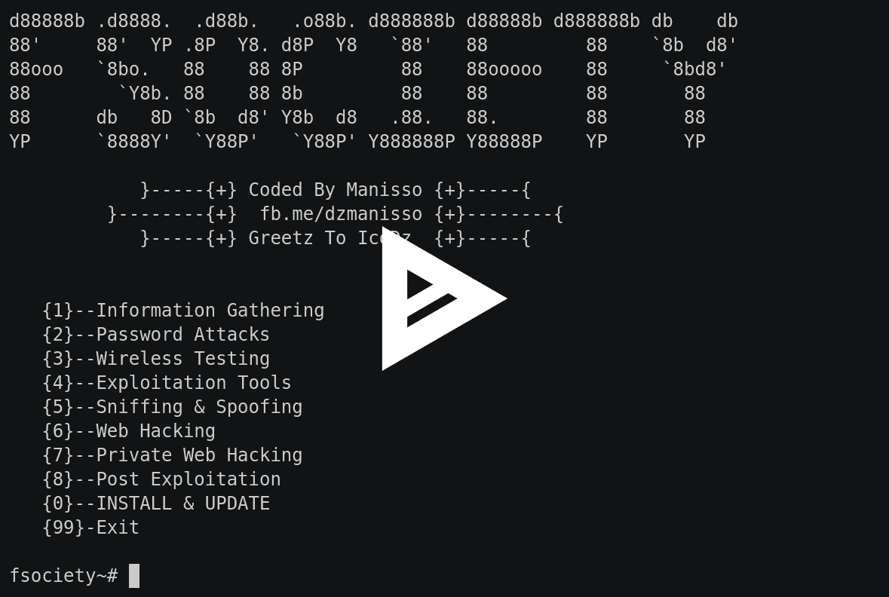
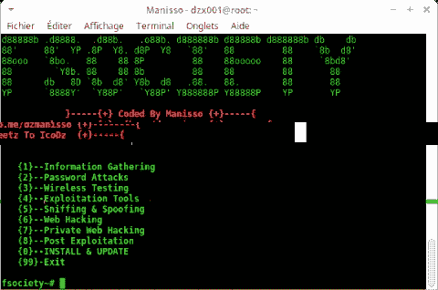

# 社会黑客工具包——渗透测试框架

> 原文：<https://kalilinuxtutorials.com/fsociety-hacking-tools-pack/>

fsociety 是一个渗透测试系统，由程序员需要的所有渗透测试设备组成。

它整合了与机器人先生系列相关的每一个设备。该工具包括一个庞大的设备列表，开始构建信息社会事件，以进行后期开发。

**也可理解为[auto VPN–连接到您选择的国家的 VPN](https://kalilinuxtutorials.com/autovpn-connect-vpn/)**

## **信息收集**

*   Nmap
*   Setoolkit
*   主机到 IP
*   WPScan
*   CMS 扫描仪
*   XSStrike
*   呆子-谷歌呆子被动漏洞审计员
*   扫描服务器的用户
*   瘸子

## **密码攻击:**

*   Cupp
*   Ncrack

## **无线测试:**

*   掠夺者（网络游戏空灵机甲里的飞船名）
*   像素视图
*   蓝牙蜜罐

## **剥削工具:**

*   ntscan
*   sqlcmap
*   外壳
*   混合
*   FTP 自动旁路
*   JBoss 汽车城

## **嗅探&欺骗:**

*   Setoolkit
*   SSLtrip
*   派皮舍尔
*   SMTP 邮件程序

## **网络黑客:**

*   Drupal 黑客
*   Inurlbr
*   WordPress & Joomla 扫描仪
*   重力形式扫描仪
*   文件上传检查器
*   WordPress 漏洞扫描器
*   WordPress 插件扫描仪
*   外壳和目录查找器
*   珠姆拉。1.5–3 . 4 . 5 远程代码执行
*   Vbulletin 5。x 远程代码执行
*   BruteX 自动强力攻击目标上运行的所有服务
*   arachni–Web 应用程序安全扫描器框架

## **fsociety 私人网站黑客:**

*   获取所有网站
*   获取 Joomla 网站
*   获取 WordPress 网站
*   控制面板搜索器
*   Zip 文件查找器
*   上传文件查找器
*   获取服务器用户
*   SQli 扫描仪
*   端口扫描(端口范围)
*   端口扫描(通用端口)
*   获取服务器信息
*   绕过云闪

## **后期剥削:**

*   外壳检查器
*   诗人
*   威曼

## **截图**

