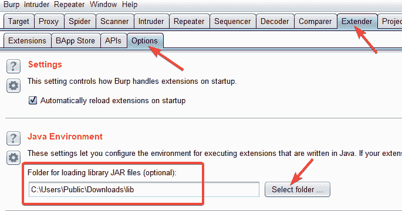
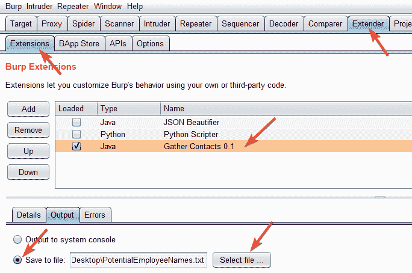
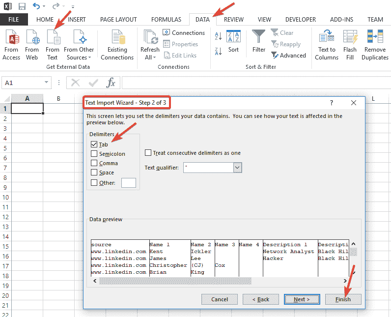
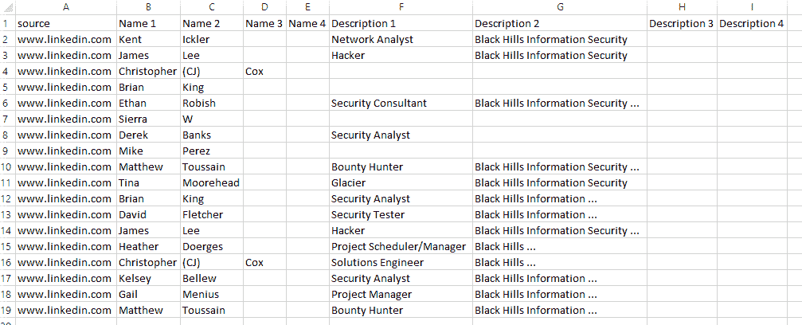
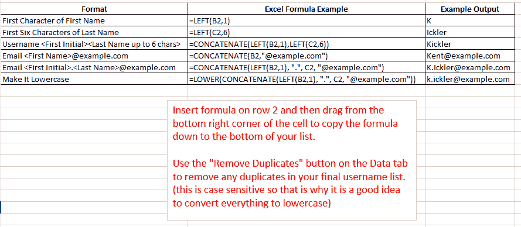

# gather contacts——一个从 Google & Bing LinkedIn 搜索结果中提取员工姓名的 Burp 套件扩展

> 原文：<https://kalilinuxtutorials.com/gathercontacts/>

GatherContacts 是一个 Burp 套件扩展，用于从 Google 和 Bing LinkedIn 搜索结果中提取员工姓名。

作为执行渗透测试时侦察的一部分，收集员工姓名通常是有用的，然后可以将这些姓名发送到电子邮件地址和用户名中。例如，用户名可以方便地用于执行密码喷射攻击。收集员工姓名的一个简单方法是使用以下 Burp Suite Pro 扩展，如下所述。

要使用 Burp 收集员工姓名，您需要执行以下步骤。

**也读作[SQLMap v 1 . 2 . 9——自动 SQL 注入&数据库接管工具](https://kalilinuxtutorials.com/sqlmap-v1-2-9-automatic-injection/)**

## **第一步**

这个扩展使用了 **jsoup** Java 库。你需要[下载 jsoup](https://jsoup.org/download) 并告诉 Burp 在哪里可以找到它，如下所示。

## **第二步**

从**扩展器->扩展**选项卡添加“收集联系人”扩展，如下所示:

单击**添加–>选择文件…** 并浏览到您从该存储库中下载的“GatherContacts.jar”文件。

## **第三步**

配置扩展以将输出保存到文件。这是您的用户名将被写入的地方。您可以选择“在 UI 中显示”选项，但是当列表太长时,“输出”窗口会截断项目。

## **第四步**

将您的浏览器配置为像平常一样使用 Burp 作为代理。在浏览器中，使用谷歌或必应搜索以下表单(不要忘记“linkedin.com”末尾的“/in”:

网站:LinkedIn . com/在“公司名称”中

搜索结果中的每个员工姓名将作为制表符分隔的列表写入您指定的输出文件。您可以单击结果的附加页面，将更多员工姓名写入文件。

## **第五步**

使用这种方法，您可以快速方便地收集大量员工姓名。尝试将列表导入到 Microsoft Excel 中，您可以在其中使用公式将员工姓名转换为适当的用户名格式，如“名字首字母后跟姓氏”。

## **第六步**

完成后，卸载扩展，这样就不会让 Burp 检查所有响应。

**注意:**如果您没有像预期的那样将名称写入输出文件，可能是因为该名称在加载后已经被扩展名输出了。要重置一切，卸载(取消选中)扩展，然后重新加载。

## **附加信息**

对于那些不熟悉 Excel 公式的人，这里有一些根据上面的输出创建用户名和电子邮件地址的公式。(假设 B 列包含名字，C 列包含姓氏)

## **收集联系人提示**

在喷洒前随机化你的用户名列表的顺序，以避免在某些情况下被发现。您可以使用 **=RAND()** 公式将一列随机数添加到电子表格中，然后按此列排序。

