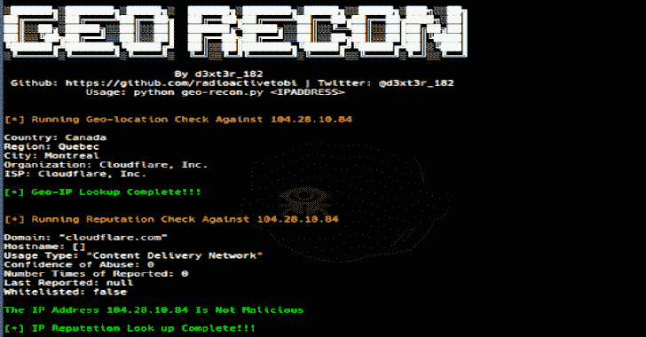

# Geo-Recon:旨在快速跟踪知识产权声誉的 OSINT CLI 工具

> 原文：<https://kalilinuxtutorials.com/geo-recon/>

**Geo-Recon** 是一款 OSINT CLI 工具，旨在为安全分析师快速跟踪 IP 信誉和地理位置查找。

**设置**

该工具可与以下工具一起使用:

*   任何 Linux 操作系统(Debian、Ubuntu、CentOS)
*   泰尔穆克

**Linux 设置**

**git 克隆 https://github.com/radioactivetobi/geo-recon.git
CD geo-recon
chmod+x geo-recon . py
pip install-r requirements . txt**

**Termux 设置**

**git 克隆 https://github.com/radioactivetobi/geo-recon.git
CD geo-recon
chmod+x geo-recon . py
pip install-r requirements . txt**

**示例语法 Linux**

**root @ kali:~/Geo-recon # python Geo-recon . py 138.121.128.19**

**{ * }运行地理位置检查对照 138.121.128.19**

国家:巴西
地区:皮亚乌伊
城市:Teresina
组织:Itech Telecom
ISP:Itech Telecom

**{ * }地理 IP 查找完成！！！**

针对 138.121.128.19
域名运行信誉检查:【reditechtelecom . com . br】
主机名:【】
使用类型:【固话 ISP】
滥用可信度:100
举报次数:982
上次举报:【2020-08-21t 16:43:12+00:00】
白名单:假

**IP 地址 138.121.128.19！！**

**示例语法术语**

**$ python 2 Geo-recon . py 138.121.128.19**

**{ * }对照 138.121.128.19**
运行地理位置检查国家:巴西
地区:皮亚乌伊
城市:Teresina
组织:Itech Telecom
ISP:Itech Telecom

**{ * }地理 IP 查找完成！！！**

**{ * }针对 138.121.128.19**

域名运行信誉检查: " reditechtelecom . com . br "
主机名:[]
使用类型:"固网 ISP"
滥用可信度:100
举报次数:982
上次举报:" 2020-08-21T16:43:12+00:00"
白名单:false【T26！！

**待办事项清单**

*   包括地理 IP 查找的经度和纬度
*   修复 API

[**Download**](https://github.com/radioactivetobi/geo-recon)