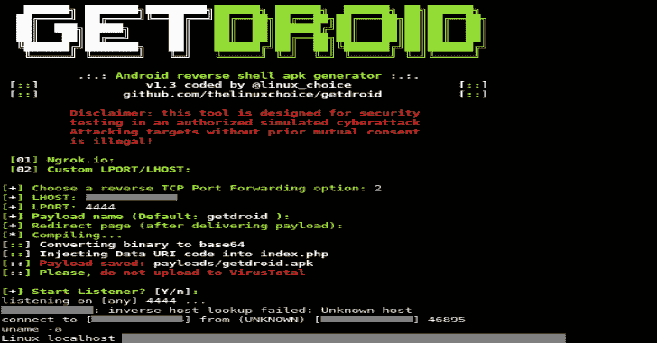

# Getdroid : FUD Android 有效载荷和监听器

> 原文：<https://kalilinuxtutorials.com/getdroid/>

Getdroid 是一个 FUD 的 Android 负载和监听器。

**需求(Android-SDK，APKSinger)**

**apt-get 安装 Android-SDK apksinar-y**

**用途**

**git 克隆 https://github . com/thelinuxoice/getdroid
CD getdroid
bash getdroid . sh**

**也可阅读-[Kali Linux 2020.2 发布-渗透测试和道德黑客 Linux 分发](https://kalilinuxtutorials.com/kali-linux-2020-2/)**

**免责声明**

未经双方同意，使用 GetDroid 攻击目标是非法的。最终用户有责任遵守所有适用的地方、州和联邦法律。开发者不承担任何责任，也不对本程序造成的任何误用或损害负责。

[**Download**](https://github.com/thelinuxchoice/getdroid)