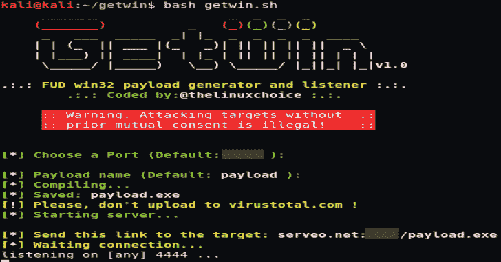

# GetWin : FUD Win32 有效负载生成器和侦听器

> 原文：<https://kalilinuxtutorials.com/getwin/>

GetWin 是一个 FUD Win32 负载生成器和侦听器。以下是该工具的一些功能；

*   FUD:完全探测不到
*   不需要配置端口转发，或安装其他程序，只使用 ssh 和 serveo.net。

**用途**

**git 克隆 https://github . com/thelinuxoice/getwin
CD getwin
bash getwin . sh**

**也可阅读-[PhoneInfoga:高级信息收集& OSINT 电话号码工具](https://kalilinuxtutorials.com/phoneinfoga-information-gathering-osint-tool/)**

**安装要求(mingw-w64)**

**sudo apt-get 安装 mingw-w64**

**免责声明**

未经双方事先同意，使用此工具攻击目标是非法的。最终用户有责任遵守所有适用的地方、州和联邦法律。开发人员不承担任何责任，也不对本程序造成的任何误用或损坏负责。

[**Download**](https://github.com/thelinuxchoice/getwin/)