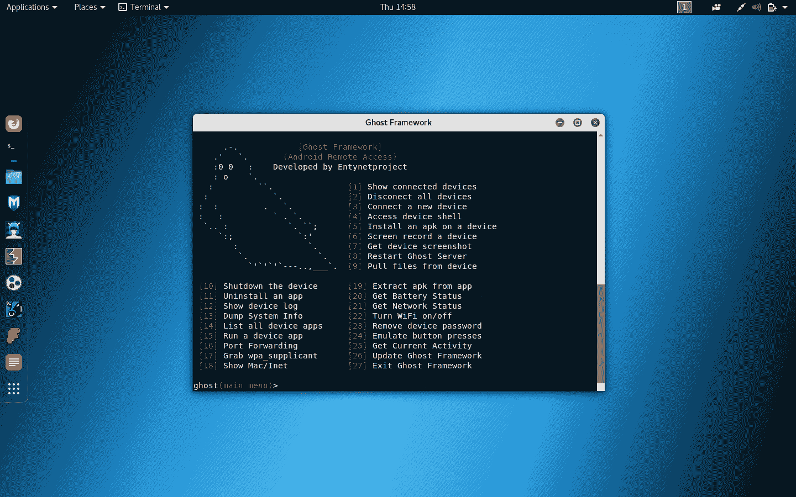
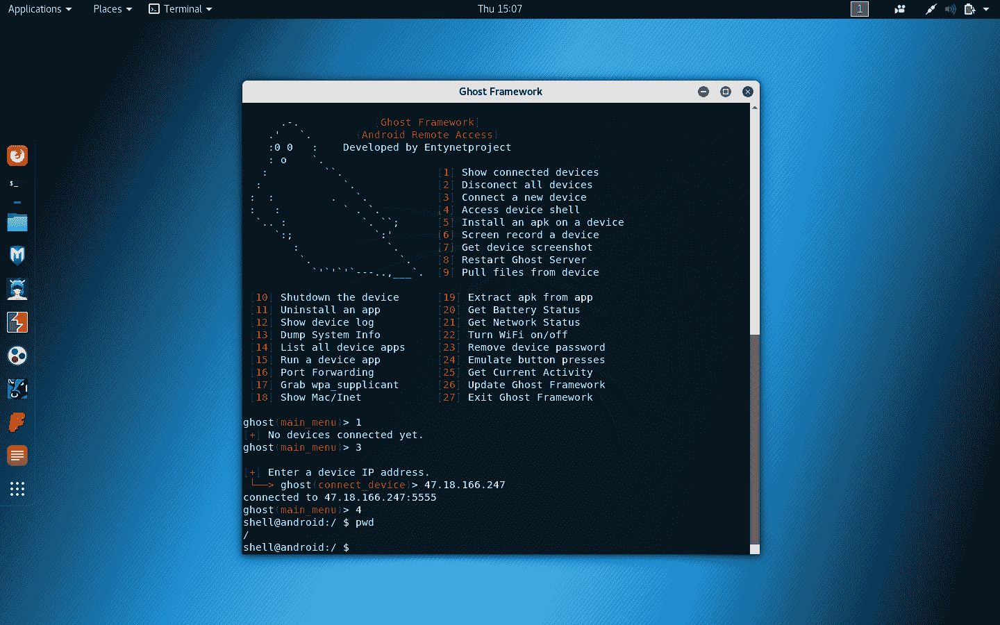

# Ghost:远程访问 Android 设备的 Android 调试桥

> 原文：<https://kalilinuxtutorials.com/ghost/>

**Ghost** Framework 是一个 Android 后开发框架，它使用 Android 调试桥来远程访问 Android 设备。It 框架为您提供了远程 Android 设备管理的能力和便利。

**安装**

**CD ghost
chmod+x install . sh
。/install.sh**

**卸载**

**CD ghost
chmod+x uninstall . sh
。/uninstall.sh**

**执行**

要执行框架，您应该执行以下命令。

**幽灵**

**也读作-[bad blood:微软活动目录域名与结构](https://kalilinuxtutorials.com/badblood/)**

**为什么？**

*   它有一个简单明了的 UX/用户界面。它很容易理解，你也更容易掌握它。
*   如果忘记了远程 Android 设备密码，可以使用它来删除密码。
*   它可以用来访问远程 Android 设备外壳，而无需使用 OpenSSH 或其他协议。

**免责声明**

未经双方事先同意，使用此框架攻击目标是非法的。最终用户有责任遵守所有适用的地方、州、联邦和国际法律。开发人员不承担任何责任，也不对本程序造成的任何误用或损坏负责。

[**Download**](https://github.com/entynetproject/ghost)