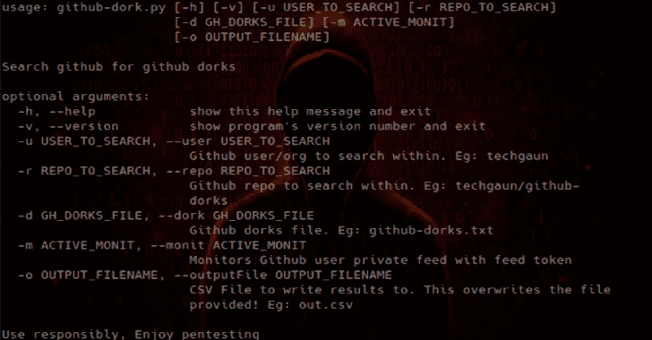

# Github 呆子:Github 呆子和辅助工具的集合

> 原文：<https://kalilinuxtutorials.com/github-dorks/>

Github search 是一个非常强大和有用的功能，可以用来搜索存储库上的敏感数据。github 呆子的集合，可能泄露敏感的个人和/或组织信息，如私钥、凭证、认证令牌等。

这个列表应该对评估安全性和执行系统的 pen 测试很有用。

github-dork.py 是一个简单的 python 工具，可以搜索您的存储库或您的组织/用户存储库。目前它还不是一个完美的工具，但是它提供了一个基本的功能，可以根据文本文件中指定的呆子来自动搜索你的存储库。

**安装**

这个工具使用 [github3.py](https://github.com/sigmavirus24/github3.py) 与 github 搜索 API 对话。

克隆此存储库并运行:

**pip install-r requirements . txt**

**又读-[Trivy:Simple&综合漏洞扫描器](http://kalilinuxtutorials.com/trivy-comprehensive-vulnerability-scanner/)**

**用途**

GH _ USER–指定 github 用户的环境变量
GH _ PWD–指定密码的环境变量
GH _ TOKEN–指定 github 令牌的环境变量
GH _ URL–指定 GitHub 企业基本 URL 的环境变量

下面列出了一些使用示例:

python GitHub-dork . py-r tech gaun/GitHub-dorks
#搜索单一回购

python GitHub-dork . py-u tech gaun
#搜索用户的所有回购

python GitHub-dork . py-u dev-Nepal
#搜索某机构的所有回购

GH _ USER = tech gaun GH _ PWD =<my pass>python GitHub-dork . py-u dev-Nepal

**限制**

*   经过身份验证的请求获得更高的速率限制。但是，因为这个工具等待 api 速率限制被重置(通常不到一分钟)，所以它可能会稍微慢一些。
*   输出格式不是很好。公关欢迎
*   ~~处理速率限制并重试。公关欢迎~~

**呆瓜名单**

我现在不分类。取而代之的是，我要去一份有描述的呆子名单。许多傻瓜可以修改，使搜索更具体或通用。这里可以看到更多选项[。](https://github.com/search#search_cheatsheet_pane)

| 笨蛋 | 描述 |
| --- | --- |
| 文件名:。npmrc _auth 节 | npm 注册表身份验证数据 |
| 文件名:。dockercfg auth | docker 注册表认证数据 |
| 分机:pem 私人 | 私钥 |
| 分机:ppk 专用 | puttygen 私钥 |
| 文件名:id_rsa 或文件名:id_dsa | 私有 ssh 密钥 |
| 扩展:sql mysql 转储 | mysqldump |
| 扩展:sql mysql 转储密码 | mysql 转储查找密码；你可以尝试各种各样的 |
| 文件名:凭据 aws_access_key_id | 可能会返回带有伪值的假阴性 |
| 文件名:. s3cfg | 可能会返回带有伪值的假阴性 |
| filename:wp-config.php | wordpress 配置文件 |
| filename:.htpasswd | htpasswd 文件 |
| 文件名:。环境数据库 _ 用户名不是家园 | 拉弗尔。env (CI，还有各种基于 ruby 的框架) |
| 文件名:。env MAIL_HOST=smtp.gmail.com | gmail smtp 配置(也尝试不同的 smtp 服务) |
| 文件名:。git 证书 | git 凭据存储，添加非用户名以获得更多有效结果 |
| PT_TOKEN 语言:bash | 数据透视跟踪令牌 |
| 文件名:。bashrc 密码 | 搜索密码等。英寸 bashrc(尝试使用。bash_profile 也是) |
| 文件名:。bashrc mailchimp | 上述变化(尝试更多变化) |
| 文件名:。bash_profile aws | aws 访问和密钥 |
| rds.amazonaws.com 密码 | 亚马逊 RDS 可能的凭证 |
| 扩展:json api.forecast.io | 尝试各种变化，寻找 api 密钥/秘密 |
| 扩展:JSON mongolab.com | json 配置中的 mongolab 凭据 |
| 分机:YAML mongolab.com | yaml 配置中的 mongolab 凭证(尝试使用 yml) |
| jsforce 扩展:js conn.login | nodejs 项目中可能的 salesforce 凭据 |
| SF _ 用户名 salesforce | 可能的 salesforce 凭据 |
| 文件名:。拖船不是拖船 | 数字海洋拖船配置 |
| HEROKU_API_KEY 语言:shell | Heroku api 密钥 |
| HEROKU_API_KEY 语言:json | json 文件中的 Heroku api 键 |
| 文件名:。netrc 密码 | 可能持有敏感凭据的 netrc |
| 文件名:_netrc 密码 | 可能持有敏感凭据的 netrc |
| 文件名:集线器 oauth_token | 存储 github 令牌的集线器配置 |
| filename:robomongo.json | robomongo 使用的 mongodb 凭据文件 |
| 文件名:filezilla.xml Pass | 具有可能用户/传递到 ftp 的 filezilla 配置文件 |
| 文件名:recentservers.xml Pass | 具有可能用户/传递到 ftp 的 filezilla 配置文件 |
| 文件名:config.json auths | docker 注册表认证数据 |
| 文件名:idea14.key | IntelliJ Idea 14 键，尝试其他版本的变体 |
| 文件名:配置 irc_pass | 可能的 IRC 配置 |
| 文件名:connections.xml | 可能的数据库连接配置，尝试具体的变化 |
| 文件名:express.conf 路径:。openshift | openshift 配置，只有电子邮件和服务器 |
| filename:.pgpass | 可以包含密码的 PostgreSQL 文件 |
| 文件名:proftpdpasswd | cpanel 创建的 proftpd 的用户名和密码 |
| 文件名:ventrilo_srv.ini | 腹肌构型 |
| [wf client]Password = extension:ICA | win frame-用户连接到 Citrix 应用程序服务器所需的客户端信息 |
| 文件名:server.cfg rcon 密码 | 反恐精英 RCON 密码 |
| 杰基尔 _ GITHUB _ 令牌 | 用于 jekyll 的 Github 令牌 |
| 文件名:。bash _ 历史 | Bash 历史文件 |
| 文件名:。cshrc | csh shell 的 RC 文件 |
| 文件名:。历史 | 历史文件(经常被许多工具使用) |
| 文件名:。sh _ 历史记录 | korn shell 历史 |
| filename:sshd_config | OpenSSH 服务器配置 |
| 文件名:dhcpd.conf | DHCP 服务配置 |
| 文件名:prod.exs 而不是 prod.secret.exs | Phoenix 产品配置文件 |
| 文件名:产品.秘密. exs | 凤凰产品秘密 |
| 文件名:configuration.php JConfig 密码 | Joomla 配置文件 |
| filename:config.php dbpasswd | PHP 应用程序数据库密码(如 phpBB 论坛软件) |
| 路径:站点数据库密码 | Drupal 网站数据库凭据 |
| shodan_api_key 语言:python | Shodan API 键(也尝试其他语言) |
| 文件名:阴影路径:等等 | 包含新 unix 系统的加密密码和帐户信息 |
| 文件名:密码路径:等等 | 包含用户帐户信息，包括传统 unix 系统的加密密码 |
| 分机:avastlic "support.avast.com " | 包含 Avast 的许可证密钥！抗病毒素 |
| 文件名:dbeaver-data-sources.xml | 包含 MySQL 凭证的 DBeaver 配置 |
| 文件名:。esmtprc 密码 | esmtp 配置 |
| 扩展:JSON Google user content client _ secret | 用于访问 Google APIs 的 OAuth 凭证 |
| 家酿 _GITHUB_API_TOKEN 语言:shell | Github 令牌通常由自制软件用户设置 |
| xoxp 或 xoxb | Slack bot 和私有令牌 |
| . mlab.com 密码 | MLAB 托管了 MongoDB 凭据 |
| filename:logins.json | Firefox 保存的密码集合(key3.db 通常在同一个 repo 中) |
| 文件名:CCCam.cfg | CCCam 服务器配置文件 |
| msg nickserv 标识文件名:配置 | 可能的 IRC 登录密码 |
| 文件名:settings.py SECRET_KEY | Django 密钥(通常允许会话劫持、RCE 等) |
| 文件名:secrets.yml 密码 | 用户名/密码，Rails 应用程序 |
| 文件名:master.key 路径:config | Rails 主密钥(用于为 Rails 5.2+解密`credentials.yml.enc`) |
| 文件名:部署配置. json | 由 sftp-deployment for Atom 创建，包含服务器详细信息和凭据 |
| filename:.ftpconfig | 由 remote-ssh for Atom 创建，包含 SFTP/SSH 服务器的详细信息和凭据 |
| 文件名:。远程同步 | 由 Atom 远程同步创建，包含 FTP 和/或 SCP/SFTP/SSH 服务器详细信息和凭据 |
| 文件名:sftp.json 路径:。虚拟代码 | 由 vscode-sftp for VSCode 创建，包含 SFTP/SSH 服务器详细信息和凭据 |
| filename:sftp-config.json | 由 SFTP 为 Sublime Text 创建，包含 FTP/FTPS 或 SFTP/SSH 服务器的详细信息和凭证 |
| 文件名:WebServers.xml | 由 Jetbrains IDEs 创建，包含带编码密码的 web 服务器凭证([未加密！](https://intellij-support.jetbrains.com/hc/en-us/community/posts/207074025/comments/207034775)) |

[**Download**](https://github.com/techgaun/github-dorks)