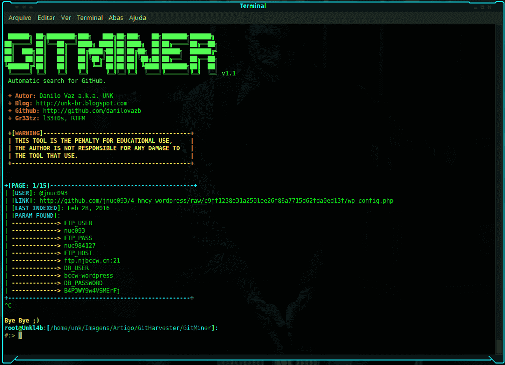
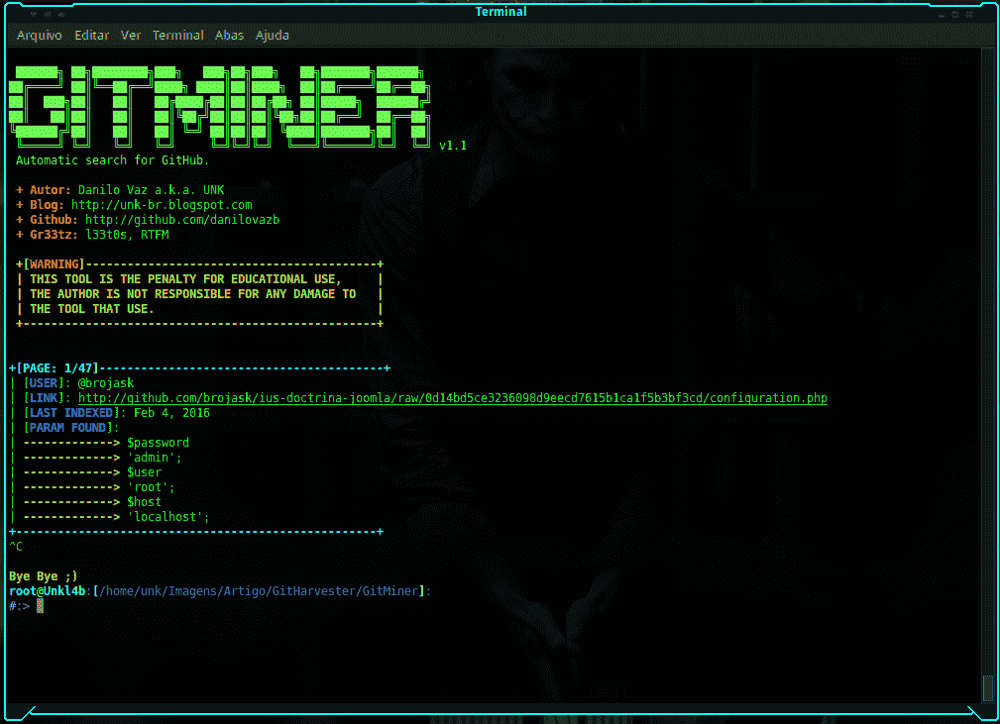

# git miner——对 Github 上的内容进行高级挖掘的工具

> 原文：<https://kalilinuxtutorials.com/gitminer-tool-mining-content-github/>

GitMiner 是 Github 中的一个高级搜索工具和自动化。该工具旨在通过网站的搜索页面，方便通过 github 上的代码或代码片段进行研究。

## **GitMiner 要求**

*   lxml
*   要求
*   抱怨吗
*   json
*   关于

## **安装**

```
$ git clone http://github.com/UnkL4b/GitMiner
$ cd GitMiner
~/GitMiner $ pip3 install -r requirements.txt
```

## **码头工人**

```
$ git clone http://github.com/UnkL4b/GitMiner
$ cd GitMiner
$ docker build -t gitminer .
$ docker run -it gitminer -h
```

**也可阅读[easy SSH——SSH 连接管理器让你的生活更轻松](https://kalilinuxtutorials.com/easyssh-ssh-connection-manager/)**

## **参考**

```
 **`UnkL4b
  __                   Automatic search for Github
((OO))   ▄████  ██▓▄▄▄█████▓ ███▄ ▄███▓ ██▓ ███▄    █ ▓█████  ██▀███  
 \__/   ██▒ ▀█▒▓██▒▓  ██▒ ▓▒▓██▒▀█▀ ██▒▓██▒ ██ ▀█   █ ▓█   ▀ ▓██ ▒ ██▒      OO
  |^|  ▒██░▄▄▄░▒██▒▒ ▓██░ ▒░▓██    ▓██░▒██▒▓██  ▀█ ██▒▒███   ▓██ ░▄█ ▒      oOo
  | |  ░▓█  ██▓░██░░ ▓██▓ ░ ▒██    ▒██ ░██░▓██▒  ▐▌██▒▒▓█  ▄ ▒██▀▀█▄      OoO
  | |  ░▒▓███▀▒░██░  ▒██▒ ░ ▒██▒   ░██▒░██░▒██░   ▓██░░▒████▒░██▓ ▒██▒  /oOo 
  | |___░▒___▒_░▓____▒_░░___░_▒░___░__░░▓__░_▒░___▒_▒_░░_▒░_░░_▒▓_░▒▓░_/ /
  \______░___░__▒_░____░____░__░______░_▒_░░_░░___░_▒░_░_░__░__░▒_░_▒░__/  v2.0
       ░ ░   ░  ▒ ░  ░      ░      ░    ▒ ░   ░   ░ ░    ░     ░░   ░ 
             ░  ░                  ░    ░           ░    ░  ░   ░ 
  -> github.com/UnkL4b
  -> unkl4b.github.io

  +---------------------[WARNING]---------------------+
  | DEVELOPERS ASSUME NO LIABILITY AND ARE NOT        |
  | RESPONSIBLE FOR ANY MISUSE OR DAMAGE CAUSED BY    |
  | THIS PROGRAM                                      |
  +---------------------------------------------------+ 
    [-h] [-q 'filename:shadow path:etc']
       [-m wordpress] [-o result.txt]
       [-r '/^\s*.*?;?\s*$/gm']
       [-c _octo=GH1.1.2098292984896.153133829439; _ga=GA1.2.36424941.153192375318; user_session=oZIxL2_ajeDplJSndfl37ddaLAEsR2l7myXiiI53STrfhqnaN; __Host-user_session_same_site=oXZxv9_ajeDplV0gAEsmyXiiI53STrfhDN; logged_in=yes; dotcom_user=unkl4b; tz=America%2FSao_Paulo; has_recent_activity=1; _gh_sess=MmxxOXBKQ1RId3NOVGpGcG54aEVnT1o0dGhxdGdzWVpySnFRd1dVYUk5TFZpZXFuTWxOdW1FK1IyM0pONjlzQWtZM2xtaFR3ZDdxlGMCsrWnBIdnhUN0tjVUtMYU1GeG5Pbm5DMThuWUFETnZjcllGOUNkRGUwNUtKOVJTaGR5eUJYamhWRE5XRnMWZZN3Y3dlpFNDZXL1NWUEN4c093RFhQd3RJQ1NBdmhrVDE3VVNiUFF3dHBycC9FeDZ3cFVXV0ZBdXZieUY5WDRlOE9ZSG5sNmRHUmllcmk0Up1MTcyTXZrN1RHYmJSdz09--434afdd652b37745f995ab55fc83] 
optional arguments:
  -h, --help            show this help message and exit
  -q 'filename:shadow path:etc', --query 'filename:shadow path:etc'
                        Specify search term
  -m wordpress, --module wordpress
                        Specify the search module
  -o result.txt, --output result.txt
                        Specify the output file where it will be
                        saved
  -r '/^\s*(.*?);?\s*$/gm', --regex '/^\s*(.*?);?\s*$/gm'
                        Set regex to search in file
  -c _octo=GH1.1.2098292984896.153133829439; _ga=GA1.2.36424941.153192375318; user_session=oZIxL2_ajeDplJSndfl37ddaLAEsR2l7myXiiI53STrfhqnaN; __Host-user_session_same_site=oXZxv9_ajeDplV0gAEsmyXiiI53STrfhDN; logged_in=yes; dotcom_user=unkl4b; tz=America%2FSao_Paulo; has_recent_activity=1; _gh_sess=MmxxOXBKQ1RId3NOVGpGcG54aEVnT1o0dGhxdGdzWVpySnFRd1dVYUk5TFZpZXFuTWxOdW1FK1IyM0pONjlzQWtZM2xtaFR3ZDdxlGMCsrWnBIdnhUN0tjVUtMYU1GeG5Pbm5DMThuWUFETnZjcllGOUNkRGUwNUtKOVJTaGR5eUJYamhWRE5XRnMWZZN3Y3dlpFNDZXL1NWUEN4c093RFhQd3RJQ1NBdmhrVDE3VVNiUFF3dHBycC9FeDZ3cFVXV0ZBdXZieUY5WDRlOE9ZSG5sNmRHUmllcmk0Up1MTcyTXZrN1RHYmJSdz09--434afdd652b37745f995ab55fc83, --cookie _octo=GH1.1.2098292984896.153133829439; _ga=GA1.2.36424941.153192375318; user_session=oZIxL2_ajeDplJSndfl37ddaLAEsR2l7myXiiI53STrfhqnaN; __Host-user_session_same_site=oXZxv9_ajeDplV0gAEsmyXiiI53STrfhDN; logged_in=yes; dotcom_user=unkl4b; tz=America%2FSao_Paulo; has_recent_activity=1; _gh_sess=MmxxOXBKQ1RId3NOVGpGcG54aEVnT1o0dGhxdGdzWVpySnFRd1dVYUk5TFZpZXFuTWxOdW1FK1IyM0pONjlzQWtZM2xtaFR3ZDdxlGMCsrWnBIdnhUN0tjVUtMYU1GeG5Pbm5DMThuWUFETnZjcllGOUNkRGUwNUtKOVJTaGR5eUJYamhWRE5XRnMWZZN3Y3dlpFNDZXL1NWUEN4c093RFhQd3RJQ1NBdmhrVDE3VVNiUFF3dHBycC9FeDZ3cFVXV0ZBdXZieUY5WDRlOE9ZSG5sNmRHUmllcmk0Up1MTcyTXZrN1RHYmJSdz09--434afdd652b37745f995ab55fc83
                        Specify the cookie for your github
```

## **例子**

**搜索带有密码的 wordpress 配置文件:**

```
$:> python3 gitminer-v2.0.py -q 'filename:wp-config extension:php FTP_HOST in:file ' -m wordpress -c pAAAhPOma9jEsXyLWZ
```



**寻找包含密码的巴西政府文件:**

```
$:> python3 gitminer-v2.0.py --query 'extension:php "root"** **in:file AND "gov.br" in:file' -m senhas -c pAAAhPOma9jEsXyLWZ-16RTTsGI8wDawbNs4
```

**寻找 etc 粘贴上的影子文件:**

```
$:> python3 gitminer-v2.0.py --query** **'filename:shadow path:etc' -m root -c pAAAhPOma9jEsXyLWZ-16RTTsGI8wDawbNs4
```

**搜索带有密码的 joomla 配置文件:**

```
$:> python3 gitminer-v2.0.py --query 'filename:configuration extension:php** **"public password" in:file' -m joomla -c pA
```

## 

## **呆呆地搜索**

| 笨蛋 | 描述 |
| --- | --- |
| 文件名:。npmrc _auth 节 | npm 注册表身份验证数据 |
| 文件名:。dockercfg auth | docker 注册表认证数据 |
| 分机:pem 私人 | 私钥 |
| 分机:ppk 专用 | puttygen 私钥 |
| 文件名:id_rsa 或文件名:id_dsa | 私有 ssh 密钥 |
| 扩展:sql mysql 转储 | mysqldump |
| 扩展:sql mysql 转储密码 | mysql 转储查找密码；你可以尝试各种各样的 |
| 文件名:凭据 aws_access_key_id | 可能会返回带有伪值的假阴性 |
| 文件名:. s3cfg | 可能会返回带有伪值的假阴性 |
| filename:wp-config.php | wordpress 配置文件 |
| filename:.htpasswd | htpasswd 文件 |
| 文件名:。环境数据库 _ 用户名不是家园 | 拉弗尔。env (CI，还有各种基于 ruby 的框架) |
| 文件名:。env MAIL_HOST=smtp.gmail.com | gmail smtp 配置(也尝试不同的 smtp 服务) |
| 文件名:。git 证书 | git 凭据存储，添加非用户名以获得更有效的结果 |
| PT_TOKEN 语言:bash | 数据透视跟踪令牌 |
| 文件名:。bashrc 密码 | 搜索密码等。英寸 bashrc(尝试使用。bash_profile 也是) |
| 文件名:。bashrc mailchimp | 上述变化(尝试更多变化) |
| 文件名:。bash_profile aws | aws 访问和密钥 |
| rds.amazonaws.com 密码 | 亚马逊 RDS 可能的凭证 |
| 扩展:json api.forecast.io | 尝试各种变化，寻找 api 密钥/秘密 |
| 扩展:JSON mongolab.com | json 配置中的 mongolab 凭据 |
| 分机:YAML mongolab.com | yaml 配置中的 mongolab 凭证(尝试使用 yml) |
| jsforce 扩展:js conn.login | nodejs 项目中可能的 salesforce 凭据 |
| SF _ 用户名 salesforce | 可能的 salesforce 凭据 |
| 文件名:。拖船不是拖船 | 数字海洋拖船配置 |
| HEROKU_API_KEY 语言:shell | Heroku api 密钥 |
| HEROKU_API_KEY 语言:json | json 文件中的 Heroku api 键 |
| 文件名:。netrc 密码 | 可能持有敏感凭据的 netrc |
| 文件名:_netrc 密码 | 可能持有敏感凭据的 netrc |
| 文件名:集线器 oauth_token | 存储 github 令牌的集线器配置 |
| filename:robomongo.json | robomongo 使用的 mongodb 凭据文件 |
| 文件名:filezilla.xml Pass | 具有可能用户/传递到 ftp 的 filezilla 配置文件 |
| 文件名:recentservers.xml Pass | 具有可能用户/传递到 ftp 的 filezilla 配置文件 |
| 文件名:config.json auths | docker 注册表认证数据 |
| 文件名:idea14.key | IntelliJ Idea 14 键，尝试其他版本的变体 |
| 文件名:配置 irc_pass | 可能的 IRC 配置 |
| 文件名:connections.xml | 可能的数据库连接配置，尝试具体的变化 |
| 文件名:express.conf 路径:。openshift | openshift 配置，只有电子邮件和服务器 |
| filename:.pgpass | 可以包含密码的 PostgreSQL 文件 |
| 文件名:proftpdpasswd | cpanel 创建的 proftpd 的用户名和密码 |
| 文件名:ventrilo_srv.ini | 腹肌构型 |
| [wf client]Password = extension:ICA | win frame-用户连接到 Citrix 应用程序服务器所需的客户端信息 |
| 文件名:server.cfg rcon 密码 | 反恐精英 RCON 密码 |
| 杰基尔 _ GITHUB _ 令牌 | 用于 jekyll 的 Github 令牌 |
| 文件名:。bash _ 历史 | Bash 历史文件 |
| 文件名:。cshrc | csh shell 的 RC 文件 |
| 文件名:。历史 | 历史文件(经常被许多工具使用) |
| 文件名:。sh _ 历史记录 | korn shell 历史 |
| filename:sshd_config | OpenSSH 服务器配置 |
| 文件名:dhcpd.conf | DHCP 服务配置 |
| 文件名:prod.exs 而不是 prod.secret.exs | Phoenix 产品配置文件 |
| 文件名:产品.秘密. exs | 凤凰产品秘密 |
| 文件名:configuration.php JConfig 密码 | Joomla 配置文件 |
| filename:config.php dbpasswd | PHP 应用程序数据库密码(如 phpBB 论坛软件) |
| 路径:站点数据库密码 | Drupal 网站数据库凭据 |
| shodan_api_key 语言:python | Shodan API 键(也尝试其他语言) |
| 文件名:阴影路径:等等 | 包含新 unix 系统的加密密码和帐户信息 |
| 文件名:密码路径:等等 | 包含用户帐户信息，包括传统 unix 系统的加密密码 |
| 扩展:avastlic | 包含 Avast 的许可证密钥！抗病毒素 |
| 扩展名:dbeaver-data-sources.xml | 包含 MySQL 凭证的 DBeaver 配置 |
| 文件名:。esmtprc 密码 | esmtp 配置 |
| 扩展:JSON Google user content client _ secret | 用于访问 Google APIs 的 OAuth 凭证 |
| 家酿 _GITHUB_API_TOKEN 语言:shell | Github 令牌通常由自制软件用户设置 |
| xoxp 或 xoxb | Slack bot 和私有令牌 |
| . mlab.com 密码 | MLAB 托管了 MongoDB 凭据 |
| filename:logins.json | Firefox 保存的密码集合(key3.db 通常在同一个 repo 中) |
| 文件名:CCCam.cfg | CCCam 服务器配置文件 |
| msg nickserv 标识文件名:配置 | 可能的 IRC 登录密码 |
| 文件名:settings.py SECRET_KEY | Django 密钥(通常允许会话劫持、RCE 等) |

## **免责声明**

开发者不承担任何责任，也不对本程序造成的任何误用或损害负责。

[](https://github.com/UnkL4b/GitMiner)

**Autor: UnK**