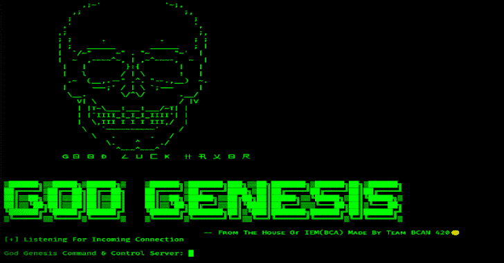

# 上帝创世纪:有效载荷能够绕过所有已知的抗病毒和终点

> 原文：<https://kalilinuxtutorials.com/god-genesis/>

[](https://blogger.googleusercontent.com/img/b/R29vZ2xl/AVvXsEhbKqtPXM4bAcf3a8rI1oABAM6-qjQIA-sm8ony23cLuVrWH545SzxQlRQli-AJCiwJxYv3za2tajHRJd95HCw-jtsY1ax9xib6qLkOKEghhIcBxt5GOEbHlZUFTOkM85BcSAhiqNey8ATbW1ba-gCF1UyNKSMSKfPSfOwn65wty8BslolR30IYcq5X/s728/GodGenesis.png)

**God Genesis** 是一个纯 Python3 编码的 C2 服务器，用来帮助红队队员和渗透测试员。目前，它只支持 TCP 反向外壳，但等一下，它是一个 FUD，可以从任何目标 WINDOWS 机器给你管理外壳。

它支持的命令列表:-

```
                ===================================================================================================
                  BASIC COMMANDS:
                ===================================================================================================
                            help                  --> Show This Options
                            terminate             --> Exit The Shell Completely
                            exit                  --> Shell Works In Background And Prompted To C2 Server
                            clear                 --> Clear The Previous Outputs

                ===================================================================================================
                  SYSTEM COMMANDS:
                ===================================================================================================
                            cd                    --> Change Directory
                            pwd                   --> Prints Current Working Directory
                            mkdir *dir_name*      --> Creates A Directory Mentioned
                            rm *dir_name*         --> Deletes A Directoty Mentioned
                            powershell [command]  --> Run Powershell Command
                            start *exe_name*      --> Start Any Executable By Giving The Executable Name

                ===================================================================================================
                  INFORMATION GATHERING COMMANDS:
                ===================================================================================================
                            env                   --> Checks Enviornment Variables
                            sc                    --> Lists All Services Running
                            user                  --> Current User
                            info                  --> Gives Us All Information About Compromised System
                            av                    --> Lists All antivirus In Compromised System

                ===================================================================================================
                  DATA EXFILTRATION COMMANDS:
                ===================================================================================================
                            download *file_name*  --> Download Files From Compromised System
                            upload *file_name*    --> Uploads Files To Victim Pc

                ===================================================================================================
                  EXPLOITATION COMMANDS:
                ===================================================================================================
                            persistence1          --> Persistance Via Method 1
                            persistence2          --> Persistance Via Method 2
                            get                   --> Download Files From Any URL
                            chrome_pass_dump      --> Dump All Stored Passwords From Chrome Bowser
                            wifi_password         --> Dump Passwords Of All Saved Wifi Networks
                            keylogger             --> Starts Key Logging Via Keylogger
                            dump_keylogger        --> Dump All Logs Done By Keylogger 
                            python_install        --> Installs Python In Victim Pc Without UI

```

## 我们框架的特点

查看视频以获得详细的知识

```
1\. The Payload.py is a FULLY UNDETECTABLE(FUD) use your own techniques for making an exe file. (Best Result When Backdoored With Some Other Legitimate Applictions)
2\. Able to perform privilege escalation on any windows systems.
3\. Fud keylogger
4\. 2 ways of achieving persistance 
5\. Recon automation to save your time.
```

## 如何使用我们的工具？

```
git clone https://github.com/SaumyajeetDas/GodGenesis.git
pip3 install -r requirements.txt
python3 c2c.py
```

值得一提的是，[苏曼·查克拉博蒂](https://github.com/ANON4MOUS)通过编写 Fud Keyloger、Wifi 密码提取和 Chrome 密码转储器模块对该框架做出了贡献。

[Click Here To Download](https://github.com/SaumyajeetDas/GodGenesis)