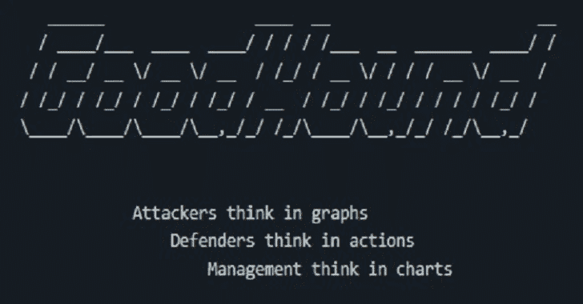

# GoodHound:使用 Sharphound、Bloodhound 和 Neo4j 生成可操作的攻击路径列表

> 原文：<https://kalilinuxtutorials.com/goodhound/>

GoodHound 的出现是因为我需要使用 Bloodhound 对攻击路径进行可重复的评估。
我发现，当以防御方式使用 BloodHound 时，它非常善于识别某个领域中的攻击路径，每次审查时我都要面对数千条攻击路径，没有办法对我在以前的审查中已经记录的结果进行重复删除。

我希望有一种方法能够以编程方式找到攻击路径，并以优先顺序显示这些路径，从暴露于每条路径的用户数量开始。这意味着我可以找到网络中的关键点，从而可以建议补救团队采取**行动**，帮助减少大多数用户能够使用的攻击路径。

我还希望能够提取一些汇总管理信息，以便能够记录这些信息。这有助于使用**图表**向管理层展示随着时间的推移所取得的进步。

最后，我想要一种方法来探测寻回 Bloodhound 的路径，并以 Bloodhound 一直做得很好的熟悉且易于阅读的攻击路径图**呈现。**

这是一个工作项目，也是我第一次尝试真正的工具。我非常感谢您的任何反馈，无论是错误、问题、功能请求还是一般的使用问题。只需记录一个问题，我会尽最大努力解决。

**快速启动**

要使用默认选项快速启动和运行:

## 先决条件

*   确保您已经安装了 Bloodhound 和 neo4j–https://bloodhound.readthedocs.io/en/latest/#install
*   确保您安装了 python
*   将您的 sharehound 输出上传到 bloodhound

## 安装 GoodHound

**pip 安装 goodhound**

**使用基本选项运行**

**good hound-p " neo4j password "**

**安装**

## 先决条件

*   Python 和 pip 已经安装。
    *   这已经在 Python 版本 3.9 和 3.10 中测试过了。早期版本也可能有效。请随意尝试并记录一个问题，让我知道它是否有效。
*   neo4j 和 bloodhound 都需要已经安装。https://bloodhound.readthedocs.io/en/latest/#install 的医生很好地解释了这一点。
    *   如果使用 Sharphound 版运行 Bloodhound，您将需要在运行 GoodHound 时添加一个参数，以修补 Bloodhound 4.1 中的一个小错误。请参见错误报告。
        此处详细说明了该参数。

## 使用 Pipenv(推荐)

如果不想对已安装的 python 库进行任何更改，可以使用 pipenv:

**pipenv 安装 goodhound**

然后调用 pipenv run 在刚刚创建的虚拟环境中运行 GoodHound

**pipenv run goodhound -h**

## 使用画中画

使用 pip 从 PyPi 库直接安装:

**pip 安装 goodhound**

这将创建一个“goodhound”入口点，您可以从 CLI 调用它:

goodhound -h

## 从 GitHub 克隆

从 GitHub 运行原始代码

**git 克隆 https://github.com/idnahacks/GoodHound.git
CD good hound
pip install-r requirements . txt
python-m good hound-h**

**猎犬 4.1**

在最新版本的 Bloodhound 4.1 中，有一个小错误，即没有将 highvalue 属性设置为 true 的节点根本不会以该属性结束。这导致了 GoodHound 的一个问题，因为它使用这个参数来确定从非高值节点到高值节点的路径。

## 补丁

在使用 SharpHound 4.1 收集的一组数据上运行 GoodHound 时，添加参数–patch 41:

**good hound-p " neo4j password "-patch 41**

这将遍历 neo4j 数据库，并在尚未设置为*真*的地方将 highvalue 属性赋值为*假*。

## 因素

下面是对 GoodHound 可以使用的所有可用参数的解释。

## 数据库设置

-s 可用于将 GoodHound 指向默认本地主机安装之外的服务器(bolt://localhost:7687)
-u 可用于设置 neo4j 用户名
-p 可用于设置 neo4j 密码

## 输出格式

-o 可用于选择:

*   stdout-在屏幕上显示输出
*   csv 保存逗号分隔值文件，用于报告或 MI
*   md 或 markdown 来显示 markdown 格式的输出

-d csv 输出选项的可选文件路径目录路径
默认情况下，输出为 CSV，这些文件在当前工作目录中创建。

-q 抑制所有输出
-v 启用详细输出
-debug 启用调试输出

## 结果数量

-r 可用于选择要显示的结果数量。默认情况下，显示前 5 个最繁忙的路径。
-排序可用于排序依据:

*   具有该路径的用户数(降序)
*   跳数(升序)
*   风险评分(降序)

## 图式

-sch 选择包含密码查询的文件以设置自定义模式，从而改变默认的 Bloodhound 模式。
如果您想要在不作为标准涵盖的广告对象上设置“高价值”标签，这将非常有用，有助于提供内部上下文。
例如，您希望将 highvalue 标签添加到“dbserver01 ”,因为它包含您的所有客户记录。要加载的模式文件可能包含以下 cypher 查询:

match(c:Computer { name:' db server 01 @ your domain。LOCAL'}) set c.highvalue=TRUE

该模式可以包含多个查询，每个查询占一行。

## SQLite 数据库

默认情况下，GoodHound 将所有攻击路径存储在一个名为 goodhound.db 的 SQLite 数据库中，该数据库存储在当前工作目录中。这为查询攻击路径提供了机会。
–d b-skip 将跳过向本地数据库记录任何内容
–SQL-path 可用于将 GoodHound 指向数据库文件的位置。如果提供了一个目录，将在该目录中创建一个名为 goodhound.db 的数据库。如果提供了现有的数据库文件，将使用任何新的发现更新该数据库。

## 猎犬 4.1 补丁

在最新版本的 Bloodhound 4.1 中，有一个小错误，即没有将 highvalue 属性设置为 true 的节点根本不会以该属性结束。这导致了 GoodHound 的一个问题，因为它使用这个参数来确定从非高值节点到高值节点的路径。

在使用 SharpHound 4.1 收集的一组数据上运行 GoodHound 时，添加参数
–patch 41

**good hound-p " neo4j password "-patch 41**

这将遍历 neo4j 数据库，并在任何尚未设置为*真*的地方将高值属性赋值为*假*。

## 输出

默认输出是生成一个 html 报告和 3 个 csv 文件，如下所示:

## 总结报告

摘要报告包含一些高级信息，包括找到的路径数量、暴露于攻击路径的已启用非管理员用户的数量，以及根据 GoodHound 本地数据库中的条目发现的路径数量。

最终目标是通过双管齐下的方法减少暴露用户的数量。
最繁忙的路径将突出暴露给最多用户的攻击路径。
最弱的链路将突出显示可能有助于减少可用路径数量的链路。

## 最繁忙路径报告

输出显示了具有高价值目标路径的唯一用户的总数。
然后，它根据风险分值排序，将其分解为单独的路径。
然后显示每条路径，显示起始组、该路径中非管理员用户的数量、跳数、风险分值、路径的文本版本以及密码查询。这个密码查询可以直接复制到 Bloodhound 中的原始查询栏中，以直观显示攻击路径。

## 最薄弱环节报告

最弱链接报告是一种潜在的方法，可以找到在数据集中重复出现的攻击路径的链接。对于显示的每个薄弱环节，报告还会告诉您在中看到的攻击路径总数。

**注意:为了使用通过最弱链接报告创建的 Bloodhound 查询，您需要安装 APOC 库 neo4j 插件。为此，将 APOC jar 文件从＄NEO4J _ HOME/labs 目录复制到＄NEO4J _ HOME/plugins 目录，然后重启 NEO4J。**

## 风险分数

风险评分是一种帮助确定补救优先级的机制。它是根据漏洞利用成本和暴露于该攻击路径的非管理员用户数量计算的。暴露的用户越多，利用成本越低，风险分值就越高。
**它本身并不是一项风险评估，其目的也不是将严重程度(如严重、高、中等)分配给某些分数。**

分数使用以下公式计算:

**风险评分=(max explosive potential–explosive cost)/max explosive * %熔炉 enabled non-adminuserswithpath**

可能的最大利用成本是 3 *所有攻击路径上看到的最大跳数。之所以选择 3，是因为它是攻击路径中任何单跳可能拥有的最高分数。

## 剥削成本

利用成本是对特定攻击路径的噪声或复杂程度的估计。(ACLPWN 项目的这个想法值得称赞。)
例如，如果攻击者已经入侵了 userA，而 userA 是 groupB 的成员，那么攻击路径中的这一步不需要任何进一步的利用或真正的 opsec 考虑。
相反，如果攻击者已经入侵了一个用户的工作站，而该工作站上也有一个管理员用户会话，要利用这一点，攻击者(可能)需要提升工作站上的权限，并运行 Mimikatz 之类的程序来从内存中提取凭证。这需要 OPSEC 考虑 LSASS 过程的监控，还可能需要端点保护旁路。所有这些都让开发变得更加困难。

这些分数是根据我个人的最佳判断分配的。他们不是一成不变的，围绕得分的讨论是受欢迎的，只会有助于改善这一点。
分配给每个漏洞的分数为:

| 关系 | 目标节点类型 | OPSEC 注意事项 | 可能的旁路保护 | 需要可能的权限 | 费用 |
| --- | --- | --- | --- | --- | --- |
| Memberof | 组 | 不 | 不 | 不 | Zero |
| HasSession | 任何的 | 是 | 是 | 是 | three |
| caredp | 任何的 | 不 | 不 | 不 | Zero |
| 包含 | 任何的 | 不 | 不 | 不 | Zero |
| tplink | 任何的 | 不 | 不 | 不 | Zero |
| AdminTo | 任何的 | 是 | 不 | 不 | one |
| 强制更改密码 | 任何的 | 是 | 不 | 不 | one |
| AllowedToDelegate | 任何的 | 是 | 不 | 不 | one |
| 允许行动 | 任何的 | 是 | 不 | 不 | one |
| AddAllowedToAct | 任何的 | 是 | 不 | 不 | one |
| ReadLapsPassword | 任何的 | 是 | 不 | 不 | one |
| ReadGMSAPassword | 任何的 | 是 | 不 | 不 | one |
| HasSidHistory | 任何的 | 是 | 不 | 不 | one |
| CanPSRemote | 任何的 | 是 | 不 | 不 | one |
| ExecuteDcom | 任何的 | 是 | 不 | 不 | one |
| SqlAdmin | 任何的 | 是 | 不 | 不 | one |
| 所有延伸权利 | 组/用户/计算机 | 是 | 不 | 不 | one |
| AddMember | 组 | 是 | 不 | 不 | one |
| AddSelf | 组 | 是 | 不 | 不 | one |
| 类属的 | 组/用户/计算机 | 是 | 不 | 不 | one |
| WriteDACL | 组/用户/计算机 | 是 | 不 | 不 | one |
| 写所有者 | 组/用户/计算机 | 是 | 不 | 不 | one |
| 拥有 | 组/用户/计算机 | 是 | 不 | 不 | one |
| 泛型写入 | 组/用户/计算机 | 是 | 不 | 不 | one |
| 所有延伸权利 | 领域 | 是 | 是 | 不 | Two |
| 通用呼叫 | 领域 | 是 | 是 | 不 | Two |
| WriteDACL | 领域 | 是 | 是 | 不 | Two |
| 写所有者 | 领域 | 是 | 是 | 不 | Two |
| 拥有 | 领域 | 是 | 是 | 不 | Two |
| 类属的 | GPO/OU | 是 | 不 | 不 | one |
| WriteDACL | GPO/OU | 是 | 不 | 不 | one |
| 写所有者 | GPO/OU | 是 | 不 | 不 | one |
| 拥有 | GPO/OU | 是 | 不 | 不 | one |
| WriteSPN | 用户 | 是 | 不 | 不 | one |
| AddKeyCredentialLink | 任何的 | 是 | 是 | 不 | Two |

## SQLite 数据库

默认情况下，Goodhound 会将它发现的所有攻击路径插入到一个本地 SQLite 数据库中，该数据库位于当前工作目录下的 db 目录中。
然后可以使用 SQLite 工具和查询单独查询该数据库。

为了查询数据库，您需要 https://www.sqlite.org/download.html 提供的 SQLite 二进制文件

## 【Goodhound SQLITE 查询示例

### 连接到数据库

**sqlite3.exe db \ good hound . db**

获取超过 90 天未看到的路径

**select * from path where date(last _ seen，' unixepoch') < date('now '，'-90 天')；**

查看包含一部分路径的路径数，这对于查看最弱链路报告中出现的节点非常有用

**select count(*)from path 其中 full path like ' % ReadLAPSPassword->SERVER % . domain . local %**'；

有关包含关键起始组和扫描时间的路径，请参见 bloodhound 查询

**从路径中选择查询，其中 groupname = 'GROUP1@DOMAIN。' LOCAL '和 datetime(last_seen，' unixepoch ')= ' 2021-10-28 05:15:22 '；**

关闭数据库连接

**。退出**

[**Download**](https://github.com/idnahacks/GoodHound)