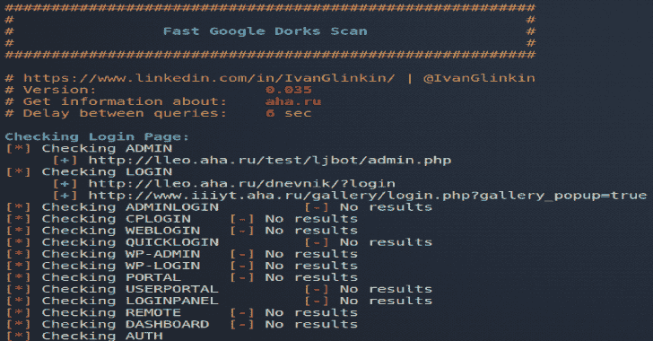
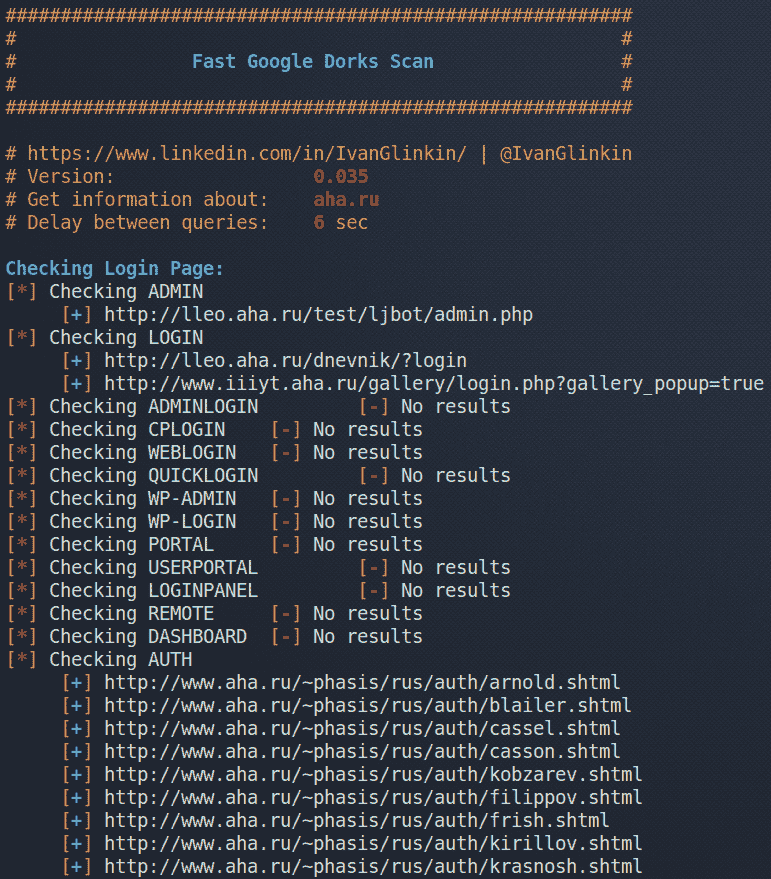
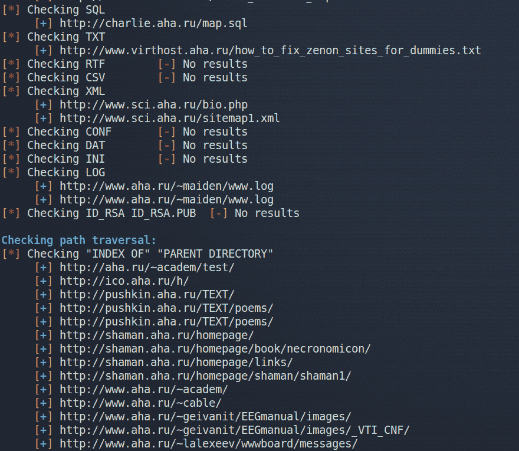

# 快速谷歌呆子扫描

> 原文：<https://kalilinuxtutorials.com/google-dorks-scan/>

**快速谷歌呆子扫描**是一个使用谷歌呆子列举网站的脚本。

**用法举例:。/FGDS.sh megacorp.one**

*   **版本:** 0.035，2020 年 06 月 07 日

**特性**

*   寻找公共管理面板
*   寻找广泛传播的文件类型
*   路径遍历
*   阻止谷歌封禁

**又读-[Jshole:一个 JavaScript 组件漏洞扫描器](https://kalilinuxtutorials.com/jshole/)**

**截图**

[**Download**](https://github.com/IvanGlinkin/Fast-Google-Dorks-Scan)