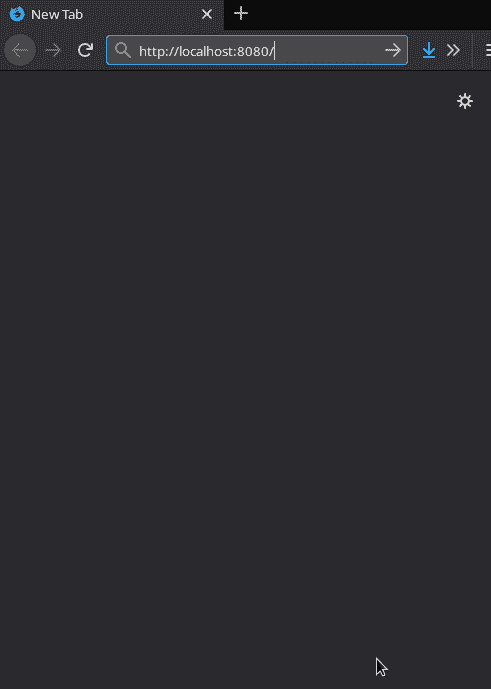
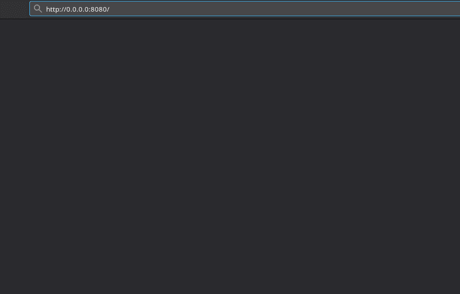
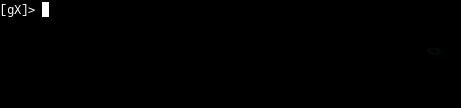
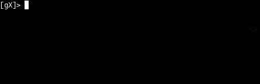
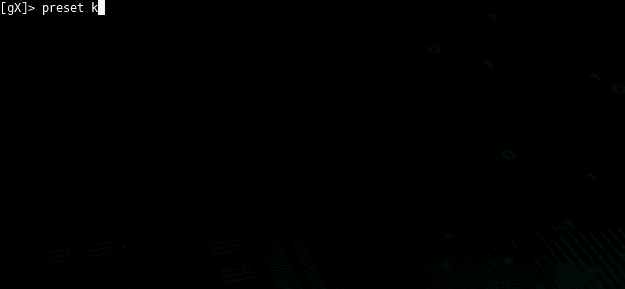
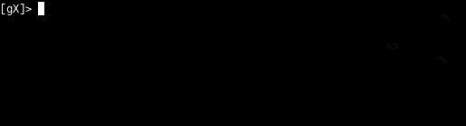
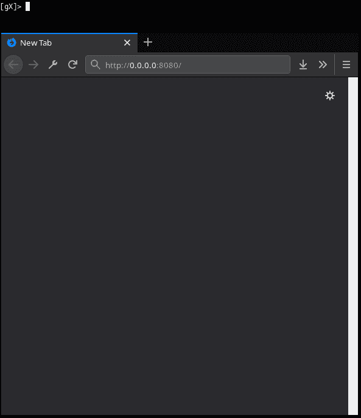
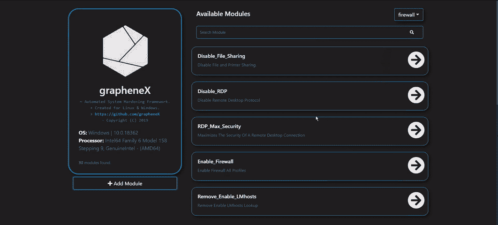
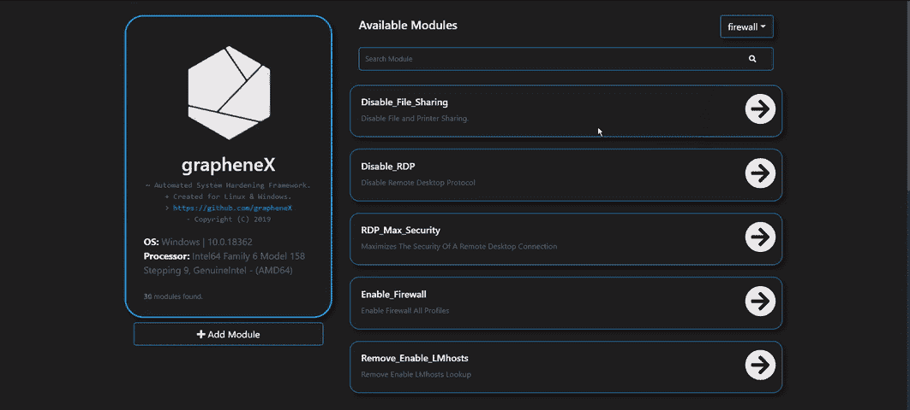

# GrapheneX:自动化系统加固框架

> 原文：<https://kalilinuxtutorials.com/graphenex-automated-system-hardening-framework/>

[](https://1.bp.blogspot.com/-fz6MNqWE1-A/XUqcmzLGAXI/AAAAAAAABwI/EXOJTqzbs88VMGE57y518RZVmjTxx7v6ACLcBGAs/s1600/grapheneX.png)

GrapheneX 是一个自动化的系统加固框架。尽管当前的技术试图设计尽可能安全的系统，但安全缺陷和可能导致由无意识使用和缺失配置导致的漏洞的情况仍然存在。

用户必须了解系统架构的技术方面，并且应该意识到保护他/她的系统免受此类漏洞攻击的重要性。

不幸的是，不可能知道每个普通用户关于加固和必要命令的所有细节，并且由于理解操作系统内部的困难，加固仍然是一个技术问题。

因此，存在包含指定操作系统的各种命令和规则的强化清单，例如互联网上的 trimstray/Linux-Hardening-check list & Windows Server Hardening check list，用于提供一组命令及其部分，当然也简化了最终用户的概念。

但是，用户仍然必须知道命令，并根据系统手动应用强化。这正是 grapheneX 发挥作用的地方。

这个项目旨在提供一个框架，通过自动强化命令来保护系统。由于界面选项，它是为最终用户以及 Linux 和 Windows 开发人员设计的。(交互式 shell/web 界面)除此之外，grapheneX 还可用于保护 web 服务器/应用程序。

强化命令和这些命令的范围是指项目中的模块和命名空间。安装后，它们存在于 modules.json 文件中。($ PYPATH/site-packages/graphenex/modules . JSON)此外，还可以添加、编辑或删除模块和名称空间。此外，可以使用包含模块列表的预置来自动执行强化操作。

目前，grapheneX 支持以下强化部分。这些名称空间中的每一个都包含多个模块。

防火墙
用户
网络
服务
内核
文件系统
其他

**也可阅读-[USB rip:用于跟踪 USB 设备工件的简单 CLI 取证工具](https://kalilinuxtutorials.com/usbrip-simple-cli-forensics/)**

**安装**

可以用 pip 安装 grapheneX。通常这是最简单的方法:

**pip 安装 graphenex**

或者，如果出现错误，请尝试:

**python3 -m pip 安装 graphenex**

也可以如下运行`setup.py`进行安装:

**python setup.py 安装**

以下命令可用于测试项目，无需安装:

**cd grapheneX
pipenv 安装
pipenv 运行 python -m graphenex**

**用途**

**命令行参数**

用法:grapheneX[-h][-v][-w][–open][host:port]

位置参数:
host:port 运行 web 界面的主机和端口

可选参数:
-h，–help 显示此帮助信息并退出
-v，–version 显示版本信息
-w，–web 运行 grapheneX web 服务器
–在 web 服务器启动时打开浏览器

**交互外壳**

执行 grapheneX 命令以启动交互式 shell。


为演示而添加的动画 gif 和屏幕截图，包括未版本化的 grapheneX 的测试执行。使用`grapheneX`或`python -m graphenex`命令执行。
grapheneX 目前支持 [Python3.7](https://www.python.org/)

**网页界面**

执行带有`-w`或`--web`参数的`grapheneX`，以启动网络服务器。


Web 界面具有需要`access token`的认证系统。一旦用户在 shell 中用给定的令牌验证了自己的身份，grapheneX 就会创建一个会话供以后使用。



默认的主机和端口值是`localhost:8080`。可以通过如下所示的`host:port`参数进行更改。

**python graphenex . py-w 192 . 168 . 1 . 36:8090**

服务器启动后，使用`--open`参数打开浏览器。

**python graphenex . py-w–open**

CLI 命令

| 命令 | 描述 |
| --- | --- |
| 背部 | 从名称空间或模块返回 |
| 清楚的 | 清空航站楼 |
| 出口 | 退出交互式外壳 |
| 变硬 | 执行强化命令 |
| 帮助 | 用“help”列出可用命令，或用“help `<cmd>`”显示详细帮助 |
| 信息 | 显示关于模块的信息 |
| 目录 | 列出可用的强化模块 |
| 经营 | 添加、编辑或删除模块 |
| 事先调整 | 显示/执行强化模块预设 |
| 搜索 | 搜索模块 |
| 转换 | 在模块或命名空间之间切换 |
| 使用 | 使用强化模块 |
| 网 | 启动 grapheneX web 服务器 |

**帮助**

`help`或`?`显示上面的命令列表。
`help [CMD]`显示给定命令的详细用法。

**列表**

在表格中显示可用的模块。例如:


**开关**

`switch`命令可以用来切换到一个命名空间或使用一个模块。如果您想查看名称空间中的模块列表，这很有帮助。

**切换【命名空间】**


支持命名空间的自动完成。

同样，像这样使用`switch`命令也是可能的:

**切换【名称空间】/【模块】**

在这种情况下，它相当于`use`命令。

**使用**

用于选择强化模块的目的。

**使用【模块】**



支持模块的自动完成。

**信息**

显示有关选定模块的信息(名称空间、描述、操作系统命令)。


**涨停**

执行选定模块的强化命令。


**预设**

grapheneX 具有预设，其中包含用于自动化强化操作的特定模块。预置可以用`modules.json`文件定制，它们可以包含任何支持的模块。`preset`命令显示可用的模块预设，`preset [PRESET]`运行预设中的强化命令。



上面显示了一个`preset`命令输出的例子。下面，选择包含 2 个模块的预设，并执行强化模块。



`preset`命令支持预设名称的自动完成。此外，它还支持在每次强化命令执行之间请求许可的选项，以便用户知道他/她正在做什么。

**搜索**

**搜索【查询】**



**管理**

`manage`命令允许添加、编辑或删除模块。

用`manage`添加模块

按照说明添加新模块。在命名空间提示中选择“新建”选项以创建新的命名空间。


手动添加模块

grapheneX 将模块和名称空间存储在`modules.json`文件中。当在这个 JSON 文件中创建新的元素时，它将显示为一个新的模块。下面给出了一个示例元素。

```
"namespace": [
        {
            "name": "Module_Name",
            "desc": "This is the module description.",
            "command": "echo 'hardening command'",
            "require_superuser": "True/False",
            "target_os": "linux/win"
        }
    ]
```

建议从 CLI 或 Web 界面添加模块，而不是编辑`modules.json`文件。

编辑模块

选择`manage`命令后的`edit`选项编辑模块属性。


或者手动编辑`modules.json`。

移除模块

选择`manage`菜单中的`remove`选项即可移除指定的模块。也可以从`modules.json`手动移除模块。


**网页**

使用可选的`host:port`参数启动 grapheneX web 服务器。

**web【主机:端口】**



**第二回**

从选定的名称空间或模块返回。

**清除**

触发器的清零端

**退出**

退出交互式外壳

**网页**

大多数命令行功能都可以通过 Web 界面访问。

**名称空间&模块**

很容易在名称空间之间切换并查看模块的细节。


**硬化**

只需点击模块属性下的`run`即可执行加固命令。



**添加模块**

在网络界面中有一个菜单可以用来添加新模块。



**码头工人**

**构建映像**

docker build -t graphenex。

**运行容器**

**docker run–RM–name graphenex-p 8080:8080–特权 graphenex**

[**Download**](https://github.com/grapheneX/grapheneX#back)