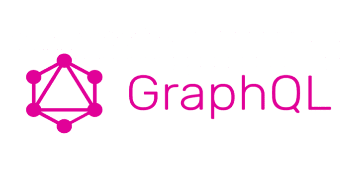

# graph QL Cop:graph QL API 的安全审计实用程序

> 原文：<https://kalilinuxtutorials.com/graphql-cop/>

.png)

GraphQL Cop 是一个小的 Python 工具，用于针对 GraphQL APIs 运行常见的安全性测试。GraphQL Cop 非常适合在 GraphQL 中运行 CI/CD 检查。它是轻量级的，涵盖了 GraphQL 中有趣的安全问题。

GraphQL Cop 允许您通过对任何已识别的漏洞提供 cURL 命令来重现这些发现。

## 要求

*   Python3
*   请求库

## 检测

*   别名过载(DoS)
*   批量查询(DoS)
*   获取基于查询(CSRF)
*   GraphQL 跟踪/调试模式(信息泄漏)
*   字段复制
*   现场建议(信息泄露)
*   图 QL(关于泄漏)
*   自省(信息泄露)
*   指令重载(DoS)

## 用法

**$****python graph QL-COP . py-H
用法:graph QL-COP . py-t http://example.com-o JSON
选项:
-h，–help 显示此帮助消息并退出
-t URL，–target = URL 目标 URL，路径为
-H HEADER，–HEADER = HEADER
将 HEADER 追加到请求的“{ Authorization”:
“Bearer eyjt”} '
-o OUTPUT _ JSON，–OUTPUT = OUTPUT _ 中**

测试网站

****python 3 graphql-Cop . py-t https://mywebsite.com/graphql
graph QL Cop 1.1
graph QL 的安全审计员
Dolev Farhi & Nick Aleks
开始…
【高】自检查询已启用(信息泄漏)
【低】graph QL 操场 UI(信息泄漏)
【高】允许别名过载 100+别名(拒绝服务)
【高】允许查询 1000****

 **测试网站，转储到可解析的 JSON 输出，cURL reproduction 命令

**python 3 main . py-t https://mywebsite.com/graphql-o JSON
{ ' curl _ verify ':' curl-X POST-H "用户代理:graph QL-COP/1.2 "-H '
' " Accept-Encoding:gzip，deflate "-H " Accept:*/*"-H '
' " Connection:keep-alive "-H " Content-Length:33 "-H '
' " Content-Type:application/JSON "-d \ ' { " query ":" query { ' deflate "-H " Accept:*/*"-H '
' " Connection:keep-alive "-H " Content-Length:64 "-H '
' " Content-Type:application/JSON "-d \ ' { " query ":" query { '
' _ _ typename @ aa @ aa @ aa @ aa @ aa @ aa @ aa @ aa } " } \ ' '
" ' http://localhost:5013/graph QL ' "，"**

使用`**graphql-cop**`通过带有自定义标题(如授权)的代理(如 Burp 套件)测试网站:

**$****python 3 graph QL-Cop . py-t https://mywebsite.com/graphql-proxy-header ' { " Authorization ":" Bearer token _ here " } '
graph QL Cop 1.2
graph QL 的安全审计员
Dolev Farhi&Nick Aleks
Starting…
【HIGH】内省查询已启用(信息泄漏)
【LOW】graph QL Playground UI(信息泄漏)
【HIGH】允许超过 100 个别名的别名过载(拒绝**

[**Download**](https://github.com/dolevf/graphql-cop)**