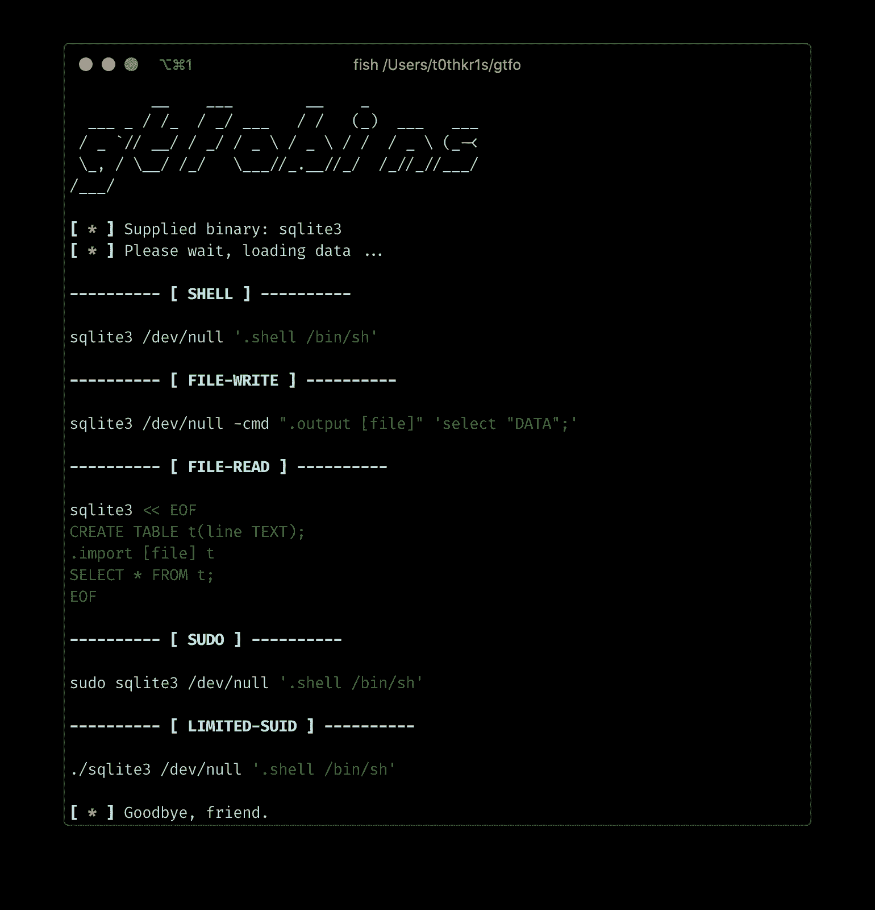
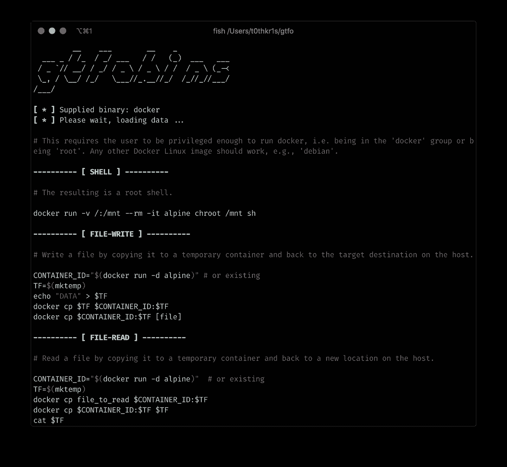

# GTFO:搜索 Unix 二进制文件以绕过系统安全限制

> 原文：<https://kalilinuxtutorials.com/gtfo/>

**GTFO** 是一个用来搜索 Unix 二进制文件的工具，这些文件可以被利用来绕过系统安全限制。

这是一个用 Python 3 为 [GTFOBins](https://github.com/GTFOBins/GTFOBins.github.io) 编写的独立脚本。您可以搜索可被利用来绕过系统安全限制的 Unix 二进制文件。这些二进制文件可以被滥用于~~获得破解受限外壳、升级权限、传输文件、生成绑定和反向外壳等~~

**也读作-[HeapInspect:在 Python 中检查堆](https://kalilinuxtutorials.com/heapinspect-inspect-heap-in-python/)**

**下载**

**git 克隆 https://github.com/t0thkr1s/gtfo**

**安装**

该脚本有两个依赖项:

*   [colorama](https://pypi.org/project/colorama/)
*   [pygments](https://pypi.org/project/Pygments/)

您可以通过键入以下命令来安装它们:

**python3 setup.py 安装**

**运行**

**python3 gtfo.py【二进制】**

**截图**

**免责声明**

该工具仅用于测试和学术目的，并且只能在严格同意的情况下使用。请勿用于非法目的！最终用户有责任遵守所有适用的地方、州和联邦法律。开发人员不承担任何责任，也不对该工具和软件造成的任何误用或损坏负责。

[**Download**](https://github.com/t0thkr1s/gtfo)