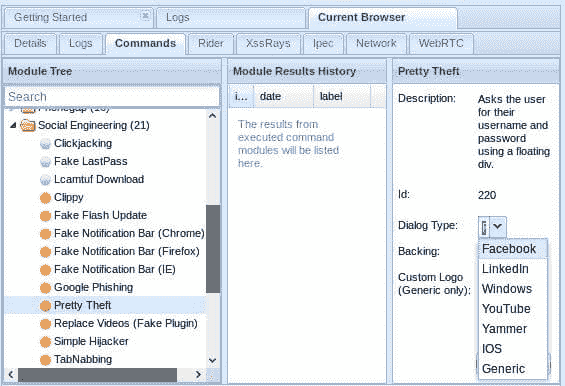
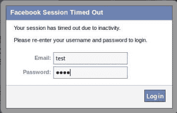
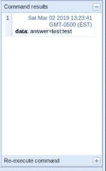
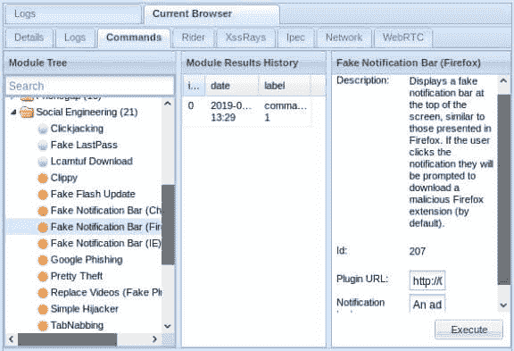
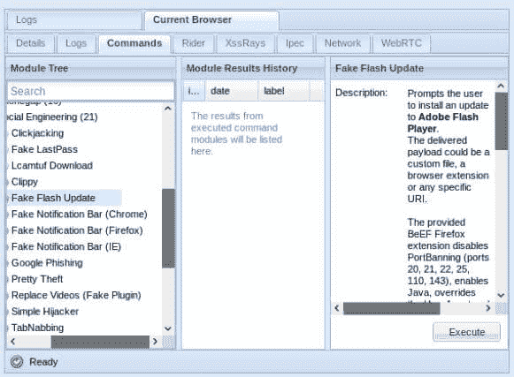
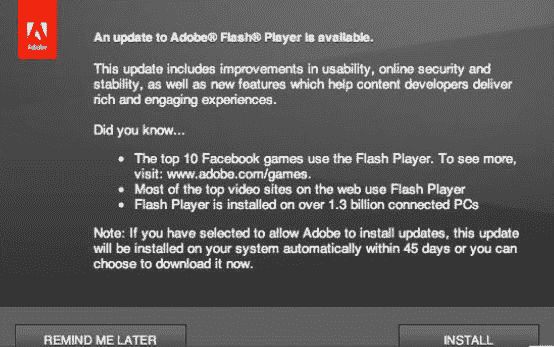
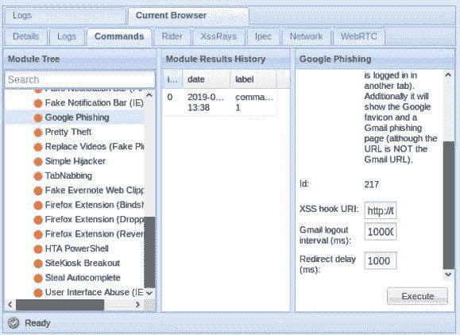
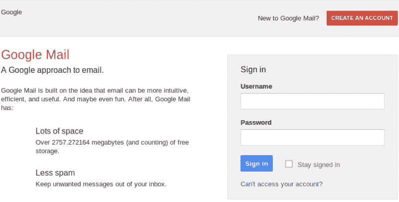

# 黑客用牛肉-假闪存更新，附加软件安装，窃取脸书和 Gmail 证书

> 原文：<https://kalilinuxtutorials.com/hacking-with-beef/>

黑客与牛肉，浏览器开发框架是一个渗透测试工具，侧重于网络浏览器。与其他安全框架不同，BeEF 通过加固的网络边界和客户端系统，单独检查 web 浏览器。

## 牛肉是如何工作的？

BeEF 将连接网络浏览器，并将其用作启动定向命令模块的滩头阵地，进而通过浏览器上下文攻击系统。

## **再来看看这些:**

**1。盗取脸书证件:**

当你执行一个“漂亮的盗窃”命令来窃取 Facebook[或任何社交媒体]凭证时:

在目标浏览器中将会看到一个**超时**会话警报，提示他们使用自己的用户凭证登录。

该凭证将保存在 BeEf 数据库中，与执行的命令相对应。

**2。假冒附加安装**:

创建一个命令，在目标浏览器上设置一个弹出警报，恶意 URL 可以添加到插件 URL 上

目标计算机上的输出

**3。Flash 播放器的假更新:**

在客户端浏览器制作一个**假的 Flash Player 更新提醒**，通过它收集信息。

看到的弹出窗口:

**4。正在过滤 Gmail 凭据:**

设置 BeEf 命令以收集 gmail 凭据:

目标会看到的普通 gmail 主页:

BeEF 有一个非常干净的界面，通过根据类型组织攻击，还通过指示特定的攻击是否与浏览器(例如，FF，Chrome 等)相关。).因此，您只需点击攻击即可启动。

这是一个严肃的 PenTest 工具，它出现在 GUI 上并显示完美的输出，一定要试试！