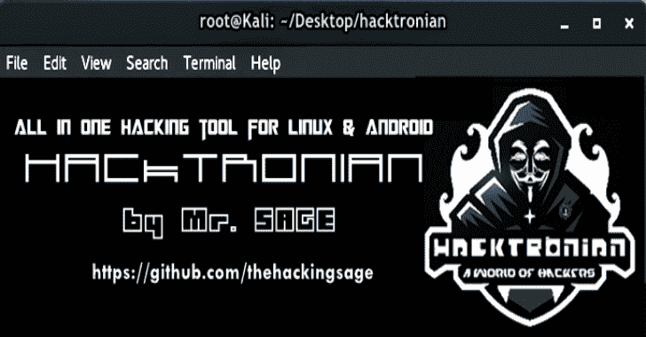

# Hacktronian:适用于 Linux 和 Android 的一体化黑客工具

> 原文：<https://kalilinuxtutorials.com/hacktronian-hacking-tool-linux-android/>

**Hacktronian** 是一款适用于 Linux & Android 和 pentesing 的多功能黑客工具，所有黑客都需要。

菜单

*   情报收集
*   密码攻击
*   无线测试
*   开发工具
*   嗅探和欺骗
*   网络黑客
*   私人网络黑客
*   后期开发
*   安装黑客工具
*   [谷歌呆子](https://gbhackers.com/latest-google-dorks-list/)

**信息收集:**

*   Nmap
*   Setoolkit
*   端口扫描
*   主机到 IP
*   wordpress 用户
*   CMS 扫描仪
*   XSStrike
*   呆子-谷歌呆子被动漏洞审计员
*   扫描服务器的用户
*   瘸子

**密码攻击:**

*   Cupp
*   Ncrack

**也可阅读-[PEpper:一个对可移植的可执行文件](https://kalilinuxtutorials.com/pepper-malware-analysis-portable-executable/)执行恶意软件静态分析的开源脚本**

**无线测试:**

*   掠夺者（网络游戏空灵机甲里的飞船名）
*   像素视图
*   流动

**开发工具:**

*   ntscan
*   sqlcmap
*   外壳
*   混合
*   FTP 自动旁路
*   JBoss-汽车城

**嗅探&欺骗:**

*   Setoolkit
*   SSLtrip
*   派皮舍尔
*   SMTP 邮件程序

**网络黑客:**

*   Drupal 黑客
*   Inurlbr
*   WordPress & Joomla 扫描仪
*   重力形式扫描仪
*   文件上传检查器
*   WordPress 漏洞扫描器
*   WordPress 插件扫描仪
*   外壳和目录查找器
*   珠姆拉。1.5–3 . 4 . 5 远程代码执行
*   Vbulletin 5。x 远程代码执行
*   BruteX 自动强力攻击目标上运行的所有服务
*   arachni–Web 应用程序安全扫描器框架

**私人网络黑客:**

*   获取所有网站
*   获取 joomla 网站
*   获取 wordpress 网站
*   控制面板搜索器
*   Zip 文件查找器
*   上传文件查找器
*   获取服务器用户
*   SQli 扫描仪
*   端口扫描(端口范围)
*   端口扫描(通用端口)
*   获取服务器信息
*   绕过云闪

**后期开发:**

*   外壳检查器
*   诗人
*   威曼

**Linux 中的安装:**

该工具必须以 ROOT 用户身份运行！！！

git 克隆 https://github . com/thehacking age/hacktronian . git
hacktronian CD
chmod+x install . sh
。/install.sh

**安卓系统安装:**

开放式〔t0〕术语〔t1〕

pkg install git
pkg install python
git clone https://github . com/thehacking age/hacktronian . git
hacktronian CD
chmod+x hacktronian . py
python 2 hacktronian . py

**视频教程:**

https://www.youtube.com/watch?v=1LJlyQAQby4[**Download**](https://github.com/thehackingsage/hacktronian)