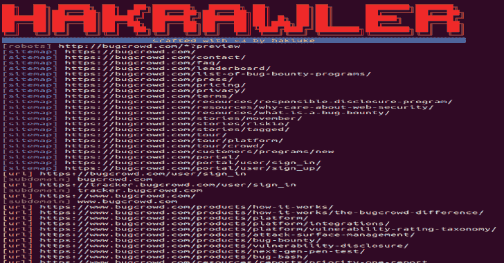

# Hakrawler:在 Web 应用程序中发现端点和资产

> 原文：<https://kalilinuxtutorials.com/hakrawler-endpoints-assets-web-application/>

Hakrawler 是一个 Go 网络爬虫，旨在方便、快速地发现 web 应用程序中的端点和资产。它可用于发现:

*   形式
*   端点
*   子域
*   相关领域
*   JavaScript 文件

目标是以一种方式创建该工具，使其可以轻松地与子域枚举工具和漏洞扫描器等其他工具链接，以便于工具链接，例如:

资产发现者 target.com |哈科洛勒| some-xss-scanner

**另请参阅–[laraveln 00 b:自动扫描。env 文件&检查受害主机](https://kalilinuxtutorials.com/laraveln00b/)中的调试模式**

**特性**

*   无限制、快速的网络爬行，用于端点发现
*   用于领域发现的模糊匹配
*   robots.txt 解析
*   sitemap.xml 解析
*   简单输出，便于解析到其他工具中
*   从 stdin 接受域以简化工具链接
*   SQLMap 友好的输出格式
*   从 JavaScript 文件收集链接

**安装**

*   安装 Golang
*   运行下面的命令

去找 github.com/hakluke/hakrawler

*   从您的 Go bin 目录运行 hakrawler。对于 linux 系统，可能是:

**~/go/bin/hakrawler**

请注意，如果您需要这样做，您可能希望将 Go bin 目录添加到您的$PATH 中以使事情变得更容易！

**用途**

注意:多个域可以通过管道从 stdin 进入 hakrawler 来爬行。如果只对一个域进行爬网，可以使用-domain 标志添加该域。

$ hak rawler-h
hak rawler 的用法:
-all
包含输出中的所有内容–这是默认设置，因此该选项是多余的(默认为真)
-auth string
其值将作为授权头
-cookie string
其值将作为 cookie 头
-depth int
最大爬行深度，默认为 1。任何高于 1 将包括来自机器人，网站地图，waybackurls 和作为种子的初始爬虫的 URL。数字越大，耗时越长，但产生的结果越多。(默认 1)
-表单
在输出中包含表单动作
-js
包含指向所用 javascript 文件的链接
-linkfinder
对 JavaScript 文件运行 linkfinder。
-outdir string
保存发现的原始 HTTP 请求的目录
-plain
不使用颜色或打印横幅以方便解析
-robots
在输出中包含 robots.txt 条目
-scope string
要包含的范围:
strict =仅指定域
subs =指定域和子域
fuzzy =包含所提供域的任何内容
yolo =所有内容(默认“subs”)【T27 模式默认为 http
-URL
包括输出中的 URL
-使用 wayback
查询 wayback 机器中的 URL 并将其添加为爬虫的种子
-v 显示版本并退出
-wayback
包括输出中的 wayback 机器条目

[**Download**](https://github.com/hakluke/hakrawler)