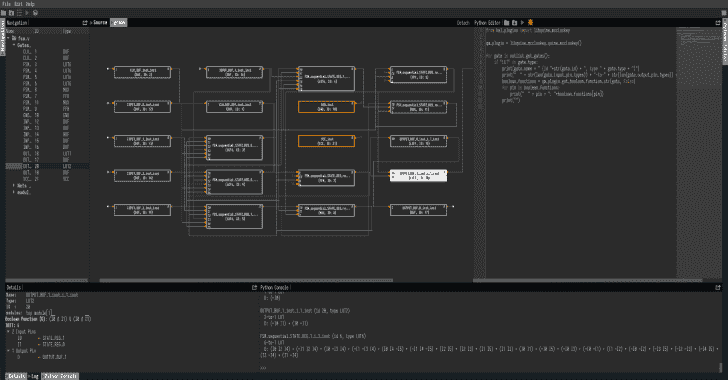
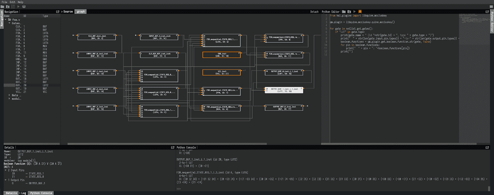

# 硬件分析器

> 原文：<https://kalilinuxtutorials.com/hal-hardware-analyzer/>

HAL 是一个全面的逆向工程和操作框架，面向注重效率、可扩展性和可移植性的门级网表。它带有一个完全成熟的插件系统，允许向核心引入任意功能。

**特性**

*   网表元素及其连接的自然有向图表示
*   支持自定义门库
*   优化的 C++内核带来高性能
*   模块化:为高效的网表分析和操作编写自己的 C++插件(例如，通过图形算法)
*   一个功能丰富的 GUI，支持可视化网表检查和交互式分析
*   一个集成的 Python shell，用于探索性地与网表元素进行交互，并从 GUI 连接插件
*   **更新版本 1.1.0** 现已增加对 Xilinx Unisim、Xilinx Simprim、Synopsys 90nm、GSCLIB 3.0 和 UMC 0.18 m 库的支持

**快速启动**

安装或构建 HAL 并通过`**hal -g**`启动 GUI。您可以通过`**hal [--help|-h]**`列出所有可用选项。我们在`**examples**`中包含了一些示例网表，并在`**plugins/example_gate_library**`中实现了相应的示例门库。关于创建你自己的 gate 库和其他有用教程的指导，请看一下[维基](https://github.com/emsec/hal/wiki)。

从`**examples**` 目录加载一个库，并开始探索图形表示。使用集成的 Python shell 或 Python 脚本窗口进行交互。两者都具有(有限)自动完成功能。

让我们列出所有查找表并打印它们的布尔函数:

从 hal_plugins 导入 libquine _ MCC luskey

QM _ plugin = libquine _ MCC luskey . Quine _ MCC luskey()

for gate in netlist . get _ gates():
if“LUT in gate . type:
print(gate . name+"(id "+str(gate . id)+"，type "+gate . type+")
print("+str(len(gate . input _ pin _ types))+"-to-"+str(len(gate(gate output)。

对于示例网表`**fsm.vhd**`,这会打印:

**FSM _ sequential _ STATE _ REG _ 1 _ I _ 2 _ inst(id 5，type LUT6)**
6 对 1 LUT
O:(~ I0 I1 ~ I2 I3 I4 ~ I5)+(I0 ~ I2 I3 I4 I5)
 ****FSM _ sequential _ STATE _ REG _ 0 _ I _ 2 _ inst(id 3，type LUT6)**
6 对 1 LUT
O: (I2 I3 type LUT6)
6 对 1 LUT
O:(~ I1 ~ I2 I3 ~ I4 I5)+(I0 I5)+(I0 I4)+(I0 I3)+(I0 I1)+(I0 ~ I2)

**OUTPUT _ BUF _ 0 _ inst _ I _ 1 _ inst(id 18，type LUT1)**
1 对 1 LUT
O: (~I0)
类型 lut 6)6 对 1 LUT
O:(I0 I2 I4)+(~ I1 I2 I4)+(I0 ~ I3 I4)+(~ I1 ~ I3 I4)+(I0 I4 ~ I5)+(~ I1 I4 ~ I5)+(I2 I5)+(I2 I3)+(I1 I5)+(I1 I3)+(I0 I1)+(~ I0 I3)+(~ I0 ~ I1)**

 ****引文**

如果您在学术环境中使用 HAL，请使用下面的参考引用该框架:

@misc{hal，
author = { { EmSec Chair for Embedded Security }}，
publisher = { {鲁尔大学波鸿} }，
title = { { HAL–The Hardware Analyzer } }，
year = {2019}，
how published = { \ URL { https://github . com/em sec/HAL } }，
}

也可以随意加入原始的[论文](http://eprint.iacr.org/2017/783)

@article{2018:Fyrbiak:HAL，
author = { Marc Fyrbiak and
Sebastian Wallat and
Pawel Swierczynski and
马克斯·霍夫曼 and
Sebastian Hoppach and
Matthias Wilhelm and
Tobias Weidlich and
Russell Tessier and
Christof Paar }，
title = {{HAL-}硬件逆向工程的缺失部分，
木马检测和插入}，【T11

**安装说明**

**Ubuntu**

HAL 版本可以通过它自己的 ppa 获得。你可以在这里找到: [ppa:塞巴斯蒂安-瓦拉特/哈尔](https://launchpad.net/~sebastian-wallat/+archive/ubuntu/hal)

**苹果电脑**

使用以下命令通过[自制软件](https://brew.sh/index_de)安装 hal。

brew tap emsec/hal
brew 安装 hal

**构建指令**

运行以下命令下载并安装 HAL。

$git 克隆 https://github.com/emsec/hal.git & & CD Hal
**>>安装所有必要的依赖项执行**
$。/install _ dependencies . sh
$ mkdir 构建& & cd 构建
$cmake..
$make

您可以选择安装 HAL:

进行安装

**在 macOS 上构建**

请确保使用支持 OpenMP 的编译器。您可以通过`**brew install llvm**`安装一个。

要让 cmake 知道自定义编译器，请使用以下命令。

cmake..-DC make _ C _ COMPILER =/usr/local/opt/llvm/bin/clang-DC make _ CXX _ COMPILER =/usr/local/opt/llvm/bin/clang++

[**Download**](https://github.com/emsec/hal#features)**