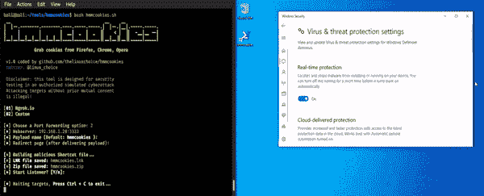

# hmm Cookies–从 Firefox、Chrome 和 Opera 获取 Cookies

> 原文：<https://kalilinuxtutorials.com/hmmcookies/>

**Hmmcookies** 是一个使用快捷文件(绕过 UAC)从火狐、Chrome、 [Opera](https://www.kitploit.com/search/label/Opera) 抓取[cookie](https://www.kitploit.com/search/label/Cookies)的工具。

**安装**

**git 克隆 https://github.com/thelinuxchoice/hmmcookies
CD hmm cookies
bash hmm cookies . sh**

**免责声明**

未经双方同意，使用 HMMCOOKIES 攻击目标是非法的。最终用户有责任遵守所有适用的地方、州和联邦法律。开发人员不承担任何责任，也不对本程序造成的任何误用或损坏负责

**作者:[https://github.com/thelinuxchoice/hmmcookies](https://github.com/thelinuxchoice/hmmcookies)**
推特:[https://twitter.com/linux_choice](https://twitter.com/linux_choice)

[**Download**](https://github.com/thelinuxchoice/hmmcookies)