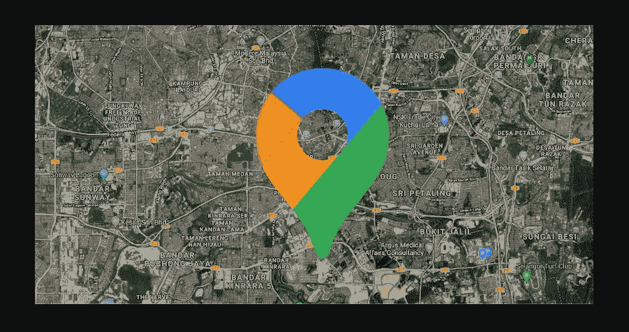
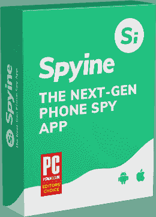
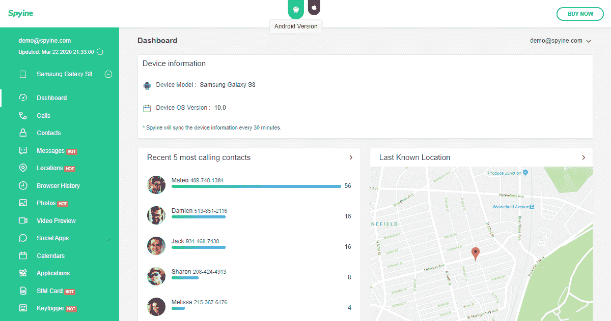
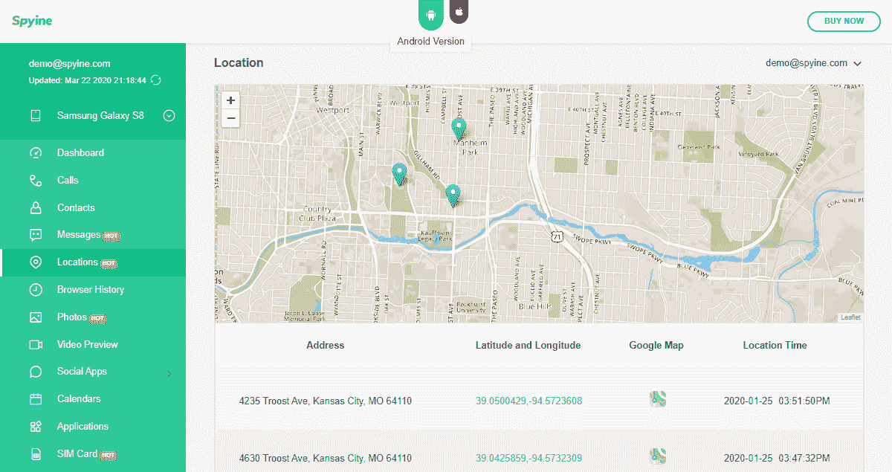

# 如何在网上找到某人的位置？

> 原文：<https://kalilinuxtutorials.com/how-can-i-find-someones-location-online/>

互联网正在改变我们看待事物的方式。这就是为什么当你有关系的时候，在网上找人并不困难。早期和现在的区别是，今天，我们有应用程序简化了这个过程。

他们使用互联网来帮助你完成任务，比如找到电话号码的[位置，以及其他活动。很快就能学会如何使用一个查找某人的电话或号码。](https://www.ilounge.com/articles/how-to-track-an-iphone-by-number-online-free)

我们将关注市场上的潮流引领者之一。正如我们将会看到的，世界各地的人们一直在出于不同的原因使用它。

## **在线查找某人位置的理由**

你可能听说过有人失踪。可能是孩子、配偶、朋友、员工等等。前阵子，这类案件迫使人们去报警。找遍所有地方后，这种情况仍会发生，但在线帮助可以提供更好的确认。

为此，我们感谢现代手机以及手机的发展。另一个在网上找到某人位置的原因是想随时知道他们在哪里。那些面临软禁的人有跟踪脚踝手镯，但你不能对每个人都使用它。

在追踪人们时，需要体面和保密，这就是电话和互联网以及其他可用设备的用武之地。想知道孩子在哪里的父母会在他们的手机上使用类似 Spyine 的应用程序[。](https://spyine.com/)

如果有一个不值得信任的人，同样的情况也会发生在人际关系中。想要跟踪移动员工的雇主将需要一个出色的应用程序，可以实时告诉他们的位置和他们过去的位置。

虽然以上都包含了正确的理由，但你不能在没有适当授权的情况下对你不认识的人使用追踪软件。你应该尊重隐私权。这就是为什么在工作情况下，雇主需要在监控前通知雇员。

出于正确的原因，让我们看看当你需要知道某人在哪里时，间谍是如何有益的。

## **如何用间谍软件追踪某人的位置**

一个最好的应用程序，你可以投资在定位跟踪的目的是 Spyine。它的设置和使用都很简单，这也是它拥有来自世界各地的 100 多万用户的原因。

如果您有互联网连接，并且目标有 Android 或 iOS 手机，您将一切就绪。获得它并不需要很长时间，而且你可以用它做许多其他的事情。Spyine 有超过 30 个功能，这意味着你不仅会得到定位结果。

Android 的情况下没有涉及到生根，它将需要不到五分钟的时间让它工作。当您安装时，有一个隐藏模式功能，您必须在此过程中激活。

它帮助你和应用程序保持隐藏，这意味着安装后图标将不会出现。更重要的是，它将在手机中占据不到 2MB 的空间。微小和隐蔽是保持未知的最好特征。

在 iOS 中，没有越狱，也没有安装。这听起来可能很奇怪，但这很简单，因为 Spyine 只有在创建帐户后才会要求 iCloud 凭据。iPhones 的一切都发生在网上，这就是使用这种解决方案的好处。

由于不会占用目标 iPhone，所以隐形模式在苹果这边就是这么实现的。一旦设置完成，其他一切都将在线进行。以下是 Spyine 提供的在线位置跟踪功能:

### **用户友好的仪表板**

Spyine 有一个直观的仪表板，可用于所有浏览器。这就是为什么使用任何手机、平板电脑或电脑登录并查看你的目标在哪里更容易。功能也安排得很好，很难错过任何东西，因为一切都是很好的标签。

### **位置特征**

一旦你进入控制面板，手机的摘要也将包括手机的位置。Spyine 使用手机的 GPS 或连接的 Wi-Fi 来显示它的位置和过去的位置。

那里有一个更大的地图，你只需要点击菜单上的“位置”就可以了。您将在地图下方看到位置、其他游览过的地方以及更多信息，以帮助您更好地进行追踪。它包括地址、时间戳、坐标和用于指示方向的地图图标。

这就是它能跟踪你的孩子、配偶或雇员的程度。

### **地理围栏**

更多的位置包括有一些限制。你可能想知道某人是否去某些地方。也有可能发现他们什么时候去那些地方，什么时候离开。这就是地理围栏的力量。

它帮助你在地图上设置区域，并在越界时发送电子邮件通知你。之后，你需要等待的就是结果了。

### **SIM 卡追踪**

Spyine 还可以跟踪 SIM 卡，并告诉你更多关于它的信息。它将通过电子地图检测它的细节和位置。最好的部分是提醒你，当有一个 SIM 卡交换。你必须发送电子邮件才能收到通知，应用程序将继续跟踪插入的 SIM 卡。

### **远程卸载**

当你不再需要使用 Spyine 的时候，你不需要针对性的手机来摆脱它。web 门户有一个卸载按钮，允许您远程卸载它。这就是你如何悄悄地停止跟踪某人而不引起他们的警觉。

## **结论**

正如你所看到的，当你有正确的解决方案时，在网上找到某人的位置并不是一项艰巨的任务。有了 Spyine，您只需在手机上进行一次性设置，然后就可以在线获得独家结果。

没有手机改动，这意味着除了应用程序隐藏，设备将保持原样。这就消除了任何让你的目标发现的线索。现在，是时候使用最好的应用程序之一无缝跟踪你的目标了。