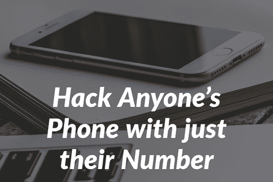
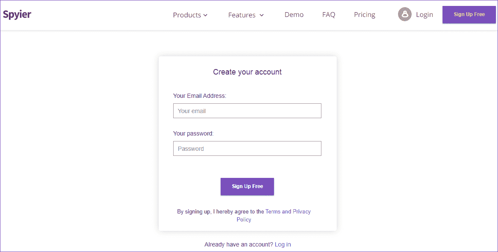
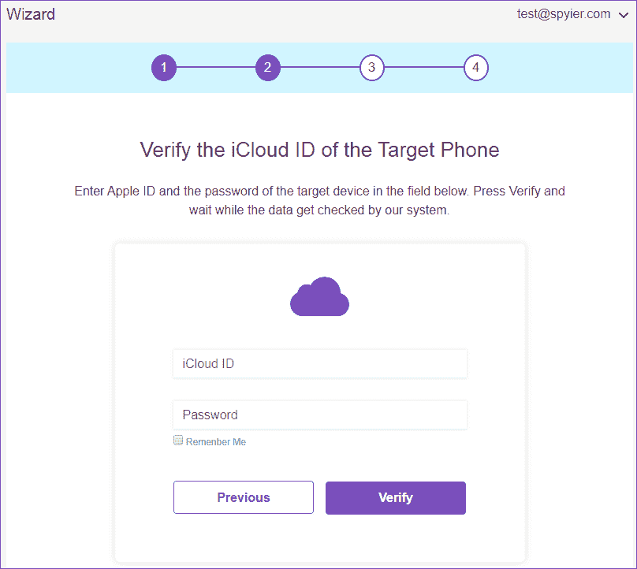
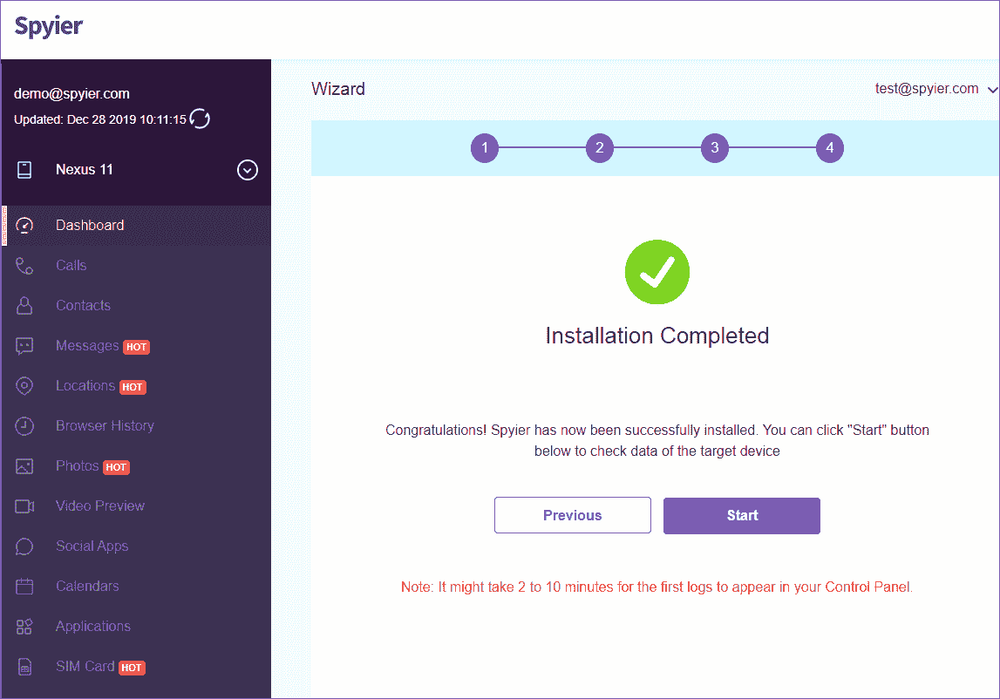
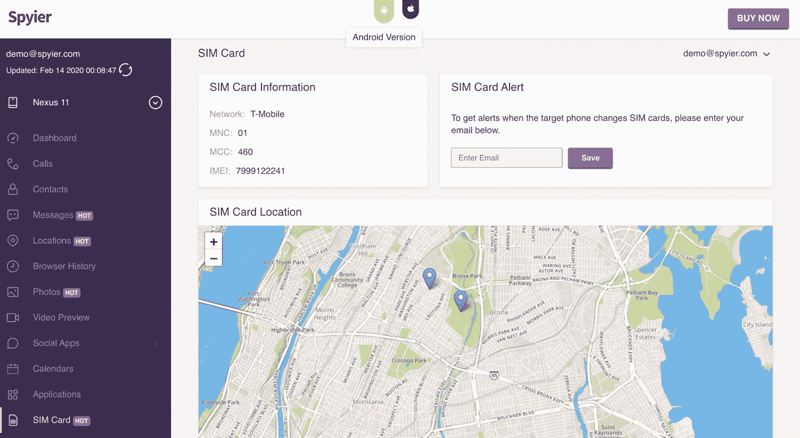

# 如何只用号码黑手机

> 原文：<https://kalilinuxtutorials.com/how-to-hack-a-mobile-phone-with-just-the-number/>

黑客是几乎吸引所有人的行为之一，尤其是青少年。在这个现代技术时代，黑客攻击日益普遍，尽管黑客攻击并不是每个人都可以在公园里散步。

如果我们谈论黑客移动电话，那么有许多类型的黑客技术，发生在这个特定的黑客类别。问题是，我们如何在没有任何专业知识或黑客知识的情况下，黑掉任何手机设备？

你会惊讶地知道，有电话间谍公司在市场上工作。他们向全球所有客户提供电话监控服务，让他们使用他们的服务来监视任何目标移动设备。现在，你所要做的就是找到一个可靠和专业的电话间谍品牌，你可以信任它来根据你的喜好监控任何电话设备。

经过数小时的搜索和分析，我们为您提供了一款可靠、安全的手机间谍软件。 **Spyier** 是一款手机间谍解决方案，可以满足您对手机追踪的所有期望和要求。让我们进一步了解 Spyier 以及这个间谍应用程序的实际工作原理。

## **Spyier——一款创新的手机间谍软件**

Spyier 是一家专业的、在市场上久负盛名的电话间谍公司。数百万客户对 Spyier 的电话间谍服务感到满意。这个间谍解决方案是通过使用聪明和智能的算法来设计的，这是非常了不起的。在特定的使用条款下，这种电话监听服务是完全安全和合法的。

让这个间谍软件的间谍服务更有吸引力的是它的智能间谍方法，你不必启动你的 Android 设备或破解你的 iPhone 来入侵该设备。利用 Spyier 的电话监控服务，只使用 这个号码就可以窃听一部手机。一些公司监视他们的员工只是为了监视他们，而父母也在监视他们孩子的电话活动，所以 Spyier 是这种监视使用的理想选择。

Spyier 的电话间谍应用程序不是设备依赖的，你可以使用这个应用程序来入侵 Android 和 iPhone 设备，没有任何兼容性问题。那么，你还在等什么？去 Spyier 官网 [**下载这个监控 app**](https://www.ilounge.com/articles/spyier-review) 开始黑你的目标手机设备。这项间谍服务的另一个惊人之处是，你可以使用任何网络浏览器来使用这个应用程序，因为这完全是一个基于网络的间谍服务。

现在，是时候深入了解一下 Spyier 的一些专业间谍功能了。

## **间谍手机间谍软件的特点**

Spyier 相信，提供高质量和可靠的间谍功能，用户可以使用没有任何复杂或困难。有许多电话间谍功能添加，以便为用户提供各种各样的，跟踪电话设备根据他们的喜好。每一个间谍功能都是根据用户的要求特别设计的。

看看 Spyier 手机监控应用程序的一些主要间谍功能。

**呼叫跟踪器**

电话跟踪器是 Spyier 的主要核心间谍功能之一。此功能可让您控制查看您想要锁定的特定设备的整个通话记录。除了通话记录，您还可以查看所有来电或去电的持续时间。

**短信跟踪器**

这种短信追踪器也是数百万 Spyier 客户最喜欢的间谍功能。使用此功能，您可以记录目标手机设备的所有短信，还可以查看已删除的短信。

iMessages 和不同的文本媒体也可以查看使用这个神奇的间谍功能。

**轨道位置**

位置跟踪器是一个重要的间谍功能，你可以在任何时候要求。此功能允许您在 GPS 或 WiFi 的帮助下跟踪目标设备的位置。您可以查看不同的位置坐标以及 3D 街景支持。

**隐身模式**

这种隐形模式对每个用户来说不仅仅是一个间谍功能，因为隐形模式没有人能发现你在监视任何手机设备，甚至是设备的主人。

Spyier 间谍解决方案运行在一个隐形模式，所以你可以跟踪电话位置，短信，通话记录，网络历史和更多的没有被发现。

## **追踪社交媒体应用**

支持跟踪第三方应用程序，尤其是社交媒体应用程序。

你可以使用 Spyier 的间谍功能来跟踪 FB 消息，间谍 WhatsApp，Instagram，Viber 和其他社交媒体应用程序。对这些应用程序的监控没有任何限制。

你可以通过访问 Spyier 的官方网站查看更多间谍功能。

现在，让我们来看看如何使用 Spyier 电话间谍解决方案，以实际黑客任何手机号码。

## **如何用 Spyier 破解只有号码的手机**

窃听移动电话看起来像火箭科学，但 Spyier 让电话窃听变得前所未有的简单和智能。

你必须遵循一些简单的步骤，以获得任何移动电话设备的全面跟踪控制。

Spyier 的间谍应用程序适用于 Android 和 iPhone 设备。唯一不同的是安卓和 iPhone 的刺探方法。我们将了解使用 Spyier 的电话间谍解决方案从帐户注册到电话跟踪的每个过程。

让我们遵循一些简单的步骤，看看如何使用 Spyier 手机间谍应用程序入侵任何手机设备。

**第一步**

打开你的网页浏览器，访问 Spyier 的官方网站。点击网站右上角的注册按钮。输入您的电子邮件和密码以继续操作。

**第二步**

根据您的喜好选择 iOS 或 Android 设备。对于 Android，您必须在目标 Android 设备上安装一次 Spyier 的应用程序。

对于 iPhone 来说，你必须输入你想攻击的特定 iPhone 设备的 iCloud 账户详细信息。

**第三步**

让系统验证您想要锁定的 Android 或 iPhone 设备的所有细节。按照屏幕上的指示，继续完成 Spyier 的帐户注册。

**第四步**

祝贺您，您已经成功地配置了您想要作为目标的设备。现在你所要做的就是打开一个网络浏览器，登录你几秒钟前创建的 Spyier 的账户。

使用手机间谍功能，如 **SIM 卡跟踪器**，你可以获取 IMEI 号码和你正在监视的特定手机设备的其他细节。

您还可以找到基于 SIM 卡的目标电话设备的位置。这些间谍功能让你只需一个 SIM 卡号码就能侵入手机。

按照这整个指南，你会熟悉这个间谍解决方案实际上是如何破解任何移动电话设备，无论是 Android 还是 iPhone。您也可以通过访问 Spyier 官网，点击演示选项，试用 Spyier 手机间谍 app 的**演示**版本。

## **结论**

在了解 Spyier 手机监控应用程序的工作原理后，我们可以得出结论，这是最可靠和专业的手机间谍解决方案。

这个电话监控解决方案不要求用户执行 Root 或越狱类的风险活动。

你可以使用这项间谍服务来入侵任何 Android 或 iPhone 设备。因此，Spyier 是所有那些寻找跟踪任何目标手机设备的用户的建议。