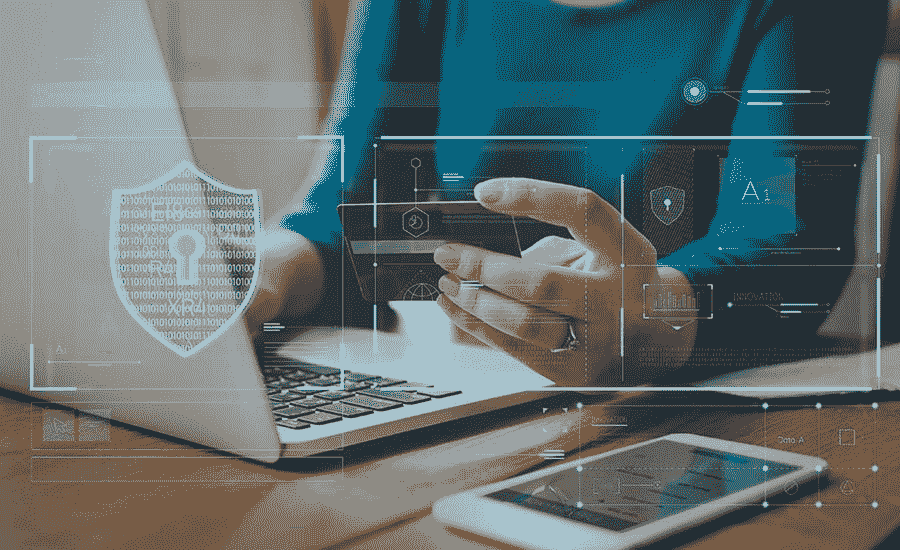
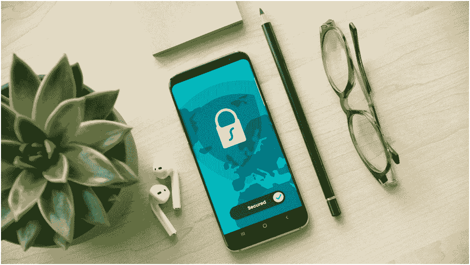
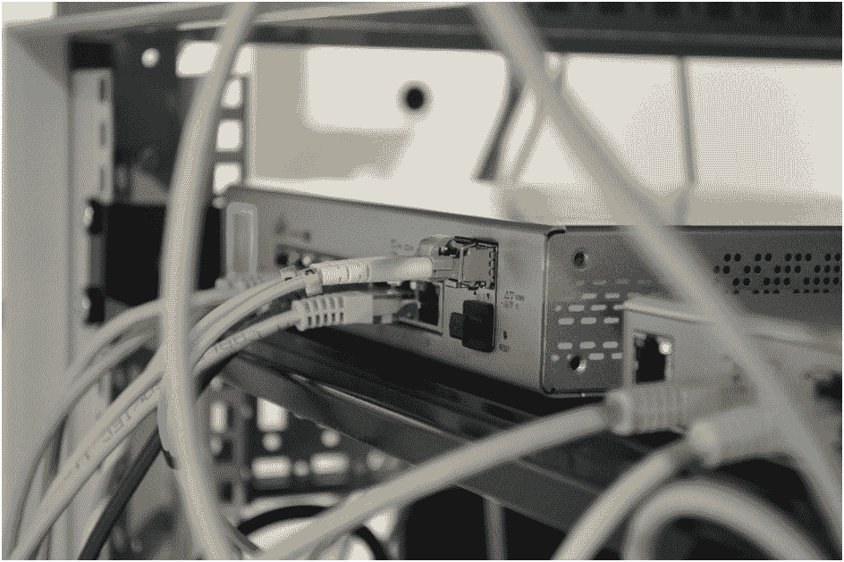

# 如何保护中小企业免受网络攻击

> 原文：<https://kalilinuxtutorials.com/how-to-protect-small-and-medium-sized-businesses-from-cyberattacks/>

许多中小型企业主错误地认为，由于营业额低和数据量少，他们的企业不会成为网络攻击的受害者。他们认为只有大公司才会面临这种威胁。然而，在任何公司中，最常见的是忽视安全措施的员工构成威胁。

这样一来，工人的个人信息，以及公司的客户，都泄露到网络中。这要么导致欺诈，要么导致盗窃。在任何情况下，每个业主都应该提前注意如何保护他们的业务和他们的客户。

今天，我们将告诉您将风险降至最低需要经历的步骤。

## **第一阶段:检查信息存储**

首先，您应该注意所有数据存储在哪里，以及谁可以查看这些数据。接下来，您需要确定您有哪些漏洞。

应该说，如果不了解网络安全问题，这样的工作是无法靠自己完成的。你只能粗略地检查一下。

建议雇佣专门从事这些事情的员工或雇佣承包商。这是因为检查必须定期进行。如果你不这样做，那么你可能不会注意到你的数据是如何被盗的。

检查后，回答以下问题:

*   您的员工中是否有人可以保护您的数据？
*   公司所有员工的电脑都安装了杀毒吗？
*   员工熟悉网络安全的规则吗？
*   你用程序加密你的数据吗？
*   你如何建立一个威胁警报系统？
*   如果遇到威胁，你有现成的行动计划吗？

如果你对大多数问题的回答都是否定的，那么你就有严重的问题。检查结束后，继续下一步。

## **第二阶段:通知员工**

首先，你必须告诉每一个员工，任何粗心和鲁莽的行动都可能毁掉你一直在努力的东西。这适用于所有人，甚至是那些与有价值的数据没有直接联系的人。

例如，你的设计师不与员工或客户的信息互动，他可以坐在咖啡馆里，使用免费 Wi-Fi，为你的网站或产品插图创作设计，在 [retoucher.online](https://retoucher.online) 删除背景或创作公司标志，甚至可能不会想到他的行为会导致数据泄露。

超过 80%的成功黑客行为是由于员工的鲁莽行为造成的。

这就是为什么有必要召开一次集体会议，并告知员工哪些行动会导致公司的脆弱性。您可以邀请专家来教您的员工如何使用安全程序、创建复杂的密码以及使用外部媒体。

## **第三阶段:使用官方软件**

许多公司不愿意使用正版软件，因为它太贵了。然而，应该记住，官方软件的制造商不断地测试他们的程序，并识别未受保护的地方。当他们找到它们时，他们会发布更安全的更新程序。

攻击者不需要针对特定的公司。他们可以在大多数人使用的软件中找到一个缺陷，并立即打击所有人。使用许可软件将允许您及时获得软件的改进版本。

## **第四阶段:生成复杂密码**

这件小事似乎不会造成重大伤害。然而，研究表明，17%的黑客攻击是由于创建了过于简单的密码。

在创建工作邮件时，许多人使用容易记住的个人信息。然而，并不是每个人都明白，您的邮件将能够提供对公司网络的访问，并向黑客透露所有感兴趣的信息。

在这方面，建议采取以下行动:

*   每个帐户必须有一个唯一的密码；
*   密码应至少每六个月更新一次；
*   如果可能，那么设置双因素验证；
*   使用密码生成器创建复杂的组合；
*   不要在浏览器中保存密码；
*   禁用自动完成。

## **第五阶段:测试备份服务**

一旦遭到攻击，您可能会丢失运营业务所需的所有信息。如果您有备份，那么对您来说快速恢复数据并不困难。

然而，许多人忘记了定期检查保存数据的正确配置的服务是必要的。为了防止头发瞬间变白，定期检查备份。

## **第六阶段:安全 Wi-Fi**

您的路由器应该配置为最大限度地防止黑客攻击。手动检查将阻止未经授权的用户访问您的网络的任何设置。

## **输出**

不要再想，如果你拥有一家中小型企业，那么黑客们不会有兴趣窃取你的数据，不会把它卖给第三方，也不会向你索要一大笔钱把它拿回来。进行定期安全检查，通知您的员工可能会导致数据泄露的疏忽。

* * *