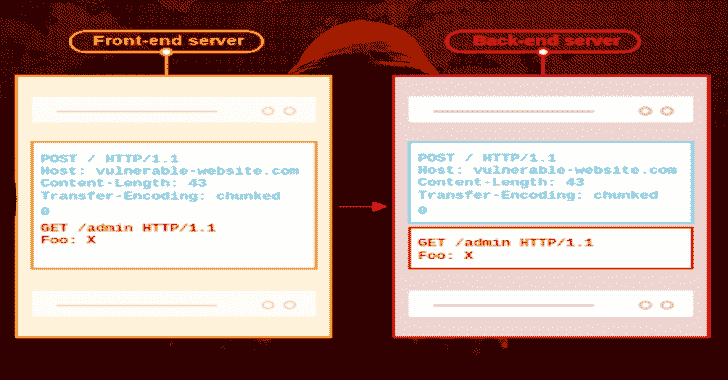

# Http 请求走私者:Burp 套件的扩展

> 原文：<https://kalilinuxtutorials.com/http-request-smuggler-extension-burp-suite/>

这是 Burp Suite 的扩展，旨在帮助您发起 [HTTP 请求走私者](https://portswigger.net/web-security/request-smuggling)攻击，最初是在 [HTTP Desync 攻击](https://portswigger.net/blog/http-desync-attacks-request-smuggling-reborn)研究期间创建的。

它支持扫描请求走私漏洞，并通过为您处理繁琐的偏移调整来帮助利用漏洞。

**安装** **Http 请求走私者**

最简单的安装方法是在 Burp 套件中，通过 Extender -> BApp Store。

如果您喜欢手动加载 jar，在 Burp Suite(社区版或专业版)中，使用扩展器->扩展->添加来加载 `**build/libs/http-request-smuggler-all.jar**`

**编译**

*   [涡轮入侵者](https://github.com/PortSwigger/turbo-intruder)是这个项目的一个依赖项，将其作为`**turbo-intruder-all.jar**`添加到这个源代码树的根中
*   使用`**gradle fatJar**`构建

**也可阅读:[PHP stan——PHP 静态分析工具——在不运行代码的情况下发现代码中的 bug](https://kalilinuxtutorials.com/phpstan-php-static-analysis-tool/)**

**使用**

右键单击一个请求并单击“启动同步探测”，然后在`**Extender->Extensions->HTTP Request Smuggler**`下观察扩展的输出窗格

如果您使用的是 Burp Pro，任何发现也会被报告为扫描问题。

**视频演示**

[**Download**](https://github.com/PortSwigger/http-request-smuggler)