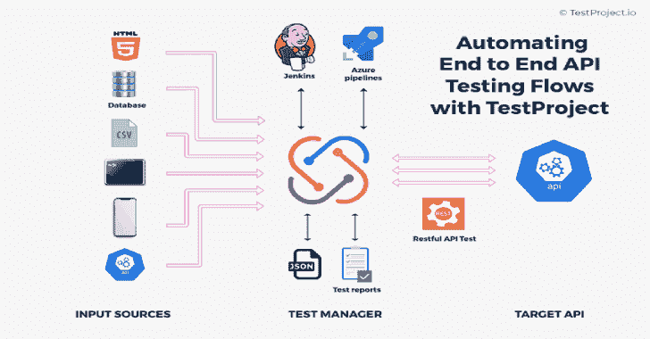
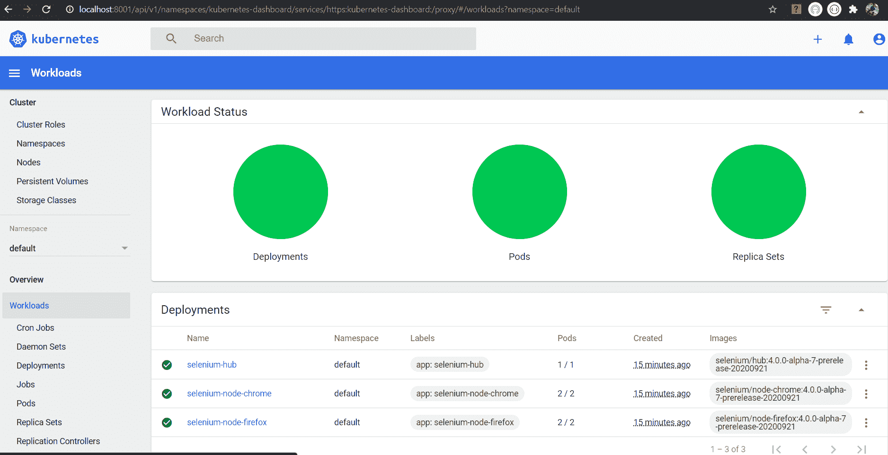

# 混合测试框架:Web、API 和安全性的端到端测试

> 原文：<https://kalilinuxtutorials.com/hybrid-test-framework/>

.png)

**混合测试框架**是一个支持跨 Chrome、Firefox、IE 等多种浏览器的 WebUi 自动化的框架，不仅仅限于此，还扩展到测试 rest api、安全性和可视化测试。

# 功能

*   跨浏览器测试支持
*   增加了对跨浏览器测试的浏览器堆栈支持
*   在 docker 容器硒网格中运行测试
*   在 AWS DeviceFarm selenium 网格中运行测试
*   在 docker 容器中的 selenium 服务器中运行测试
*   使用 OWASP 的安全测试，运行在 docker 容器中
*   使用 RestAssured 的 Api 测试支持
*   使用 percy.io 进行可视化回归测试
*   使用 axe-selenium 进行可访问性测试
*   使用 WireMock 的存根 api 测试
*   可以将日志发送到 ElasticSearch 以实现 kibana 仪表板可视化
*   数据库测试支持
*   Kafka 测试支持
*   坚如磐石的支持

### 设置&工具

*   安装智能 https://www.jetbrains.com/idea/download/
*   安装 docker 桌面 https://www.docker.com/products/docker-desktop
*   爪哇 https://adoptopenjdk.net/ _ 11
    JDK
*   格拉德·https://gradle.org/next-steps/?version=6.8.3&format=bin
*   allure https://github . com/allure-framework/allure 2/archive/2 . 17 . 2 . zip
*   设置环境变量
    *   JAVA_HOME:指向 Java SDK 文件夹\bin
    *   GRADLE_HOME:指向 GRADLE 目录\bin。
    *   ALLURE_HOME:指向 ALLURE 目录\bin。

### 开始使用

**$ git 克隆
$ cd
$从 intellij 导入项目作为 gradle 项目
$ gradle 清理
$ gradle 构建
$ gradle 任务 E2E
$ gradle 诱惑报告
$ gradle 诱惑服务**

### 写下你的第一次用户旅程

创建新的类并命名为 TC00*_E2E 测试-***

*   在@Link 中提供 jira 链接
*   将所有 api 组件作为@Feature 提供
*   提供测试严重性和描述
*   书写测试
*   在尝试/捕捉部分使用捕捉块

### 启动 chrome、firefox、selenium hub 和 OWASP 代理服务器

**$ docker-合成 up -d**

**完成本地运行的基础设施创建**

**$ docker-compose-f docker-compose-infra up-d**

**启动四个额外的链接到 hub 的 node-chrome/firefox 实例**

**$ docker-compose scale chrome = 5
$ docker-compose scale Firefox = 5**

**自旋向上的卡夫卡实例**

**$ docker-compose-f docker-compose-Kaka . yml up
【docker-compose-f docker-compose-Kaka . yml down】—RMI all**

**在 kubernetes 实例中启动 selenium hub**

**$ kube CTL apply-f selenium-k8s-deploy-SVC . YAML
$ kube CTL apply-f https://raw . githubusercontent . com/kubernetes/dashboard/v 2 . 0 . 0/AIO/deploy/recommended . YAML
$ kube CTL proxy
$ kube CTL describe-n kube-system | grep deployment-A 12
删除部署
$ kubectl 删除部署 selenium-node-Firefox
$ kube CTL**

导航至`**http://localhost:8001/api/v1/namespaces/kubernetes-dashboard/services/https:kubernetes-dashboard:/proxy/**`

[**Download**](https://github.com/dipjyotimetia/HybridTestFramework)