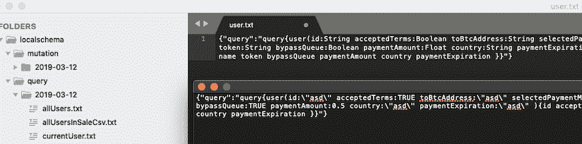
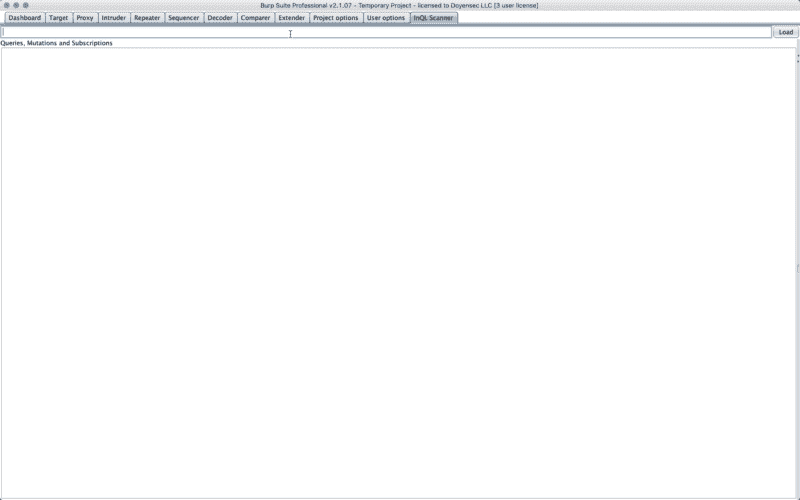

# InQL——graph QL 安全测试的 Burp 扩展

> 原文：<https://kalilinuxtutorials.com/inql/>

一个安全测试工具，用于促进 [GraphQL](https://graphql.org/) 技术安全审计工作。 **InQL** 可以作为独立脚本使用，也可以作为 [Burp Suite](https://portswigger.net/burp) 的扩展。

从 Python 运行`inql`将向目标 GraphQL 端点发出一个[自省](https://graphql.org/learn/introspection/)查询，以便获取以下元数据信息:

*   查询、突变、订阅
*   它的字段和参数
*   对象和自定义对象类型

InQL 可以检查自省查询结果，并生成不同格式的干净文档，比如 HTML 和 JSON schema。InQL 还能够为所有已知的基本数据类型生成模板(带有可选的占位符)。

生成的 HTML 文档页面将包含所有可用的`**Queries**`、`**Mutations**`和`**Subscriptions**`的详细信息，如下所示:

下面的屏幕截图显示了模板生成的使用:

对于所有支持的选项，请查看命令行帮助:

**用法:**InQL[-h][-t TARGET][-f SCHEMA _ JSON _ FILE][-k KEY][-p PROXY]
[–header HEADERS][-d][–generate-html]
[–generate-SCHEMA][–generate-queries][–unsecured]
[-o OUTPUT _ DIRECTORY]

**InQL 扫描器**

**可选参数:**
-h， –帮助显示此帮助消息并退出
-t 目标远程 GraphQL 端点(https:///graphql)
-f SCHEMA _ JSON _ FILE JSON 格式的模式文件
-k KEY API 认证密钥
-p 要通过的 web 代理的代理 IP(http://127 . 0 . 0 . 1:8080)
–header HEADERS
-d 用占位符值替换已知的 graph QL 参数类型(对 Burp 套件有用)

**打嗝套件扩展**

从该工具的 1.0 版本开始，InQL 被扩展到在 Burp Suite 中运行。在这种模式下，该工具将保留独立脚本的所有功能，外加一个方便的用户界面来操作查询。

使用 Burp Suite 的`inql`扩展，您可以:

*   搜索已知的 GraphQL URL 路径；该工具将 grep 和匹配已知值，以检测目标网站中的 GraphQL 端点
*   搜索公开的 GraphQL 开发控制台(*graph QL*、 *GraphQL Playground* 以及其他常见控制台)
*   使用包含 GraphQL 的每个 HTTP 请求/响应上显示的自定义 GraphQL 选项卡
*   通过将这些请求发送到 Burp 的 Repeater 工具来利用模板生成
*   使用自定义设置选项卡配置工具

要在 Burp Suite 中使用`inql`,请导入 Python 扩展:

*   下载 Jython Jar
*   启动打嗝套件
*   扩展器选项卡>选项> Python 环境>设置 Jython 独立 JAR 的位置
*   扩展器选项卡>扩展>添加>扩展类型>选择 Python
*   下载最新`**inql_burp.py**`发布[这里](https://github.com/doyensec/inql/releases)
*   扩展名文件>设置`**inql_burp.py**`的位置>接下来
*   输出现在应该显示以下消息:`**InQL Scanner Started!**`

将来，我们可能会考虑将扩展整合到 Burp 的 BApp 商店中。

**打嗝分机用法**

开始使用`inql`打嗝扩展很容易:

*   在顶部输入字段中加载 GraphQL 端点或 JSON 模式文件位置
*   按下“加载”按钮
*   几秒钟后，左侧面板将刷新加载选定端点的目录结构，如下例所示:

1.  全球资源定位器(Uniform Resource Locator)
    *   询问

*   选择任意*查询* / *突变* / *订阅*将在主文本区加载相应的模板

安德烈·布兰卡莱奥尼&保罗·斯塔尼奥

[**Download**](https://github.com/doyensec/inql)